> ⚠️🏗️🚧🦺🧱🪵🪨🪚🛠️👷
> 
> This is a working draft in progress
> 
> 
> 
> gif image is provided by [Giphy](https://giphy.com)
> 
> ⚠️🏗️🚧🦺🧱🪵🪨🪚🛠️👷

----


# Albert Einstein: A Revolution in Physics

> **Disclaimer:**
>
> This document contains my personal notes on the topic,
> compiled from publicly available documentation and various cited sources.
> The materials are intended for educational purposes, personal study, and reference.
> The content is dual-licensed:
> 1. **MIT License:** Applies to all code implementations (Swift, Mermaid, and other programming languages).
> 2. **Creative Commons Attribution-ShareAlike 4.0 International License (CC BY-SA 4.0):** Applies to all non-code content, including text, explanations, diagrams, and illustrations.
---

Albert Einstein (1879-1955) was a German-born theoretical physicist who is widely hailed as one of the most influential scientists of the 20th century and of all time. He developed the theory of relativity, one of the two pillars of modern physics (alongside quantum mechanics) [1]. His work is also known for its influence on the philosophy of science. Einstein is best known by the general public for his mass–energy equivalence formula $E = mc^2$, which has been dubbed "the world's most famous equation" [2, p. 231]. He received the 1921 Nobel Prize in Physics "for his services to Theoretical Physics, and especially for his discovery of the law of the photoelectric effect" [3], a pivotal step in the development of quantum theory.


---

## 1. Early Life and Education

Albert Einstein was born in Ulm, in the Kingdom of Württemberg in the German Empire, on March 14, 1879, into a family of secular Ashkenazi Jews [4, p. 1]. His father was Hermann Einstein, a salesman and engineer, and his mother was Pauline Koch. In 1880, the family moved to Munich, where Einstein's father and uncle founded Elektrotechnische Fabrik J. Einstein & Cie, a company that manufactured electrical equipment [4, p. 14].

Einstein showed an early aptitude for mathematics and physics. A pivotal moment was his encounter with a compass at age five, which sparked his curiosity about unseen forces [4, p. 9]. Later, a family friend, Max Talmud (later Talmey), introduced him to key texts in science, mathematics, and philosophy, including Kant's *Critique of Pure Reason* and Euclid's *Elements* [4, pp. 34-35].

He attended the Luitpold Gymnasium in Munich. However, he clashed with the school's rigid pedagogical style [4, p. 25]. In 1894, when his family moved to Pavia, Italy, Einstein stayed behind to finish his studies but eventually joined his family [4, p. 37]. He then attempted to apply directly to ETH Zurich (Swiss Federal Institute of Technology) but failed the liberal arts portion of the entrance exam, despite excellent scores in physics and mathematics [5, 4, p. 41]. He subsequently attended the Argovian cantonal school in Aarau, Switzerland (1895–1896) to complete his secondary schooling [4, p. 43]. In 1896, he renounced his German citizenship to avoid military service [4, p. 45] and enrolled in the mathematics and physics teaching diploma program at ETH Zurich, graduating in 1900 [5, 4, p. 61].


*<b>Note:</b> Durations in the Gantt chart are illustrative of the period during which the event was current or ongoing, not necessarily the exact length of the event itself where it's a point in time.*

After graduation, Einstein struggled to find a teaching post. A friend's father, Marcel Grossmann, helped him secure a position as an assistant examiner at the Swiss Patent Office in Bern in 1902 [4, p. 65]. This job provided him with a stable income and, crucially, the time and freedom to pursue his groundbreaking theoretical work. He obtained his PhD from the University of Zurich in 1905 with a dissertation titled "A New Determination of Molecular Dimensions" [12].

---

## 2. The Annus Mirabilis (Miracle Year - 1905)

The year 1905 is known as Einstein's "Annus Mirabilis" or "miracle year." While working at the patent office, he published four groundbreaking papers in the prestigious German physics journal *Annalen der Physik* [4, Chapter 5]. These papers would fundamentally change our understanding of space, time, mass, energy, and the nature of light.


### 2.1. The Photoelectric Effect

Einstein's first paper of 1905, "Über einen die Erzeugung und Verwandlung des Lichtes betreffenden heuristischen Gesichtspunkt" (On a Heuristic Point of View Concerning the Production and Transformation of Light) [8], proposed that light is not a continuous wave, as classical physics suggested, but consists of discrete packets of energy called "quanta" (later named photons). This idea explained the photoelectric effect, where light shining on a metal surface can cause electrons to be emitted.

**Key Idea:** The energy of a photon ($E$) is proportional to its frequency ($f$):

$$
E = hf
$$
where $h$ is Planck's constant.

An electron is ejected only if the photon's energy ($hf$) exceeds the work function ($\phi$) of the material (the minimum energy required to remove an electron). The kinetic energy ($K_{\text{max}}$) of the ejected electron is:

$$
K_{\text{max}} = hf - \phi
$$

This work was a crucial step in the development of quantum theory and was the specific achievement cited for his Nobel Prize in Physics in 1921 [3].


### 2.2. Brownian Motion

In his second 1905 paper, "Über die von der molekularkinetischen Theorie der Wärme geforderte Bewegung von in ruhenden Flüssigkeiten suspendierten Teilchen" (On the Motion of Small Particles Suspended in a Stationary Liquid, as Required by the Molecular Kinetic Theory of Heat) [10], Einstein provided a theoretical explanation for Brownian motion. He showed that this motion was caused by the continuous bombardment of these larger particles by the smaller, unseen molecules of the fluid. This work provided strong evidence for the atomic theory of matter and allowed for the calculation of Avogadro's number and the size of atoms [4, p. 97].

### 2.3. Special Theory of Relativity

Einstein's third 1905 paper, "Zur Elektrodynamik bewegter Körper" (On the Electrodynamics of Moving Bodies) [6], introduced the Special Theory of Relativity. It reconciled Maxwell's equations for electricity and magnetism with the laws of mechanics by proposing a radical new understanding of space and time.

**Two Postulates of Special Relativity:**

1.  **The Principle of Relativity:** The laws of physics are the same for all observers in uniform motion (inertial reference frames).
2.  **The Principle of the Constancy of the Speed of Light:** The speed of light in a vacuum ($c$) is the same for all inertial observers, regardless of the motion of the light source or the observer.

**Key Consequences:**
*   **Time Dilation:** Time passes slower for a moving observer relative to a stationary observer. $\Delta t' = \gamma \Delta t_0$
*   **Length Contraction:** The length of an object appears shorter in its direction of motion for a moving observer relative to its proper length. $L = L_0 / \gamma$
*   **Relativity of Simultaneity:** Events simultaneous for one observer may not be for another if they are in relative motion.
*   The Lorentz Factor: $\gamma = \frac{1}{\sqrt{1 - v^2/c^2}}$, where $v$ is the relative velocity.

```mermaid
---
title: "Special Theory of Relativity"
author: "Cong Le"
version: "1.0"
license(s): "MIT, CC BY-SA 4.0"
copyright: "Copyright (c) 2025 Cong Le. All Rights Reserved."
config:
  layout: elk
  theme: base
---
%%%%%%%% Mermaid version v11.4.1-b.14
%%%%%%%% Available curve styles include the following keywords:
%% basis, bumpX, bumpY, cardinal, catmullRom, linear, monotoneX, monotoneY, natural, step, stepAfter, stepBefore.
%%{
  init: {
    'flowchart': { 'htmlLabels': true, 'curve': 'linear' },
    'fontFamily': 'Andale Mono, monospace',
    'themeVariables': {
      'primaryColor': '#F225E3',
      'primaryTextColor': '#145A32',
      'lineColor': '#F8B229',
      'primaryBorderColor': '#27AE60',
      'secondaryColor': '#EBDEF0',
      'secondaryTextColor': '#6C3483',
      'secondaryBorderColor': '#A569BD',
      'fontSize': '20px'
    }
  }
}%%
flowchart TD
    subgraph SpecialRelativity["<b>Special Theory of Relativity (1905)</b>"]
        P1["<b>Postulate 1:</b><br/>Principle of Relativity<br/><i>(Laws of physics are invariant<br/> in all inertial frames)</i>"]
        P2["<b>Postulate 2:</b><br/>Constancy of Speed of Light<br/><i>(c is constant for all<br/> inertial observers)</i>"]

        P1 --> C1("<font color='#87CEEB'>Time Dilation</font><br/>&Delta;t' = &gamma;&Delta;t<sub>0</sub>")
        P1 --> C2("<font color='#87CEEB'>Relativity of Simultaneity</font>")
        P2 --> C1
        P2 --> C3("<font color='#87CEEB'>Length Contraction</font><br/>L = L<sub>0</sub>/&gamma;")
        P2 --> C4("<font color='#90ee90'><b>Mass-Energy Equivalence</b></font><br/><i>(Later Paper, same year)</i><br/>E = mc²")

        C1 --> LF[("Lorentz Factor <br/> &gamma; = 1/&radic;(1-v²/c²)")]
        C3 --> LF
        C4 --> LF

        style P1 fill:#4a148c,stroke:#fff,color:#fff
        style P2 fill:#4a148c,stroke:#fff,color:#fff
        style C1 fill:#1a237e,stroke:#fff,color:#fff
        style C2 fill:#1a237e,stroke:#fff,color:#fff
        style C3 fill:#1a237e,stroke:#fff,color:#fff
        style C4 fill:#004d40,stroke:#fff,color:#fff
        style LF fill:#b71c1c,stroke:#fff,color:#fff
    end
```



### 2.4. Mass-Energy Equivalence

His fourth paper of 1905, "Ist die Trägheit eines Körpers von seinem Energieinhalt abhängig?" (Does the Inertia of a Body Depend Upon Its Energy Content?) [9], presented a derivation from the principles of special relativity that led to the famous equation:
$$
E = mc^2
$$
This equation expresses the equivalence of mass ($m$) and energy ($E$), showing that a small amount of mass can be converted into a tremendous amount of energy, and vice-versa. This principle is fundamental to understanding nuclear reactions.

---

## 3. General Theory of Relativity

After 1905, Einstein continued to work on extending his theory of relativity. His goal was to incorporate gravity and to apply the principle of relativity to accelerated reference frames. This led to the development of the General Theory of Relativity, which he finalized in 1915 and published comprehensively in "Die Grundlage der allgemeinen Relativitätstheorie" (The Foundation of the General Theory of Relativity) in 1916 in *Annalen der Physik* [7].

**Core Idea:** Gravity is not a force between masses, as Newton proposed, but rather a manifestation of the curvature of spacetime caused by mass and energy [7]. "Spacetime tells matter how to move; matter tells spacetime how to curve" (a popularization by John Archibald Wheeler) [13].

**Key Principles and Predictions:**
*   **Equivalence Principle:** The effects of gravity are indistinguishable from the effects of acceleration in a small enough region of spacetime [7].
*   **Curvature of Spacetime:** Mass and energy warp the fabric of spacetime.
*   **Gravitational Lensing:** Light bends as it passes near a massive object. This was famously confirmed by observations led by Arthur Eddington during the solar eclipse of May 29, 1919 [14, 4, pp. 284-288].
*   **Gravitational Time Dilation:** Time runs slower in stronger gravitational fields. This has been confirmed by experiments such as the Pound-Rebka experiment [15].
*   **Perihelion Precession of Mercury:** General relativity accurately accounted for the anomalous precession of Mercury's orbit, which Newtonian physics could not fully explain [7, 4, p. 238].
*   **Gravitational Waves:** Ripples in spacetime caused by accelerating masses. Predicted by Einstein in 1916 [16], and first directly detected in 2015 by the LIGO and Virgo collaborations [17].

The mathematical foundation of General Relativity is based on tensor calculus and differential geometry, described by the **Einstein Field Equations** [7]:

$$
G_{\mu\nu} + \Lambda g_{\mu\nu} = \frac{8\pi G}{c^4} T_{\mu\nu}
$$

Where:
*   $G_{\mu\nu}$ is the Einstein tensor.
*   $g_{\mu\nu}$ is the metric tensor.
*   $\Lambda$ is the cosmological constant (introduced by Einstein in 1917 [18], which he later called his "biggest blunder" [19, p. 271], though it has regained importance with the discovery of dark energy).
*   $T_{\mu\nu}$ is the stress-energy tensor.
*   $G$ is Newton's gravitational constant, and $c$ is the speed of light.


---

## 4. Later Career, Unified Field Theory, and Move to USA

After his groundbreaking work on relativity, Einstein became a world-renowned figure. He received the Nobel Prize in Physics in 1921. He held academic positions in Bern, Zurich, Prague, and then Berlin, becoming a member of the Prussian Academy of Sciences and director of the Kaiser Wilhelm Institute for Physics from 1917 [4, p. 210, 246].

Much of Einstein's later career was devoted to finding a **Unified Field Theory** – a single theoretical framework that could unite general relativity (gravity) with electromagnetism. He hoped to describe all fundamental forces and particles in a single, elegant set of equations [4, Chapter 15]. Despite decades of effort, he was ultimately unsuccessful in this quest, partly because the strong and weak nuclear forces were not yet well understood.

With the rise of the Nazi party in Germany, Einstein, being Jewish, faced increasing threats. While visiting the United States in 1933 (he was at Caltech), he learned that the Nazis had raided his property and publicly burned his books [4, pp. 430-431]. He decided not to return to Germany. He took up a position at the newly founded **Institute for Advanced Study** in Princeton, New Jersey, where he remained for the rest of his life [20, 4, p. 440]. He became an American citizen in 1940 [4, p. 498].

During World War II, concerned about the possibility of Nazi Germany developing an atomic bomb, Einstein signed a letter (largely drafted by Leó Szilárd) to U.S. President Franklin D. Roosevelt on August 2, 1939, urging the U.S. to begin its own atomic research [21, 4, pp. 488-490]. This contributed to the initiation of the Manhattan Project, though Einstein himself did not directly participate in the project and later expressed deep regret about the use of nuclear weapons, stating "Had I known that the Germans would not succeed in developing an atomic bomb, I would have done nothing." [22]


---

## 5. Philosophical Views and Social Activism

Beyond his scientific achievements, Einstein was a prominent humanist, philosopher, and social activist.

*   **Pacifism and Disarmament:** A lifelong pacifist (though he acknowledged the necessity of defending against Nazi aggression), he strongly advocated for nuclear disarmament and international cooperation to prevent future wars [4, Chapter 23].
*   **Civil Rights:** He was a vocal supporter of the Civil Rights Movement in the United States, denouncing racism as "America's worst disease" [23]. He was a member of the NAACP and corresponded with W.E.B. Du Bois [4, p. 504].
*   **Zionism:** While not religious, Einstein supported cultural Zionism and the establishment of the Hebrew University of Jerusalem, to which he bequeathed his papers [24]. He was offered the presidency of Israel in 1952 but declined [4, pp. 522-523].
*   **Science and Religion:** Einstein often spoke about his views on science and religion. He did not believe in a personal God who intervenes in human affairs but expressed a "cosmic religious feeling" driven by the comprehensibility of the universe [25]. He famously stated, "Science without religion is lame, religion without science is blind," in the context of their complementary roles in human understanding [25, p. 46].
*   **Socialism:** Einstein advocated for democratic socialism, as outlined in his 1949 essay "Why Socialism?" published in the *Monthly Review* [26].


---

## 6. Legacy and Impact

Albert Einstein's contributions transformed our understanding of the universe and continue to resonate today.

*   **Revolution in Physics:** His theories of relativity fundamentally altered concepts of space, time, gravity, and energy. His work on the photoelectric effect was pivotal for quantum theory [1].
*   **Technological Applications:** While Einstein's work was largely theoretical, it laid the groundwork for numerous technologies:
    *   **GPS (Global Positioning System):** Relies on corrections from both special (for satellite speed) and general relativity (for gravitational effects on clocks) to function accurately [27].
    *   **Nuclear Energy & Weapons:** $E=mc^2$ is the foundational principle explaining the energy release.
    *   **Lasers:** The concept of stimulated emission, crucial for lasers, was proposed by Einstein in 1917 [28].
    *   **Photovoltaics (Solar Cells):** Based on the photoelectric effect.
*   **Cultural Icon:** Einstein's name and image became synonymous with "genius." [2, Foreword].
*   **Influence on Philosophy of Science:** His work prompted deep reflection on the nature of scientific theory, observation, and the structure of reality.
*   **Continued Scientific Inspiration:** His theories continue to be tested and confirmed, and his unsolved quest for a unified field theory still inspires physicists today.

Albert Einstein died on April 18, 1955, in Princeton, New Jersey, at the age of 76 [4, p. 544]. His brain was preserved for study, famously by pathologist Thomas Harvey [29]. His ashes were scattered at an undisclosed location, in accordance with his wishes. The Albert Einstein Archives at the Hebrew University of Jerusalem hold his intellectual estate [24].

---

## 7. Comprehensive Summary of Albert Einstein

The following mind map synthesizes the key aspects of Albert Einstein's life, work, and enduring legacy.

```mermaid
---
title: "Comprehensive Summary of Albert Einstein"
author: "Cong Le"
version: "1.0"
license(s): "MIT, CC BY 4.0"
copyright: "Copyright (c) 2025 Cong Le. All Rights Reserved."
config:
  theme: base
---
%%%%%%%% Mermaid version v11.4.1-b.14
%%{
  init: {
    'fontFamily': 'Andale Mono, monospace',
    'mindmap': {
	    'nodeAlign': 'center',
	    'padding': 20
    },
    'themeVariables': {
      'primaryColor': '#FC82',
      'primaryTextColor': '#F8B229',
      'primaryBorderColor': '#27AE60',
      'secondaryColor': '#EBF3',
      'secondaryTextColor': '#6C3483',
      'secondaryBorderColor': '#A569BD',
      'fontSize': '20px'
    }
  }
}%%
mindmap
  root(("<font color='#FFD700' size='5'><b>Albert Einstein (1879-1955)</b></font> <br/> <font color='#cccccc' size='2'>A Comprehensive Summary</font>"))
    <b>I. Personal Life & Background</b>
      Born: March 14, 1879 (Ulm, Germany) [4]
      Died: April 18, 1955 (Princeton, USA) [4]
      Education: ETH Zurich (Physics & Mathematics) [5]
      Early Career: Swiss Patent Office, Bern [4]
      Citizenships: German, Swiss, Austrian, American [4]
      Key Relationships: Mileva Marić (1st wife), Elsa Einstein (2nd wife) [4]
      Personality: Inquisitive, independent, humanitarian, witty

    <b>II. Major Scientific Contributions</b>
      <b>A. Annus Mirabilis (1905)</b>
        1. <i>Photoelectric Effect</i> [8]
           ::icon(fa fa-lightbulb)
           Light quanta (photons): E = hf
           Foundation for Quantum Theory
           Nobel Prize (1921) [3]
        2. <i>Brownian Motion</i> [10]
           ::icon(fa fa-atom)
           Explained random particle movement
           Evidence for atoms/molecules
        3. <i>Special Theory of Relativity</i> [6]
           ::icon(fa fa-rocket)
           Postulates: Principle of Relativity, Constancy of c
           Consequences: Time dilation, length contraction, relativity of simultaneity
           Spacetime concept
        4. <i>Mass-Energy Equivalence</i> [9]
           ::icon(fa fa-bolt)
           E = mc²
           Derived from Special Relativity
      <b>B. General Theory of Relativity (1915-1916)</b> [7]
        ::icon(fa fa-grav)
        Gravity as spacetime curvature
        Equivalence Principle
        Einstein Field Equations: G<sub>&mu;&nu;</sub> + &Lambda;g<sub>&mu;&nu;</sub> = (8&pi;G/c<sup>4</sup>)T<sub>&mu;&nu;</sub>
        Predictions: Gravitational lensing [14], time dilation [15], perihelion of Mercury, gravitational waves [16, 17]
      <b>C. Other Contributions</b>
        Bose-Einstein Statistics & Condensates (with Satyendra Nath Bose) [30]
        Stimulated Emission (foundation for lasers) [28]
        Work on Unified Field Theory (later career, unsuccessful but influential)
        Cosmological Constant (&Lambda;) [18]

    <b>III. Career & Institutional Affiliations</b>
      Swiss Patent Office (Bern)
      University of Bern
      University of Zurich
      Charles University (Prague)
      ETH Zurich
      Prussian Academy of Sciences (Berlin)
      Kaiser Wilhelm Institute for Physics (Director, Berlin)
      Institute for Advanced Study (Princeton, NJ) [20]

    <b>IV. Philosophical, Social & Political Views</b>
      <b>Pacifism & Disarmament:</b> Strong advocate, especially post-WWII [4]
      <b>Civil Rights:</b> Opposed racism, supported NAACP [23]
      <b>Zionism:</b> Supported cultural Zionism, Hebrew University [24]
      <b>Science & Religion:</b> "Cosmic religious feeling," not a personal God [25]
      <b>Democratic Socialism:</b> Critic of capitalism (essay "Why Socialism?") [26]
      <b>Humanitarianism:</b> Deep concern for humanity
      <b>Einstein-Szilárd Letter:</b> Urged US atomic research (WWII) [21]

    <b>V. Awards & Legacy</b>
      <b>Awards:</b>
        Nobel Prize in Physics (1921) [3]
        Copley Medal (1925)
        Max Planck Medal (1929)
        Franklin Medal (1935)
        Time Person of the Century (1999) [11]
      <b>Scientific Legacy:</b>
        Revolutionized physics (relativity, quantum contributions) [1]
        Foundation for modern cosmology
        Inspired generations of scientists
      <b>Technological Impact (Indirect):</b>
        GPS [27], Nuclear Energy, Lasers [28], Solar Cells
      <b>Cultural Legacy:</b>
        Synonym for "genius" [2]
        Global icon of science and intellect
        Enduring influence on philosophy and popular culture
```

---

<!-- 


---
>**Licenses:**
>
>- **MIT License:**  [](LICENSE) - Full text in [LICENSE](LICENSE) file.
>- **Creative Commons Attribution-ShareAlike 4.0 International**: [CC BY-SA 4.0](https://creativecommons.org/licenses/by-sa/4.0/) [](https://creativecommons.org/licenses/by-sa/4.0/) - Legal details in [LICENSE-CC-BY-SA-4.0](THE_PAST/LICENSE-CC-BY-SA-4.0) and at [Creative Commons official site](https://creativecommons.org/licenses/by-sa/4.0/).
>
---


### References

1.  Pais, A. (1982). *'Subtle is the Lord…': The Science and the Life of Albert Einstein*. Oxford University Press.
2.  Isaacson, W. (2007). *Einstein: His Life and Universe*. Simon & Schuster.
3.  The Nobel Prize in Physics 1921. NobelPrize.org. Nobel Prize Outreach AB 2023. Retrieved from [https://www.nobelprize.org/prizes/physics/1921/summary/](https://www.nobelprize.org/prizes/physics/1921/summary/)
4.  Fölsing, A. (1997). *Albert Einstein: A Biography*. Viking.
5.  ETH Zurich. (n.d.). *Albert Einstein*. Retrieved from [https://ethz.ch/en/the-eth-zurich/portrait/history/albert-einstein.html](https://ethz.ch/en/the-eth-zurich/portrait/history/albert-einstein.html)
6.  Einstein, A. (1905). Zur Elektrodynamik bewegter Körper. *Annalen der Physik*, 322(10), 891–921. (English translation available in *The Principle of Relativity*, Dover Publications). https://doi.org/10.1002/andp.19053221004
7.  Einstein, A. (1916). Die Grundlage der allgemeinen Relativitätstheorie. *Annalen der Physik*, 354(7), 769–822. (English translation available in *The Principle of Relativity*, Dover Publications). https://doi.org/10.1002/andp.19163540702
8.  Einstein, A. (1905). Über einen die Erzeugung und Verwandlung des Lichtes betreffenden heuristischen Gesichtspunkt. *Annalen der Physik*, 322(6), 132–148. https://doi.org/10.1002/andp.19053220607
9.  Einstein, A. (1905). Ist die Trägheit eines Körpers von seinem Energieinhalt abhängig?. *Annalen der Physik*, 323(13), 639–641. https://doi.org/10.1002/andp.19053231314
10. Einstein, A. (1905). Über die von der molekularkinetischen Theorie der Wärme geforderte Bewegung von in ruhenden Flüssigkeiten suspendierten Teilchen. *Annalen der Physik*, 322(8), 549–560. https://doi.org/10.1002/andp.19053220806
11. Golden, F. (1999, December 31). Person of the Century: Albert Einstein. *TIME Magazine*. Retrieved from [http://content.time.com/time/magazine/article/0,9171,993017,00.html](http://content.time.com/time/magazine/article/0,9171,993017,00.html)
12. Einstein, A. (1905). *Eine neue Bestimmung der Moleküldimensionen*. University of Zurich. (Doctoral Dissertation)
13. Wheeler, J. A. (1990). *A Journey Into Gravity and Spacetime*. Scientific American Library. (The quote is widely attributed to Wheeler's popularizations).
14. Dyson, F. W., Eddington, A. S., & Davidson, C. (1920). A Determination of the Deflection of Light by the Sun's Gravitational Field, from Observations Made at the Total Eclipse of May 29, 1919. *Philosophical Transactions of the Royal Society A: Mathematical, Physical and Engineering Sciences*, 220(571-581), 291-333.
15. Pound, R. V., & Rebka Jr., G. A. (1960). Apparent Weight of Photons. *Physical Review Letters*, 4(7), 337–341. https://doi.org/10.1103/PhysRevLett.4.337
16. Einstein, A. (1916). Näherungsweise Integration der Feldgleichungen der Gravitation. *Sitzungsberichte der Königlich Preussischen Akademie der Wissenschaften (Berlin)*, Seite 688-696. 1916SPAW.......688E
17. Abbott, B. P., et al. (LIGO Scientific Collaboration and Virgo Collaboration). (2016). Observation of Gravitational Waves from a Binary Black Hole Merger. *Physical Review Letters*, 116(6), 061102. https://doi.org/10.1103/PhysRevLett.116.061102
18. Einstein, A. (1917). Kosmologische Betrachtungen zur allgemeinen Relativitätstheorie. *Sitzungsberichte der Königlich Preussischen Akademie der Wissenschaften (Berlin)*, Seite 142-152.
19. Gamow, G. (1970). *My World Line: An Informal Autobiography*. Viking Press.
20. Institute for Advanced Study. (n.d.). *Albert Einstein*. Retrieved from [https://www.ias.edu/scholars/einstein](https://www.ias.edu/scholars/einstein)
21. The Atomic Heritage Foundation. (n.d.). *Einstein's Letter to Franklin D. Roosevelt*. Retrieved from [https://www.atomicheritage.org/history/einsteins-letter-franklin-d-roosevelt](https://www.atomicheritage.org/history/einsteins-letter-franklin-d-roosevelt) (Text of the letter is widely available).
22. Einstein, A. (1947). Interview with *Newsweek*, quoted in Nathan, O., & Norden, H. (Eds.). (1960). *Einstein on Peace*. Simon and Schuster. p. 308.
23. Jerome, F. (2002). *The Einstein File: J. Edgar Hoover's Secret War Against the World's Most Famous Scientist*. St. Martin's Press. p. 110 (Citing a 1946 speech at Lincoln University).
24. Albert Einstein Archives, The Hebrew University of Jerusalem. (n.d.). *Homepage*. Retrieved from [http://www.albert-einstein.org/](http://www.albert-einstein.org/)
25. Einstein, A. (1954). *Ideas and Opinions*. Crown Publishers. (Contains essays like "Science and Religion").
26. Einstein, A. (1949, May). Why Socialism?. *Monthly Review*. Retrieved from [https://monthlyreview.org/2009/05/01/why-socialism/](https://monthlyreview.org/2009/05/01/why-socialism/)
27. National Air and Space Museum. (n.d.). *How GPS Works*. Smithsonian Institution. Retrieved from [https://airandspace.si.edu/exhibitions/gps/gps_works.cfm](https://airandspace.si.edu/exhibitions/gps/gps_works.cfm) (General explanation of relativity in GPS).
28. Einstein, A. (1917). Zur Quantentheorie der Strahlung. *Physikalische Zeitschrift*, 18, 121-128.
29. Paterniti, M. (2000). *Driving Mr. Albert: A Trip Across America with Einstein's Brain*. The Dial Press.
30. Bose, S. N. (1924). Plancks Gesetz und Lichtquantenhypothese. *Zeitschrift für Physik*, 26(1), 178–181. (Followed by Einstein's papers on Bose-Einstein statistics).


