> ⚠️🏗️🚧🦺🧱🪵🪨🪚🛠️👷
> 
> This is a working draft in progress
> 
> 
> 
> gif image is provided by [Giphy](https://giphy.com)
> 
> ⚠️🏗️🚧🦺🧱🪵🪨🪚🛠️👷

----


# BOOK - Subtle is the Lord
> **Disclaimer:**
>
> This document contains my personal notes on the topic,
> compiled from publicly available documentation and various cited sources.
> The materials are intended for educational purposes, personal study, and reference.
> The content is dual-licensed:
> 1. **MIT License:** Applies to all code implementations (Swift, Mermaid, and other programming languages).
> 2. **Creative Commons Attribution-ShareAlike 4.0 International License (CC BY-SA 4.0):** Applies to all non-code content, including text, explanations, diagrams, and illustrations.
---


**Overall Impression of the Book** 🤓

Pais's work is not a light read; it's a "scientific biography" in the truest sense. While it touches upon Einstein's personal life, its main thrust is a meticulous exploration of his scientific contributions, their historical context, and their evolution. Roger Penrose, in the foreword to the 2005 edition, notes this as the biography Einstein himself would have most valued, distinguishing it by its "detail and insight into Einstein's scientific contributions."

The title itself, "Raffiniert ist der Herrgott aber boshaft ist er nicht" ("Subtle is the Lord, but malicious He is not"), and its accompanying explanation: "Nature hides her secret because of her essential loftiness, but not by means of ruse," sets the philosophical tone for understanding Einstein's deep faith in the discoverability of Nature's laws.

----

**Book Structure Overview** 🗺️

Pais organizes the book into several major parts, allowing readers to follow either the scientific narrative or a more biographical thread (indicated by italicized entries in the original table of contents).

```mermaid
mindmap
  root("Subtle is the Lord…" by Abraham Pais)
    Foreword (Roger Penrose)
    To the Reader (Pais's Intentions & Personal Reminiscences)
    Part I: Introductory
      Ch 1: Purpose and Plan
      Ch 2: Relativity Theory and Quantum Theory
      Ch 3: Portrait of the Physicist as a Young Man
    Part II: Statistical Physics
      Ch 4: Entropy and Probability
      Ch 5: The Reality of Molecules
    Part III: Relativity, The Special Theory
      Ch 6: 'Subtle is the Lord …' (Precursors, Michelson-Morley)
      Ch 7: The New Kinematics ($E=mc^2$)
      Ch 8: The Edge of History (Lorentz, Poincare)
    Part IV: Relativity, The General Theory
      Ch 9: 'The Happiest Thought of My Life'
      Ch 10: Herr Professor Einstein
      Ch 11: The Prague Papers (Bending of Light)
      Ch 12: The Einstein-Grossmann Collaboration (Riemannian Geometry)
      Ch 13: Field Theories of Gravitation: The First Fifty Years
      Ch 14: The Field Equations of Gravitation
      Ch 15: The New Dynamics (Tests, Waves, Cosmology)
    Part V: The Later Journey
      Ch 16: 'The Suddenly Famous Doctor Einstein'
      Ch 17: Unified Field Theory
    Part VI: The Quantum Theory
      Ch 18: Preliminaries
      Ch 19: The Light-Quantum
      Ch 20: Einstein and Specific Heats
      Ch 21: The Photon
      Ch 22: Interlude: The BKS Proposal
      Ch 23: A Loss of Identity: The Birth of Quantum Statistics
      Ch 24: Einstein as a Transitional Figure: The Birth of Wave Mechanics
      Ch 25: Einstein's Response to the New Dynamics
      Ch 26: Einstein's Vision
    Part VII: Journey's End
      Ch 27: The Final Decade
      Ch 28: Epilogue
    Part VIII: Appendices
      Ch 29: Einstein's Collaborators
      Ch 30: How Einstein Got the Nobel Prize
      Ch 31: Einstein's Proposals for the Nobel Prize
      Ch 32: An Einstein Chronology
```

----

**I. Introductory** 🚀

Pais sets the stage by explaining his purpose: to present a scientific biography. He shares a personal anecdote about walking with Einstein and discussing the reality of the moon when not observed, a lead-in to Einstein's lifelong struggle with quantum mechanics.

**Key Themes Introduced:**
*   Einstein's credo: Realism and a deep faith in discoverable natural laws.
*   The distinction between "constructive theories" and "theories of principle" (Relativity being of the latter type).
*   Einstein's early life and education, dispelling myths about him being a poor student.

---

**Ch 2: Relativity Theory and Quantum Theory**  
Pais highlights the abrupt transition in physics (1895-1905) and contrasts the assimilation of Special Relativity (orderly transition) with the revolutionary, ad-hoc development of the "old" quantum theory.
*   **Special Relativity:** $E=mc^2$ (1905). Pais emphasizes it was "all there" from its inception.
*   **Old Quantum Theory (1900-1925):** Characterized by equations like:
    *   Planck's Law:
        $$
        \rho(\nu, T) = \frac{8\pi h\nu^3}{c^3} \frac{1}{e^{h\nu/kT} - 1}
        $$
    *   Photoelectric Effect (Einstein, 1905):
        $$
        E_{max} = h\nu - P
        $$
    *   Specific Heat of Solids (Einstein, 1906):
        $$
        c_v = 3R \left( \frac{h\nu}{kT} \right)^2 \frac{e^{h\nu/kT}}{(e^{h\nu/kT}-1)^2}
        $$
    *   Bohr's Atomic Model (1913):
        $$
        E_n - E_m = h\nu
        $$

---

**Ch 3: Portrait of the Physicist as a Young Man**  
This chapter details Einstein's early years, from birth in Ulm (1879), his family background, his "miracle" experiences (compass at age 4-5, Euclidean geometry at 12), his dislike of rote schooling, and his move to Italy.  
It mentions his essay "Mes Projects d'Avenir" and his eventual entry into ETH in Zurich (1896), leading up to his patent office job in Bern (1902) and the "annus mirabilis" of 1905.


----

**II. Statistical Physics** 🎲

Pais dedicates significant attention to Einstein's foundational work in statistical physics, which often gets overshadowed by relativity but was crucial for his quantum insights.

---

**Ch 4: Entropy and Probability**  
Einstein "rediscovered all essential elements of statistical mechanics" (1902-1904), initially unaware of Gibbs's comprehensive work and only fragmentarily aware of Boltzmann's.
*   **Boltzmann's Principle:** A cornerstone for Einstein. Pais notes Einstein coined the term.
    $$
    S = k \ln W
    $$
    where $S$ is entropy, $k$ is Boltzmann's constant, and $W$ is the thermodynamic probability (number of microstates).
*   Einstein preferred a "phenomenological" definition of probability (time spent in a state) over Boltzmann's "complexion counting," though he used the latter's principle.
*   **Fluctuations:** Einstein's 1904 work on energy fluctuations was pivotal:  
    Mean square energy fluctuation:
    $$
    \langle (\Delta E)^2 \rangle = kT^2 \frac{d\langle E \rangle}{dT}
    $$
    This led him to consider the volume dependence of thermodynamic quantities, key for the light-quantum hypothesis.

----

**Ch 5: The Reality of Molecules**  
The 19th-century debate on the existence of atoms and molecules is set up as context.
*   **Doctoral Thesis (1905):** "A New Determination of Molecular Dimensions."
    *   Derived a relation for viscosity $\eta^*$ of a solution with suspended spherical particles:
        $$
        \eta^* = \eta (1 + \alpha\varphi)
        $$
        (Pais notes the original coefficient $\alpha=1$ was later corrected by Einstein to $\alpha=2.5$ in 1911 after experimental discrepancies were pointed out, leading to a much better value for Avogadro's number $N_A$).  
        The volume fraction $\varphi = \frac{4}{3}\pi a^3 \frac{N_A \rho}{m_{solute}}$.
    *   Combined with the Sutherland-Einstein relation for the diffusion coefficient D (also derived in the thesis):
        $$
        D = \frac{RT}{N_A} \frac{1}{6\pi\eta a}
        $$
    These two relations allowed for the determination of Avogadro's number ($N_A$) and molecular radius ($a$).
*   **Brownian Motion (1905):**
    *   Explained as the result of molecular collisions with suspended particles.
    *   Mean square displacement:
        $$
        \langle x^2 \rangle = 2Dt
        $$
        This provided another way to determine $N_A$ and made "molecules visible."
    *   Diffusion as a Markovian process: Einstein's derivation of the diffusion equation from probabilistic jumps.
*   **Critical Opalescence (1910):** Explained by density fluctuations near the critical point, linking to Rayleigh scattering and providing yet another method to determine $N_A$.
    $$
    \langle (\delta N)^2 \rangle = N_0 \left(1 + N_0 v_0 \frac{\partial P}{\partial N_0 v_0}\right)^{-1} \approx - \text{kT} \left( \frac{\partial^2 F}{\partial v^2} \right)_T^{-1}
    $$
    (The book details Smoluchowski's independent work and the subsequent refinements by Einstein).

----

**III. Relativity, The Special Theory** ✨

This part covers the period and work for which Einstein is most famously known by the public.

**Ch 6: 'Subtle is the Lord …' (Precursors & Michelson-Morley)**  
Pais meticilously discusses the context of the aether theories and the crucial Michelson-Morley experiment (1887).
*   **Michelson-Morley:** Showed no evidence of aether wind. Einstein knew of it indirectly via Lorentz's 1895 paper, but it wasn't his primary motivation. Aberration of starlight and Fizeau's experiment on light in moving water were more direct influences.
*   **Precursors:**
    *   **Voigt (1887):** Wrote down Lorentz-like transformations (up to a scale factor) for the wave equation.
    *   **FitzGerald (1889):** Independently proposed length contraction as a dynamic effect.
    *   **Lorentz (1892, 1895, 1899, 1904):** Developed electron theory, local time $t' = t - vx/c^2$ (1895, first order), Lorentz force, and eventually the full Lorentz transformations.
        $$
        x' = \gamma(x - vt) \quad y' = y \quad z' = z \quad t' = \gamma(t - vx/c^2)
        $$
        where $\gamma = 1/\sqrt{1-v^2/c^2}$.
    *   **Larmor (1900):** Independently derived Lorentz transformations and contraction.
    *   **Poincaré (1898, 1900, 1904):** Questioned absolute simultaneity, discussed the principle of relativity, and explored Lorentz group properties almost concurrently with Einstein.

----

**Ch 7: The New Kinematics**  
Pais highlights Einstein's 1905 June paper, driven by aesthetic arguments (asymmetries in electromagnetism) and based on two postulates:
1.  The laws of physics are the same in all inertial frames.
2.  The speed of light $c$ in vacuum is constant in all inertial frames, independent of the motion of the source.
*   **Key Results derived:**
    *   Lorentz transformations (from first principles).
    *   Length contraction: $L = L_0/\gamma$.
    *   Time dilation: $\Delta t = \gamma \Delta t_0$.
    *   Velocity addition formula: $u_x' = (u_x - v) / (1 - u_x v / c^2)$.
    *   Relativistic Doppler effect.
    *   Covariance of Maxwell's equations.
    *   $E=mc^2$ relation (September 1905 paper): "The mass of a body is a measure of its energy content." Derived from considering a body emitting light symmetrically in its rest frame and analyzing the energy and momentum transformation to a moving frame. Initial energy $E_0$, emits light $L$, final energy $E_1 = E_0 - L$. In moving frame, leading to kinetic energy change related to $L/c^2$.

----

**Ch 8: The Edge of History**  
A deep analysis of why Einstein, Lorentz, and Poincaré approached the problem differently.
*   **Einstein:** New kinematics based on principles.
*   **Lorentz:** Dynamic effects within an aether framework, never fully abandoning the aether.
*   **Poincaré:** Explored group properties and relativity principle but never fully grasped Einstein's kinematic revolution, still relying on "complementary hypotheses" for contraction.

----

**IV. Relativity, The General Theory** 🌌

This section details Einstein's arduous path to his theory of gravitation.

**Ch 9: 'The Happiest Thought of My Life' (1907)**  
The **Principle of Equivalence**: An observer in free fall does not experience a gravitational field locally. This implied gravity's effect on light (red shift, bending).

----

**Ch 10-11: Prague Papers (1911-1912)**  
After a period focused on quantum theory, Einstein returned to gravitation in Prague.
*   Re-derived red shift and light bending (still based on equivalence principle and special relativity locally, space not yet curved). Predicted bending by the sun as 0.87 arcseconds (the "Newtonian" value, later corrected).
*   Realized the speed of light $c$ is not constant in a gravitational field: $c(x) = c_0 (1 + \Phi(x)/c_0^2)$, where $\Phi$ is the gravitational potential. This was a crucial step away from universal applicability of special relativity.

-----

**Ch 12: The Einstein-Grossmann Collaboration (Zurich, 1912-1913)**  
Back in Zurich, a crucial realization: space is not flat; Riemannian geometry is needed.
*   Collaboration with Marcel Grossmann, who introduced him to tensor calculus of Ricci and Levi-Civita.
*   **Line element:** $ds^2 = g_{\mu\nu}dx^\mu dx^\nu$. The metric tensor $g_{\mu\nu}$ now represents the gravitational potentials.
*   **Energy-momentum conservation:** They formulated $T^{\mu\nu}_{;\nu} = 0$ (covariant divergence).
*   **Stumbling Block:** They initially concluded that generally covariant field equations determining $g_{\mu\nu}$ from $T_{\mu\nu}$ (the energy-momentum tensor of matter) were impossible if they were of second order. This was due to a misunderstanding of the role of coordinate conditions and the Bianchi identities.

----

**Ch 13-14: The Field Equations of Gravitation (Berlin, 1914-1915)**  
The final intense period.
*   **November 1915:** A series of papers culminating in the final field equations:
    $$
    R_{\mu\nu} - \frac{1}{2}g_{\mu\nu}R = \frac{8\pi G}{c^4}T_{\mu\nu}
    $$
    This equation relates the geometry of spacetime (left side, involving the Ricci tensor $R_{\mu\nu}$ and scalar curvature $R$) to the distribution of matter and energy (right side, $T_{\mu\nu}$).
*   **Key successes (November 1915):**
    *   Correct explanation of the anomalous perihelion precession of Mercury (43 arcseconds/century).
    *   Corrected prediction for light bending by the sun to 1.74 arcseconds.
*   Hilbert also arrived at similar equations independently around the same time, but from a more axiomatic, variational approach. Pais discusses the nuanced priority issue.

-----

**Ch 15: The New Dynamics**  
Post-1915 developments by Einstein and others:
*   **Gravitational Waves (1916, 1918):** Einstein predicted their existence (linearized theory, quadrupole formula for energy emission).
*   **Cosmology (1917):** Introduced the cosmological constant $\Lambda$ to achieve a static, finite universe (Einstein Universe).
    $$
    R_{\mu\nu} - \frac{1}{2}g_{\mu\nu}R + \Lambda g_{\mu\nu} = \frac{8\pi G}{c^4}T_{\mu\nu}
    $$
    This was motivated by Mach's principle (inertia determined by cosmic matter distribution).
*   **Mach's Principle:** Einstein was heavily influenced by it initially, but his enthusiasm waned. He later considered the cosmological constant his "biggest blunder" after Hubble's discovery of the expanding universe (Friedmann and Lemaître had found expanding solutions earlier).
*   **Singularities and Problem of Motion:** Einstein grappled with singularities and the idea of deriving equations of motion from field equations.

----

**V. The Later Journey** 🌠

**Ch 16: 'The Suddenly Famous Doctor Einstein'**  
Details Einstein's life after the 1919 eclipse expedition results made him a global celebrity.
*   Illness, remarriage to Elsa.
*   His views on Germany, cultural writings.

----

**Ch 17: Unified Field Theory**  
Einstein's quest from ~1920 until his death to unify gravitation and electromagnetism.
*   Motivation: To find a deeper theory that would also resolve quantum paradoxes and describe particles as singularity-free field solutions.
*   **Kaluza-Klein Theory (5 dimensions):** Einstein explored this idea (1920s, then again in 1938-41 with Bergmann & Bargmann). The extra dimension, if compactified, could yield Maxwell's equations from 5D general relativity.
    *   Line element in 5D: $dS^2 = \gamma_{\alpha\beta}dx^\alpha dx^\beta$, where $\alpha, \beta = 0, 1, 2, 3, 5$.
    *   $\gamma_{\mu\nu} = g_{\mu\nu} + \phi A_\mu A_\nu$, $\gamma_{\mu5} = \phi A_\mu$, $\gamma_{55} = \phi$.  
    Here $g_{\mu\nu}$ is the 4D metric, $A_\mu$ the electromagnetic potential, and $\phi$ a scalar field.
*   **Post-Riemannian Geometry:** Attempts using non-symmetric connections ($g_{\mu\nu} \neq g_{\nu\mu}$), Weyl's gauge theory (length change), Eddington's affine theory, distant parallelism (teleparallelism).
    *   Einstein's final attempts (with Straus, Kaufman) involved non-symmetric $g_{\mu\nu}$ and $ \Gamma^\lambda_{\mu\nu}$.  
        Field equations like:
        $$
        R_{\underline{\mu\nu}} = 0, \quad R_{[\mu\nu],\lambda} + R_{[\nu\lambda],\mu} + R_{[\lambda\mu],\nu} = 0, \quad \Gamma^\lambda_{\mu\lambda} - \Gamma^\lambda_{\lambda\mu} = 0
        $$
        (where $\underline{\mu\nu}$ is symmetric part, $[\mu\nu]$ is antisymmetric part).  
    None of these approaches yielded the desired physical results or connection to quantum theory.

-----

**VI. The Quantum Theory** <0xF0><0x9F><0xAA><0xA6>

Pais meticulously traces Einstein's complex and often contrarian relationship with quantum theory.

**Ch 19: The Light-Quantum**
*   Einstein "discovered light-quanta without using Planck's law" (1905).
*   **Heuristic Principle:** Light interacts with matter as if consisting of energy quanta $E = h\nu$.
*   **Photoelectric Effect:** Explained by $E_{max} = h\nu - P$. Millikan's experiments (1915) confirmed this but Millikan initially rejected the theory.
*   **Reactions:** Widespread skepticism. Even proposers of Einstein for the Prussian Academy in 1913 called the light-quantum hypothesis a case where he "may sometimes have missed the target."

----

**Ch 20: Einstein and Specific Heats**  
Einstein's 1906 work on the specific heat of solids was the first application of quantum concepts beyond radiation.
*   Model of atoms in a solid as independent quantum oscillators.
*   Specific heat $c_v \rightarrow 0$ as $T \rightarrow 0$, explaining anomalies like that of diamond.
*   This work influenced Nernst in formulating the Third Law of Thermodynamics.

-----

**Ch 21: The Photon**  
The evolution from "light-quantum" (energy packet) to "photon" (particle with energy *and* momentum).
*   **1909:** Einstein's fluctuation analysis of blackbody radiation suggested particle-wave duality for light. Energy fluctuations:
    $$
    \langle (\Delta E)^2 \rangle = h\nu \langle E \rangle + \frac{c^3}{8\pi\nu^2 V d\nu} \langle E \rangle^2
    $$
    The first term is particle-like, the second wave-like.
*   **1916-1917:** New derivation of Planck's law based on A and B coefficients (spontaneous and induced transitions).
    *   Required photon momentum $p = h\nu/c$ for consistency.
    *   **First Unbehagen:** Noted that spontaneous emission leaves "time and direction … to chance (Zufall)," a "weakness of the theory."

----

**Ch 22: Interlude: The BKS Proposal**  
The Bohr-Kramers-Slater proposal (1924) was a last-ditch attempt to save classical wave theory of light by abandoning strict energy-momentum conservation in individual atomic processes, suggesting it held only statistically. This was in direct opposition to Einstein's photon concept and his insistence on conservation laws.

----

**Ch 23: A Loss of Identity: The Birth of Quantum Statistics**
*   **Bose (1924):** New derivation of Planck's law by treating photons as indistinguishable particles in cells of phase space. Einstein recognized its importance and extended it.
*   **Einstein (1924-1925):** Applied Bose's method to ideal gases of material particles.
    *   Led to **Bose-Einstein statistics**.
    *   Predicted **Bose-Einstein condensation**: at low temperatures, a macroscopic fraction of bosons occupies the ground state.
    *   Noted that BE statistics implies "a mutual influence of the molecules which for the time being is of a quite mysterious nature" – prefiguring the role of wave function symmetry for identical particles.

-----

**Ch 24: Einstein as a Transitional Figure: The Birth of Wave Mechanics**  
De Broglie (1923), inspired by Einstein, proposed that matter particles also have an associated wave: $\lambda = h/p$.
*   Einstein, in his 1925 gas theory paper, independently derived particle-wave duality for matter from fluctuation arguments and strongly supported de Broglie's thesis.
*   Schrödinger (1926), influenced by Einstein's and de Broglie's ideas, developed wave mechanics.

----

**Ch 25: Einstein's Response to the New Dynamics (Quantum Mechanics)**  
Einstein accepted the consistency of quantum mechanics but argued for its incompleteness.
*   **Bohr-Einstein Debates (starting 1927 Solvay Conference):**
    *   Einstein's thought experiments (e.g., clock-in-the-box) aimed to show violations of uncertainty principle or internal inconsistencies. Bohr refuted these, often using Einstein's own general relativity principles (like gravitational red shift for the clock-in-the-box).
    *   **EPR Paradox (Einstein-Podolsky-Rosen, 1935):** Argued that quantum mechanics doesn't provide a complete description of "physical reality." If one can predict with certainty the value of a physical quantity without disturbing a system, then there exists an element of reality corresponding to it. EPR set up a system of two entangled particles; measuring a property of one instantaneously determines the corresponding property of the other, even if spatially separated. This implies both position and momentum of the second particle could be "real" simultaneously, contradicting quantum mechanics. Einstein's point was that this "spooky action at a distance" was unacceptable.

-----

**Ch 26: Einstein's Vision**  
Einstein believed quantum mechanics was a successful statistical theory but not the final word.
*   He hoped for an **"Überkausalität"** (supercausality) from an "overdetermined" classical field theory (likely a unified field theory) from which quantum phenomena would emerge as constraints or special solutions.
*   He remained skeptical of the probabilistic interpretation and the abandonment of objective reality independent of observation.

----

**Diagram: Einstein's Shifting Views on Quantum Theory**


----

**VIII. Appendices** 📜

**Ch 29: Einstein's Collaborators**  
Pais lists over thirty collaborators. This appendix would detail them. Examples mentioned in the provided text:
*   Jakob Laub (electrodynamics of ponderable media)
*   Habicht Brothers (Maschinchen - voltage amplifier)
*   Ludwig Hopf (statistical aspects of radiation)
*   Marcel Grossmann (mathematics for General Relativity)
*   Adriaan Fokker (Nordstrom theory)
*   Wander Johannes de Haas (Einstein-de Haas effect)
*   And many later in Berlin and Princeton (Mayer, Podolsky, Rosen, Infeld, Hoffmann, Bergmann, Bargmann, Pauli, Straus, Kemeny, Kaufman).

----

**Ch 30-31: Einstein and the Nobel Prize**  
Einstein was awarded the 1921 Nobel Prize in Physics (announced in 1922) *"for his services to Theoretical Physics, and especially for his discovery of the law of the photoelectric effect."*
*   **Why not for Relativity?** Pais implies the committee was under pressure due to numerous nominations for relativity, but experimental confirmations were still debated, and the theoretical implications were harder for the committee to assess. The photoelectric effect was a "safer" choice.
*   **Nominations:** Einstein was nominated almost every year from 1910 to 1922. Key nominators included Ostwald, Wien, Planck, Lorentz, Bohr, Sommerfeld, Eddington.
*   **Einstein's Nominations:** He nominated Planck, Franck & Hertz, Langevin & Weiss, Stern & Gerlach, Sommerfeld, Compton, C.T.R. Wilson, Debye, de Broglie, Heisenberg, Schrödinger.

-----

**Key Mathematical Equations Highlighted by Pais or Central to Einstein's Work**

*   **Boltzmann's Principle:** $S = k \ln W$
*   **Planck's Law:** $\rho(\nu,T) = \frac{8\pi h\nu^3}{c^3}\frac{1}{e^{h\nu/kT}-1}$
*   **Photoelectric Effect:** $E_{max} = h\nu - P$
*   **Einstein's Fluctuation Formula (Energy):** $\langle (\Delta E)^2 \rangle = kT^2 \frac{d\langle E \rangle}{dT}$
*   **Sutherland-Einstein Relation (Brownian Motion):** $D = \frac{RT}{N_A} \frac{1}{6\pi\eta a}$
*   **Mean Square Displacement (Brownian Motion):** $\langle x^2 \rangle = 2Dt$
*   **Special Relativity:**
    *   Lorentz Transformations: $x' = \gamma(x-vt)$, $t' = \gamma(t-vx/c^2)$
    *   Mass-Energy Equivalence: $E = mc^2$
*   **General Relativity Field Equations:** $G_{\mu\nu} \equiv R_{\mu\nu} - \frac{1}{2}g_{\mu\nu}R = \frac{8\pi G}{c^4}T_{\mu\nu}$ (possibly with $+\Lambda g_{\mu\nu}$)
*   **Light Deflection (Einstein Value):** $\alpha = \frac{4GM}{c^2 R_{\odot}}$
*   **Bose-Einstein Distribution (average number of particles in state s):** $\langle n_s \rangle = \frac{1}{e^{(\epsilon_s - \mu)/kT} - 1}$
*   **De Broglie Relation:** $\lambda = h/p$

-----

**Visualizing Influences and Connections**  
A DOT graph could illustrate the network of influences:

```dot
digraph EinsteinInfluences {
    rankdir=LR;
    node [shape=box, style=rounded];

    subgraph cluster_precursors {
        label="Precursors & Contemporaries";
        Newton [label="Newton\n(Gravitation, Mechanics)"];
        Maxwell [label="Maxwell\n(Electromagnetism)"];
        Boltzmann [label="Boltzmann\n(Statistical Mechanics)"];
        Mach [label="Mach\n(Inertia, Positivism)"];
        Lorentz [label="Lorentz\n(Electron Theory, Transformations)"];
        Poincare [label="Poincaré\n(Relativity Principle, Simultaneity)"];
        Planck [label="Planck\n(Quantum Hypothesis)"];
        Michelson [label="Michelson & Morley\n(Aether Experiments)"];
    }

    Einstein [label="Albert Einstein", shape=ellipse, style="rounded,filled", fillcolor=lightblue];

    subgraph cluster_developments {
        label="Einstein's Major Contributions";
        SR [label="Special Relativity (1905)"];
        GR [label="General Relativity (1915)"];
        PE [label="Photoelectric Effect (1905)\nLight Quantum"];
        BM [label="Brownian Motion (1905)"];
        SH [label="Specific Heats (1906)"];
        BS [label="Bose-Einstein Statistics (1924-25)"];
        UFT [label="Unified Field Theory (Lifelong Quest)"];
    }

    subgraph cluster_interactions_influenced {
        label="Interactions & Influenced";
        Bohr [label="Niels Bohr\n(Quantum Debates, Complementarity)"];
        DeBroglie [label="Louis de Broglie\n(Matter Waves)"];
        Schrodinger [label="Erwin Schrödinger\n(Wave Mechanics)"];
        Bose [label="S.N. Bose\n(Photon Statistics)"];
        Grossmann [label="Marcel Grossmann\n(Math for GR)"];
    }

    // Influences on Einstein
    Newton -> Einstein [label="Foundation"];
    Maxwell -> Einstein [label="Foundation/\nProblem"];
    Boltzmann -> Einstein [label="Methodology"];
    Mach -> Einstein [label="Critique/Inspiration"];
    Lorentz -> Einstein [label="Electrodynamics/\nTransformations"];
    Poincare -> Einstein [label="Concepts"];
    Planck -> Einstein [label="Quantum Idea"];
    Michelson -> Einstein [label="Experimental Context"];

    // Einstein's Work
    Einstein -> SR;
    Einstein -> GR;
    Einstein -> PE;
    Einstein -> BM;
    Einstein -> SH;
    Einstein -> BS;
    Einstein -> UFT;

    // Connections between Einstein's work
    BM -> SH [style=dotted, label="Stat. Methods"]; // Example, Pais clarifies these links
    PE -> BS [style=dotted, label="Quantum Ideas"];

    // Einstein's Influence
    Einstein -> Bohr [label="Debates/\nStimulus"];
    Einstein -> DeBroglie [label="Light Quantum/\nWave idea support"];
    DeBroglie -> Schrodinger [label="Matter Waves"];
    Einstein -> Schrodinger [label="Gas Theory/\nWave idea support"];
    Einstein -> Bose [label="Collaboration/\nExtension"];
    Einstein -> Grossmann [label="Collaboration"];

    // Connections implied by Pais
    {PE SH BS} -> Bohr [style=dashed, label="Context for Bohr's work"];
}
```



-----

**Conclusion of the Book Review** 🎉

Abraham Pais's "'Subtle is the Lord…'" is an indispensable resource for anyone seeking a deep, scientifically grounded understanding of Albert Einstein's monumental contributions to physics. It masterfully weaves together the technical details of his theories with the narrative of his life, the influences upon him, and his own profound impact on the trajectory of science. While demanding, the journey through Pais's meticulous account is immensely rewarding, offering a perspective that, as Penrose suggests, Einstein himself would have cherished. The book doesn't shy away from equations or complex arguments, making it a true "scientific biography." It reveals not just *what* Einstein thought, but *how* he thought, his struggles, his triumphs, and his enduring philosophical considerations, particularly concerning the "Old One" and the fundamental nature of reality. 👍

----

**References and Citations:**  
Since this is a review of Pais's book, the primary citation is the book itself:
*   Pais, Abraham. *'Subtle is the Lord…': The Science and the Life of Albert Einstein*. Oxford University Press, *1982 (reissued with new foreword 2005)*.

When discussing fundamental physics concepts or historical figures mentioned by Pais, one might refer to standard academic sources or encyclopedic resources like:
*   Wikipedia articles on Special Relativity, General Relativity, Quantum Mechanics, etc. (for generally accepted summaries).
*   Standard physics textbooks for detailed explanations of equations (e.g., Griffiths for Electrodynamics, Shankar for Quantum Mechanics, Weinberg or Misner, Thorne, Wheeler for General Relativity).


---

<!-- 


---
>**Licenses:**
>
>- **MIT License:**  [](LICENSE) - Full text in [LICENSE](LICENSE) file.
>- **Creative Commons Attribution-ShareAlike 4.0 International**: [CC BY-SA 4.0](https://creativecommons.org/licenses/by-sa/4.0/) [](https://creativecommons.org/licenses/by-sa/4.0/) - Legal details in [LICENSE-CC-BY-SA-4.0](THE_PAST/LICENSE-CC-BY-SA-4.0) and at [Creative Commons official site](https://creativecommons.org/licenses/by-sa/4.0/).
>
---