> ⚠️🏗️🚧🦺🧱🪵🪨🪚🛠️👷
> 
> This is a working draft in progress
> 
> 
> 
> gif image is provided by [Giphy](https://giphy.com)
> 
> ⚠️🏗️🚧🦺🧱🪵🪨🪚🛠️👷

----

# ⚛️ Einsteins Brownian Motion Theory
> **Disclaimer:**
>
> This document contains my personal notes on the topic,
> compiled from publicly available documentation and various cited sources.
> The materials are intended for educational purposes, personal study, and reference.
> The content is dual-licensed:
> 1. **MIT License:** Applies to all code implementations (Swift, Mermaid, and other programming languages).
> 2. **Creative Commons Attribution-ShareAlike 4.0 International License (CC BY-SA 4.0):** Applies to all non-code content, including text, explanations, diagrams, and illustrations.
---

This document outlines Albert Einstein's groundbreaking 1905 paper, "Über die von der molekularkinetischen Theorie der Wärme geforderte Bewegung von in ruhenden Flüssigkeiten suspendierten Teilchen" (On the Motion of Small Particles Suspended in a Stationary Liquid, Required by the Molecular-Kinetic Theory of Heat). This seminal work provided strong evidence for the existence of atoms and molecules by explaining Brownian motion. ⚛️

Let's explore the core ideas presented by Einstein.

----

# 📜 Overall Structure of Einstein's Argument

Einstein's paper methodically builds its case, connecting macroscopic observations (like osmotic pressure and diffusion) to the microscopic world of molecular motion.

```mermaid
---
title: "Overall Structure of Einstein's Argument"
author: "Cong Le"
version: "1.0"
license(s): "MIT, CC BY 4.0"
copyright: "Copyright (c) 2025 Cong Le. All Rights Reserved."
config:
  theme: base
---
%%%%%%%% Mermaid version v11.4.1-b.14
%%{
  init: {
    'fontFamily': 'Andale Mono, monospace',
    'mindmap': {
	    'nodeAlign': 'center',
	    'padding': 30
    },
    'themeVariables': {
      'primaryColor': '#FC82',
      'primaryTextColor': '#F8B229',
      'primaryBorderColor': '#27AE60',
      'secondaryColor': '#EBF3',
      'secondaryTextColor': '#6C3483',
      'secondaryBorderColor': '#A569BD',
      'fontSize': '20px'
    }
  }
}%%
mindmap
  root)"Einstein's 1905 Paper on Brownian Motion"(
    ))"Context:<br/>Explaining Brownian Motion"((
    ))"Goal:<br/>Connect molecular-kinetic theory to observable particle motion"((
    Section1["§1 & §2:<br/>Osmotic Pressure"]
      ("Conceptual understanding of osmotic pressure")
      ("Link to molecular kinetics & number of particles")
      ("Derivation of pressure:<br/> $p = \frac{RT}{N}\nu$")
    Section3["§3:<br/>Theory of Diffusion of Suspended Particles"]
      ("Equilibrium between external/osmotic forces and fluid drag")
      ("Derivation of the Diffusion Coefficient $D$")
      ("Key Equation:<br/> $D = \frac{RT}{N} \frac{1}{6\pi \eta P}$")
    Section4["§4:<br/> Disordered Motion & its Relation to Diffusion"]
      ("Statistical treatment of particle displacement $\Delta$ over time $\tau$")
      ("Derivation of the Diffusion Equation:<br/> $\frac{\partial f}{\partial t} = D \frac{\partial^2 f}{\partial x^2}$")
      ("Mean Square Displacement:<br/> $\lambda_x = \sqrt{\overline{x^2}} = \sqrt{2Dt}$")
    Section5["§5:<br/> Formula for Mean Displacement & Determining Avogadro's Number"]
      ("Combining $D$ and $\lambda_x$ equations")
      ("The Einstein Relation:<br/> $\lambda_x^2 = t \cdot \frac{RT}{N} \frac{1}{3\pi \eta P}$")
      ))"Proposal:<br/> New method to determine Avogadro's number $N$ and atomic sizes"((
    ))"Conclusion:<br/> Observable motion is a direct consequence of molecular-kinetic theory"((
    ))"Impact: <br/>Strong evidence for atomic theory"((
```

---

# 💧|🧂 §1 & §2: Osmotic Pressure and its Molecular-Kinetic Basis

Einstein begins by considering the osmotic pressure exerted by solute molecules or suspended particles. He draws an analogy to the ideal gas law.

 conceptually, osmotic pressure arises when a semipermeable membrane separates a solution from a pure solvent. The solvent tends to move into the solution to equalize concentrations, creating a pressure.

Einstein shows that for $n$ suspended particles (or solute molecules) in a volume $V^*$, the osmotic pressure $p$ can be expressed, similarly to the ideal gas law, as:  
$p V^* = n k_B T$  
Where $k_B$ is the Boltzmann constant ($R/N_{A}$, where $R$ is the ideal gas constant and $N_{A}$ is Avogadro's number).  
If $\nu = n/V^*$ is the number density of particles, then:  
$p = \nu k_B T$  
Or, using the molar concentration and $R$:  
$p = \frac{n}{V^*} \frac{R}{N_A} T$  
Einstein uses $N$ for Avogadro's number in his paper, so this equation appears as (page 551, 553):  
$p = \frac{RT}{N} \nu$  
This connection is crucial because it links a macroscopic measurable pressure to the number of microscopic particles. 🌡️

---

# 🌊 §3: Theory of Diffusion of Suspended Particles

Einstein then investigates the diffusion of these suspended particles, driven by their random thermal motion and influenced by external forces or concentration gradients.

## Forces in Diffusion Equilibrium
In a steady state, if an external force $K$ acts on each particle, it will be balanced by a force arising from the osmotic pressure gradient.

A particle under force $K$ moves with a velocity $v = K / (6\pi \eta P)$, where $\eta$ is the viscosity of the fluid and $P$ is the radius of the spherical particle (this arises from Stokes' Law). This leads to a particle flux (number of particles per area per time) due to force $K$:  
$J_K = \nu v = \frac{\nu K}{6\pi \eta P}$

Diffusion also causes a flux, proportional to the negative gradient of concentration:  
$J_D = -D \frac{\partial \nu}{\partial x}$  
Where $D$ is the **diffusion coefficient**.

At dynamic equilibrium, these fluxes must balance if the net movement from force $K$ exactly counteracts the diffusive flux (or if $K$ *includes* the osmotic pressure force balancing another external force, leading to no net flux):  
$\frac{\nu K}{6\pi \eta P} - D \frac{\partial \nu}{\partial x} = 0$ (equation (2) on page 555)

## Derivation of the Diffusion Coefficient (D)
By combining the equilibrium condition for force $K$ (derived from thermodynamic arguments about free energy):  
$K\nu = \frac{RT}{N} \frac{\partial \nu}{\partial x}$  
with the dynamic equilibrium of fluxes:  
$\nu K = 6\pi \eta P D \frac{\partial \nu}{\partial x}$

Einstein equates the expressions for $\nu K$:  
$\frac{RT}{N} \frac{\partial \nu}{\partial x} = 6\pi \eta P D \frac{\partial \nu}{\partial x}$  
This elegantly yields the **Einstein relation for the diffusion coefficient**:  
$D = \frac{RT}{N} \frac{1}{6\pi \eta P}$  
This equation is monumental: it connects the macroscopic diffusion coefficient $D$ (measurable) to microscopic properties (Avogadro's number $N$, particle radius $P$) and fluid properties (viscosity $\eta$, temperature $T$). 💧

---

# 🎲 §4: Disordered Motion (Brownian Motion) and its Relation to Diffusion

Einstein then shifts to the directly observable random motion of suspended particles (Brownian motion) and links it quantitatively to diffusion. He considers the probability $\varphi(\Delta)d\Delta$ that a particle undergoes a displacement between $\Delta$ and $\Delta + d\Delta$ in a small time interval $\tau$.

By considering how the distribution of particles $f(x,t)$ changes over time due to these random displacements and using Taylor expansions, he derives the classical **diffusion equation** (also known as Fick's second law):  
$\frac{\partial f}{\partial t} = D \frac{\partial^2 f}{\partial x^2}$  
where $D$ is related to the mean square displacement in one dimension, $\overline{\Delta_x^2}$, over time $\tau$:  
$D = \frac{\overline{\Delta_x^2}}{2\tau}$

For a collection of particles starting at $x=0$ at $t=0$, the solution to the diffusion equation gives their distribution at a later time $t$:  
$f(x,t) = \frac{n_{total}}{\sqrt{4\pi Dt}} e^{-\frac{x^2}{4Dt}}$  
This is a Gaussian distribution. From this, the mean square displacement $\overline{x^2}$ of a particle from its origin along the x-axis after time $t$ is:  
$\overline{x^2} = 2Dt$  
The root-mean-square (RMS) displacement $\lambda_x$ is therefore:  
$\lambda_x = \sqrt{\overline{x^2}} = \sqrt{2Dt}$  
This is a hallmark of diffusive processes: the RMS displacement grows with the square root of time. 📈

```dot
/*
 * title: Disordered Motion (Brownian Motion) and its Relation to Diffusion
 * author: Cong Le
 * version: 1.0
 * license(s): MIT, CC BY-SA 4.0
 * copyright: Copyright (c) 2025 Cong Le. All Rights Reserved.
 */
digraph BrownianMotionDisplacement {
    rankdir=LR;
    node [shape=plaintext];
    edge [arrowhead=none];

    subgraph cluster_plot {
        label = "RMS Displacement vs. Time";
        xlabel = "Time (t)";
        ylabel = "RMS Displacement (λx)";
        
        origin [label="", shape=point, style=invisible]; // Invisible origin point for layout
        
        // Points on the curve sqrt(t)
        p0 [pos="0,0!", label="0"];
        p1 [pos="1,1!", label=""];
        p2 [pos="2,1.41!", label=""];
        p3 [pos="3,1.73!", label=""];
        p4 [pos="4,2!", label=""];
        p5 [pos="5,2.23!", label=""];

        p0 -> p1 -> p2 -> p3 -> p4 -> p5 [style=bold, color=blue];

        // Axis labels
        xaxis_start [pos="-0.2,-0.2!", label="0"];
        xaxis_end [pos="5.2,-0.2!", label="t"];
        yaxis_start [pos="-0.2, -0.2!", label="0"];
        yaxis_end [pos="-0.2, 2.5!", label="λx ∝ √t"];

         // Invisible edges for layout might be needed depending on renderer
         origin -> p0 [style=invis];
    }
    caption [label="\nFig: Root-Mean-Square Displacement (λx) of a\nBrownian particle increases with the square root of time (t).", fontsize=10];
}
```

Click to show/hide the full native DOT implementation with comment documentation.

*(Note: DOT language has limited capabilities for precise plotting. This is a conceptual representation.)*

---

# 🎯 §5: Formula for Mean Displacement & Determining Avogadro's Number

This is the culmination of the paper. Einstein combines his two expressions for $D$:
1.  From hydrodynamics and osmotic pressure: $D = \frac{RT}{N} \frac{1}{6\pi \eta P}$
2.  From the statistics of random walks: $D = \frac{\overline{x^2}}{2t} = \frac{\lambda_x^2}{2t}$

Equating these:  
$\frac{\lambda_x^2}{2t} = \frac{RT}{N} \frac{1}{6\pi \eta P}$  
Rearranging for the mean square displacement:  
$\lambda_x^2 = t \cdot \frac{RT}{N} \frac{1}{3\pi \eta P}$

This is the famous **Einstein-Smoluchowski relation** (though Marian Smoluchowski derived a similar result independently around the same time).  
Most importantly, Einstein pointed out that this equation could be used to determine Avogadro's number $N$ (and thus the "true size of atoms"):  
$N = \frac{t}{\lambda_x^2} \frac{RT}{3\pi \eta P}$

All quantities on the right-hand side are, in principle, measurable:
*   $t$: observation time
*   $\lambda_x^2$: mean square displacement of suspended particles (observed under a microscope 🔬)
*   $R$: ideal gas constant
*   $T$: absolute temperature
*   $\eta$: viscosity of the liquid
*   $P$: radius of the suspended particles

Einstein even performed an example calculation (page 559): For water at 17°C ($\eta \approx 1.35 \times 10^{-2}$ Poise in cgs, which is $1.35 \times 10^{-3}$ Pa·s), with particles of diameter $0.001 \text{ mm}$ (radius $P = 0.5 \times 10^{-4} \text{ cm}$), he predicted $\lambda_x \approx 0.8 \text{ \textmu m}$ in 1 second, or about $6 \text{ \textmu m}$ in 1 minute.  
Experimental verification by Jean Perrin a few years later provided strong confirmation of Einstein's theory and an accurate value for $N$, cementing the reality of atoms.

----

# ✨ Conclusion

Einstein's 1905 paper on Brownian motion was a cornerstone in physics. It demonstrated that the seemingly random jiggling of microscopic particles suspended in a fluid could be quantitatively explained by the continual bombardment of these particles by the even smaller, invisible molecules of the fluid. This provided one of the most compelling pieces of evidence for the atomic and molecular theory of matter and offered a new, independent method to determine Avogadro's number.

---

## 📚 Citation

Einstein, A. (1905). Über die von der molekularkinetischen Theorie der Wärme geforderte Bewegung von in ruhenden Flüssigkeiten suspendierten Teilchen. *Annalen der Physik*, 322(8), 549–560. [DOI: 10.1002/andp.19053220806](https://doi.org/10.1002/andp.19053220806)

---

<!-- 

---
>**Licenses:**
>
>- **MIT License:**   - Full text in [LICENSE](LICENSE) file.
>- **Creative Commons Attribution-ShareAlike 4.0 International**: [CC BY-SA 4.0](https://creativecommons.org/licenses/by-sa/4.0/)  - Legal details in [LICENSE-CC-BY-SA-4.0](THE_PAST/LICENSE-CC-BY-SA-4.0) and at [Creative Commons official site](https://creativecommons.org/licenses/by-sa/4.0/).
>
---
