> ⚠️🏗️🚧🦺🧱🪵🪨🪚🛠️👷
> 
> This is a working draft in progress
> 
> 
> 
> gif image is provided by [Giphy](https://giphy.com)
> 
> ⚠️🏗️🚧🦺🧱🪵🪨🪚🛠️👷

----

# On a Heuristic Point of View Concerning the Production and Transformation of Light
> **Disclaimer:**
>
> This document contains my personal notes on the topic,
> compiled from publicly available documentation and various cited sources.
> The materials are intended for educational purposes, personal study, and reference.
> The content is dual-licensed:
> 1. **MIT License:** Applies to all code implementations (Swift, Mermaid, and other programming languages).
> 2. **Creative Commons Attribution-ShareAlike 4.0 International License (CC BY-SA 4.0):** Applies to all non-code content, including text, explanations, diagrams, and illustrations.
---

This document outlines Albert Einstein's groundbreaking 1905 paper, *"Über einen die Erzeugung und Verwandlung des Lichtes betreffenden heuristischen Gesichtspunkt"* (On a Heuristic Point of View Concerning the Production and Transformation of Light). This paper is one of the pillars of modern physics, introducing the revolutionary concept of light quanta (later named photons) and providing explanations for phenomena that classical physics could not. 😮

We'll break down the paper's main arguments and illustrate its key concepts using diagrams and the pivotal mathematical expressions Einstein presented.

---

# 📜 Overall Structure and Argument Flow of Einstein's 1905 Paper

Einstein's paper methodically builds a case for a new understanding of light, moving from the inadequacies of existing theories to proposing a radical new idea and then applying it to explain specific physical phenomena.

---

# 🌡️ §1-2: Black-Body Radiation and Planck's Quanta

Einstein starts by acknowledging the success of Maxwell's theory for optical phenomena like reflection and refraction but points out its limitations when dealing with the interaction of light and matter, specifically black-body radiation.

**Classical Dilemma (Ultraviolet Catastrophe):**  
Classical physics (Rayleigh-Jeans Law) predicted that a black body should emit infinite energy at high frequencies. This was obviously wrong!

**Planck's Breakthrough (1900):**  
Max Planck resolved this by postulating that energy is exchanged in discrete packets, or quanta. Einstein takes this further.

**Planck's Radiation Law (as cited by Einstein, p. 136):**  
For the energy density $\rho_{\nu}$ of radiation in equilibrium with resonators at temperature $T$:

$$
\rho_{\nu} = \frac{\alpha \nu^3}{e^{\frac{\beta \nu}{T}} - 1}
$$

Where $\alpha = 6.10 \times 10^{-56}$ and $\beta = 4.866 \times 10^{-11}$ are constants (in cgs units used in the paper).  
Einstein notes that for large wavelengths or high temperatures (small $\nu/T$), this approximates to (Rayleigh-Jeans form):

$$
\rho_{\nu} \approx \frac{\alpha}{\beta} \nu^2 T
$$

Comparing this with the classical derivation, Einstein calculates Avogadro's number $N$ (p. 137):

$$
N = \frac{\beta}{\alpha} \frac{8 \pi R}{L^3} = 6.17 \times 10^{23}
$$

(using $R$ as the ideal gas constant and $L$ as the speed of light, although $L$ is usually $c$). In the paper, $L$ is often used for light speed.

The crucial link is $\frac{R}{N} \beta = h$ (Planck's constant). Einstein's central idea is that these "energy elements" are not just a feature of matter's interaction with radiation but are inherent properties of light itself.

---

# 🎲 §3-6: Entropy, Boltzmann's Principle, and the Light Quantum Hypothesis

Einstein uses a powerful analogy based on entropy and statistical mechanics to argue for the "particle-like" nature of light. He considers monochromatic radiation of low density (where Wien's approximation of Planck's law is valid).

**Wien's Radiation Law (approximation for low density / high frequency $\nu$, p. 139):**

$$
\rho = \alpha \nu^3 e^{-\frac{\beta \nu}{T}}
$$

**Entropy of Monochromatic Radiation (from Wien's law, p. 139):**  
The entropy $\varphi$ per unit volume and frequency interval is given as:

$$
\varphi(\rho, \nu) = -\frac{\rho}{\beta \nu} \left\{ \lg \frac{\rho}{\alpha \nu^3} - 1 \right\}
$$

For a total energy $E$ of radiation of frequency $\nu$ in a volume $V$, so $\rho = E/V$. The change in total entropy $S = V\varphi$ when the volume changes from $V_0$ to $V$ (keeping $E, \nu$ constant) is:

$$
S - S_0 = \frac{E}{\beta \nu} \lg \left( \frac{V}{V_0} \right)
$$

**Analogy with an Ideal Gas:**  
This equation has the exact same form as the entropy change for an ideal gas of $n$ particles expanding from $V_0$ to $V$:

$$
S - S_0 = n k_B \lg \left( \frac{V}{V_0} \right)
$$

(where $k_B = R/N_A$ is Boltzmann's constant).

Comparing these, Einstein suggests that the radiation behaves as if it consists of $n_q$ independent energy quanta, where:

$$
n_q = \frac{E}{\beta \nu} \frac{N}{R} = \frac{E}{h \nu}
$$

(since $h = \frac{R}{N}\beta$).

**Boltzmann's Principle ($S = k \log W$):**  
Einstein then invokes Boltzmann's principle, which relates entropy $S$ to the statistical probability $W$ of a system's state. For $n_q$ independent particles (light quanta) originally in volume $V_0$, the probability of all $n_q$ particles randomly being found in a sub-volume $V$ is:

$$
W = \left( \frac{V}{V_0} \right)^{n_q}
$$

Using Boltzmann's principle $S - S_0 = \frac{R}{N} \lg W$ (as stated on p.141, using $R/N$ effectively as Boltzmann's constant $k_B$), substituting $W$:

$$
S - S_0 = \frac{R}{N} n_q \lg \left( \frac{V}{V_0} \right)
$$

Substituting $n_q = \frac{E N}{R \beta \nu}$:

$$
S - S_0 = \frac{R}{N} \left( \frac{E N}{R \beta \nu} \right) \lg \left( \frac{V}{V_0} \right) = \frac{E}{\beta \nu} \lg \left( \frac{V}{V_0} \right)
$$

This matches the entropy equation derived from Wien's law! 🎉 This powerful analogy suggests light, at least under these conditions, behaves like a collection of independent, localized energy quanta. Each quantum carries energy $E_{quantum} = \frac{R}{N}\beta\nu = h\nu$.

```plantuml
/'
title: Statistical Argument for Light Quanta (Entropy Analogy)
author: Cong Le
version: 1.0
license(s): MIT, CC BY-SA 4.0
copyright: Copyright (c) 2025 Cong Le. All Rights Reserved.
'/
@startuml
!theme vibrant
title Statistical Argument for Light Quanta (Entropy Analogy)

package "Black-Body Radiation (Wien's Regime)" {
  object Radiation {
    Initial Volume = V<sub>0</sub>
    Final Volume = V
    Total Energy = E
    Frequency = &nu;
  }
  folder "Thermodynamic Entropy Change" {
    object "S - S<sub>0</sub>" as EntropyRadiation
    EntropyRadiation : $S - S_0 = \frac{E}{\beta \nu} \ln \left( \frac{V}{V_0} \right)$
    note right: Derived from Wien's Law
  }
}

package "Ideal Gas" {
  object Gas {
    Initial Volume = V<sub>0</sub>
    Final Volume = V
    Number of Particles = n
  }
  folder "Statistical Entropy Change" {
    object "S - S<sub>0</sub> (Boltzmann)" as EntropyGas
    EntropyGas : $S - S_0 = n k_B \ln \left( \frac{V}{V_0} \right)$
    note right: $k_B = R/N_A$
  }
}

package "Einstein's Light Quanta Hypothesis" {
  object LightQuanta {
    Each quantum has energy $E_q = \frac{R}{N}\beta\nu = h\nu$
    Number of quanta $n_q = E / (h\nu)$
  }
  folder "Probability & Boltzmann Principle" {
    object "Probability W" as Probability
    Probability : $W = \left( \frac{V}{V_0} \right)^{n_q}$
    object "S - S<sub>0</sub> (for Quanta)" as EntropyQuanta
    EntropyQuanta : $S - S_0 = k_B \ln W = n_q k_B \ln \left( \frac{V}{V_0} \right)$
    EntropyQuanta : "= $\frac{E}{h\nu} k_B \ln \left( \frac{V}{V_0} \right) = \frac{E}{\beta\nu} \frac{N}{R} \frac{R}{N} \ln \left( \frac{V}{V_0} \right)$"
    EntropyQuanta : "= $\frac{E}{\beta\nu} \ln \left( \frac{V}{V_0} \right)$"
  }
}

Radiation --> LightQuanta : Radiation behaves like…
Gas --> LightQuanta : Analogous behavior
EntropyRadiation <-down-> EntropyQuanta : **Forms are Identical!**

note as N1
  This remarkable agreement leads Einstein to propose that
  monochromatic radiation of low density behaves from a
  thermodynamic point of view as if it consisted of
  mutually independent energy quanta of magnitude $\frac{R}{N}\beta\nu$.
endnote
LightQuanta .. N1
@enduml

```

Click to show/hide the full native PlantUML implementation with comment documentation.

---

# ✨ §7: Stokes' Rule

Stokes' rule in photoluminescence states that the wavelength of emitted light is usually longer than (or equal to) the wavelength of the absorbed light that excites the luminescence. In terms of frequency ($\nu = c/\lambda$):  
$$ \nu_{emitted} \le \nu_{absorbed} $$  
Einstein provides a simple explanation using light quanta (p. 144):  
If an incident light quantum of energy $\frac{R}{N}\beta\nu_1$ is absorbed and a new light quantum of energy $\frac{R}{N}\beta\nu_2$ is emitted (some energy might be converted to other forms like heat), then by energy conservation:
$$
\frac{R}{N}\beta\nu_2 \le \frac{R}{N}\beta\nu_1
$$
$$
\implies \nu_2 \le \nu_1
$$
This is precisely Stokes' rule.

----

# 💡 §8: The Photoelectric Effect

This is perhaps the most famous application of Einstein's light quantum hypothesis. The photoelectric effect is the emission of electrons from a material when light shines on it. Classical wave theory had difficulties explaining several observed features:
1.  **Intensity:** Classical theory predicted that brighter light (higher intensity) should eject electrons with higher kinetic energy. Experimentally, higher intensity ejects *more* electrons, but their maximum kinetic energy is unchanged.
2.  **Frequency Threshold:** Classical theory predicted that any frequency of light, if intense enough, should be able to eject electrons. Experimentally, there's a minimum (threshold) frequency $\nu_0$ below which no electrons are emitted, no matter how intense the light.
3.  **No Time Lag:** Classical theory suggested a delay as electrons absorb enough energy from a continuous wave. Experimentally, emission is nearly instantaneous.

**Einstein's Quantum Explanation (p. 145-147):**  
He proposed that light of frequency $\nu$ consists of quanta, each with energy $h\nu$ (using $h = \frac{R}{N}\beta$). When a quantum strikes an electron in the metal:
*   The electron absorbs the entire quantum's energy $h\nu$.
*   A part of this energy, $P$ (the work function), is used to overcome the binding forces holding the electron in the material.
*   The remaining energy appears as the maximum kinetic energy ($\Pi_e$) of the emitted electron.

**The Photoelectric Equation (p. 146):**
$$
\Pi_e = \frac{R}{N} \beta \nu - P
$$
Or, more commonly written today as:
$$
K.E._{max} = h \nu - \Phi
$$
($\Phi$ is the work function, equivalent to $P$).

This beautifully explains the experimental observations:
1.  **Intensity:** Higher intensity means more quanta, so more electrons are ejected, but each quantum still has energy $h\nu$, so $K.E._{max}$ is unchanged.
2.  **Frequency Threshold:** For an electron to be emitted, its $K.E._{max}$ must be $>0$. So, $h\nu > \Phi$. The threshold frequency is $\nu_0 = \Phi/h$. If $\nu < \nu_0$, no single quantum has enough energy to eject an electron.
3.  **No Time Lag:** Energy is transferred in discrete lumps (quanta), not continuously. If a quantum has enough energy, emission is immediate.

```mermaid
---
title: "The Photoelectric Effect"
author: "Cong Le"
version: "1.0"
license(s): "MIT, CC BY-SA 4.0"
copyright: "Copyright (c) 2025 Cong Le. All Rights Reserved."
config:
  layout: elk
  theme: base
---
%%%%%%%% Mermaid version v11.4.1-b.14
%%%%%%%% Available curve styles include the following keywords:
%% basis, bumpX, bumpY, cardinal, catmullRom, linear, monotoneX, monotoneY, natural, step, stepAfter, stepBefore.
%%{
  init: {
    'flowchart': { 'htmlLabels': true, 'curve': 'linear' },
    'fontFamily': 'Andale Mono, monospace',
    'themeVariables': {
      'primaryColor': '#23BB',
      'primaryTextColor': '#F8B229',
      'lineColor': '#F8B229',
      'primaryBorderColor': '#27AE60',
      'secondaryColor': '#E233F1',
      'secondaryTextColor': '#6C3483',
      'secondaryBorderColor': '#A569BD',
      'fontSize': '20px'
    }
  }
}%%
flowchart TD
    subgraph ClassicalPrediction["Classical Wave Theory 🌊<br/>(Incorrect)"]
    direction LR
        L_Intense["High Intensity Light"] --> KE_High["High KE Electrons"]
        L_AnyFreq["Any Frequency Light<br/>(if intense enough)"] --> E_Emit["Electron Emission"]
    end

    subgraph ExperimentalObservation["Experimental Observations 🔬"]
    direction LR
        Obs_Intense["High Intensity Light"] --> Obs_More["More Electrons, KE Unchanged"]
        Obs_Freq["Light Frequency $\nu$"] --> Obs_Thresh{"Threshold $\nu_0$ Exists"}
        Obs_Thresh -- "$\nu < \nu_0$" --> Obs_NoEmit["No Emission"]
        Obs_Thresh -- "$\nu \ge \nu_0$" --> Obs_Emit["Emission, KE $\propto (\nu - \nu_0)$"]
        Obs_Instant["Instantaneous Emission"]
    end

    subgraph EinsteinQuantum["Einstein's Quantum Explanation 💡 (Correct)"]
    direction TB
        LightQuanta["Light = Quanta of Energy $h\nu$"] --> MetalSurface["Metal Surface"]
        MetalSurface -- Quantum Strikes Electron --> ElectronAbsorbs["Electron Absorbs $h\nu$"]
        ElectronAbsorbs --> OvercomeWork{"Energy $h\nu$ vs. Work Function $\Phi$"}
        OvercomeWork -- "$h\nu > \Phi$" --> ElectronEmitted["Electron Emitted with $K.E._{max} = h\nu - \Phi$"]
        OvercomeWork -- "$h\nu \le \Phi$" --> NoEmission["Electron Not Emitted or Returns"]
        ElectronEmitted --> ExplainsObservations["Successfully Explains All Observations!"]
    end

    ClassicalPrediction -.-> ExperimentalObservation
    EinsteinQuantum ---> ExperimentalObservation

    style ClassicalPrediction fill:#ffdddd,stroke:#cc0000
    style ExperimentalObservation fill:#ddffdd,stroke:#009900
    style EinsteinQuantum fill:#ddeeff,stroke:#0000cc
```

Einstein cites Lenard's experiments (e.g., P. Lenard, Ann. d. Phys. 8. p. 169 u. 170. 1902) showing that the kinetic energy of emitted electrons is independent of light intensity and depends on the light's nature (frequency). He uses Lenard's data to estimate values.

----

# ⚡ §9: Ionization of Gases by Ultraviolet Light

Einstein briefly applies the quantum concept to the ionization of gases by UV light (p. 148). If $J$ is the energy required to ionize a gas molecule, then a light quantum can cause ionization only if its energy is sufficient:
$$
\frac{R}{N} \beta \nu \ge J
$$
Or, $h\nu \ge J$. This explains why there's a minimum frequency (maximum wavelength) for UV light to ionize a particular gas.

----

# 🎯 Conclusion of Einstein's Paper

Einstein concludes by emphasizing the heuristic nature of his viewpoint. He argues that if the entropy dependence of monochromatic radiation on volume (for low densities) is given by the formula he derived (analogous to an ideal gas or dilute solution), then it seems natural to link this to the idea that the energy of light is discontinuously distributed in space.

This paper was revolutionary because it proposed that light itself is quantized, not just its interaction with matter. This was a radical departure from the classical wave theory of light and laid essential groundwork for quantum mechanics. For this work, particularly his explanation of the photoelectric effect, Albert Einstein was awarded the Nobel Prize in Physics in 1921. 🏆

---

<!-- 

---
>**Licenses:**
>
>- **MIT License:**   - Full text in [LICENSE](LICENSE) file.
>- **Creative Commons Attribution-ShareAlike 4.0 International**: [CC BY-SA 4.0](https://creativecommons.org/licenses/by-sa/4.0/)  - Legal details in [LICENSE-CC-BY-SA-4.0](THE_PAST/LICENSE-CC-BY-SA-4.0) and at [Creative Commons official site](https://creativecommons.org/licenses/by-sa/4.0/).
>
---

**References:**

*   Einstein, A. (1905). Über einen die Erzeugung und Verwandlung des Lichtes betreffenden heuristischen Gesichtspunkt. *Annalen der Physik*, 322(6), 132-148. (The provided document)
*   Planck, M. (1900). Zur Theorie des Gesetzes der Energieverteilung im Normalspectrum. *Verhandlungen der Deutschen Physikalischen Gesellschaft*, 2, 237-245.
*   Lenard, P. (1902). Ueber die lichtelectrische Wirkung. *Annalen der Physik*, 313(5), 149-198. (Cited by Einstein as Ann. d. Phys. 8. p. 149. 1902, likely referring to this or a related publication)

---