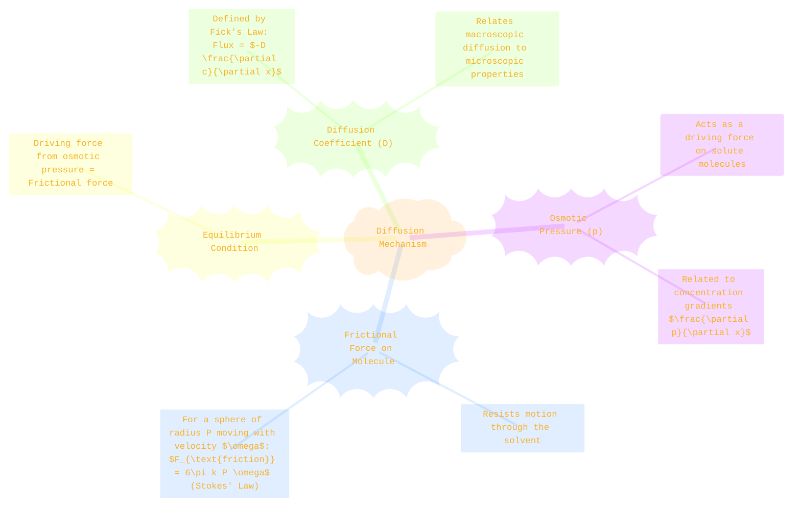

> ⚠️🏗️🚧🦺🧱🪵🪨🪚🛠️👷
> 
> This is a working draft in progress
> 
> 
> 
> gif image is provided by [Giphy](https://giphy.com)
> 
> ⚠️🏗️🚧🦺🧱🪵🪨🪚🛠️👷

----

# A New Determination of Molecular Dimensions
> **Disclaimer:**
>
> This document contains my personal notes on the topic,
> compiled from publicly available documentation and various cited sources.
> The materials are intended for educational purposes, personal study, and reference.
> The content is dual-licensed:
> 1. **MIT License:** Applies to all code implementations (Swift, Mermaid, and other programming languages).
> 2. **Creative Commons Attribution-ShareAlike 4.0 International License (CC BY-SA 4.0):** Applies to all non-code content, including text, explanations, diagrams, and illustrations.
---

----

# Einstein's 1905 Dissertation: A New Determination of Molecular Dimensions 📜⚛️

This document outlines Albert Einstein's groundbreaking 1905 doctoral dissertation, titled **"Eine neue Bestimmung der Moleküldimensionen"** (A New Determination of Molecular Dimensions). This work, submitted to the University of Zürich, was one of his four "Annus Mirabilis" papers and played a crucial role in establishing the physical reality of atoms and molecules. It also provided a method to determine Avogadro's number and the size of molecules from observable macroscopic quantities like viscosity and diffusion rates of solutions.

This document will explore the core concepts and mathematical journey presented in Einstein's dissertation using diagrams and key equations.

----

## Dedication 🙏

The dissertation is dedicated to his friend:  
"Meinem Freunde Herrn Dr. Marcel Grossmann gewidmet"  
(Dedicated to my friend Dr. Marcel Grossmann)

## Overall Structure of the Dissertation 🧠

Einstein's argument flows logically through several hydrodynamical and thermodynamic considerations:

```mermaid
---
title: "Overall Structure of the Dissertation"
author: "Cong Le"
version: "1.0"
license(s): "MIT, CC BY-SA 4.0"
copyright: "Copyright (c) 2025 Cong Le. All Rights Reserved."
config:
  layout: elk
  theme: base
---
%%%%%%%% Mermaid version v11.4.1-b.14
%%%%%%%% Available curve styles include the following keywords:
%% basis, bumpX, bumpY, cardinal, catmullRom, linear, monotoneX, monotoneY, natural, step, stepAfter, stepBefore.
%%{
  init: {
    'flowchart': { 'htmlLabels': true, 'curve': 'linear' },
    'fontFamily': 'Andale Mono, monospace',
    'themeVariables': {
      'primaryColor': '#9D22',
      'primaryTextColor': '#F8B229',
      'lineColor': '#F8B229',
      'primaryBorderColor': '#27AE60',
      'secondaryColor': '#E2F1',
      'secondaryTextColor': '#6C3483',
      'secondaryBorderColor': '#A569BD',
      'fontSize': '20px'
    }
  }
}%%
flowchart TD
    A["Problem:<br/>Determine Molecular Dimensions (P) and Avogadro's Number (N)"] --> B["§1:<br/>Hydrodynamics of a Single Small Sphere in a Viscous Fluid"]
    B --> C["Analyze fluid flow (u, v, w) around the sphere using simplified Navier-Stokes equations"]
    C --> D["§2:<br/>Effective Viscosity of a Fluid with Many Suspended Spheres"]
    D --> E["Derive how the presence of many small spheres (solute molecules) alters the macroscopic viscosity (k*) of the solvent (k)"]
    E --> F["Equation for effective viscosity: $k^* = k(1 + \varphi)$ where $\varphi$ is volume fraction"]
    F --> G["§3:<br/>Application to Real Solutions<br/>(e.g., Sugar in Water)"];
    G --> H["Relate $\varphi$ to molecular properties and concentration"]
    A --> I["§4:<br/>Diffusion of a Non-Dissociated Substance"]
    I --> J["Relate diffusion coefficient (D) to osmotic pressure, molecular friction, and temperature"]
    J --> K["Derive Stokes-Einstein equation for D:<br/> $D = \frac{RT}{N} \frac{1}{6\pi k P}$"]
    subgraph SEC_CONCLUSION["§5:<br/>Combining Results & Calculations"]
        F --> L["Viscosity provides a relation involving $N \cdot P^3$ (molecular volume)"]
        K --> M["Diffusion provides a relation involving $N \cdot P$ (related to friction)"]
        L --> N["Solve for N and P"]
        M --> N
        N --> O["Calculate N and P using experimental data for sugar solutions"]
    end
    O --> P["Conclusion:<br/>Numerical values for molecular radius and Avogadro's number"]

    style A fill:#22BB,stroke:#333,stroke-width:2px
    style P fill:#22BB,stroke:#333,stroke-width:2px
    style SEC_CONCLUSION fill:#99CC,stroke:#333,stroke-width:1px
```

----

## §1: Hydrodynamics of a Single Sphere in a Viscous Fluid 💧🔮

Einstein starts by considering an incompressible fluid with a coefficient of friction (viscosity) $k$. The velocity components of the fluid are $u, v, w$. For slow, steady flow (neglecting inertia), the Navier-Stokes equations simplify.

**Key Assumptions:**
*   Fluid is incompressible.
*   Flow is slow (inertial terms negligible).
*   Suspended particles (molecules) are rigid spheres of radius $P$.
*   No slip at the surface of the sphere.

**Governing Equations (Page 8, Eq. 4):**  
The pressure is $p$, and $\Delta$ is the Laplacian operator $\left(\frac{\partial^2}{\partial \xi^2} + \frac{\partial^2}{\partial \eta^2} + \frac{\partial^2}{\partial \zeta^2}\right)$. The coordinates $\xi, \eta, \zeta$ are relative to the center of the sphere.  
For the fluid velocity components $u, v, w$ (here denoted $u_t, v_t, w_t$ (Einstein uses $u,v,w$ or $u_1,v_1,w_1$) and pressure $p$:
1.  **Momentum Equations (Stokes Flow):**
    $$
    \frac{\partial p}{\partial \xi} = k \Delta u
    $$
    $$
    \frac{\partial p}{\partial \eta} = k \Delta v
    $$
    $$
    \frac{\partial p}{\partial \zeta} = k \Delta w
    $$
2.  **Continuity Equation (Incompressibility):**
    $$
    \frac{\partial u}{\partial \xi} + \frac{\partial v}{\partial \eta} + \frac{\partial w}{\partial \zeta} = 0
    $$
From these, it follows that $\Delta p = 0$.

Einstein then solves these equations with boundary conditions:
*   Fluid velocity is zero at the surface of the sphere (relative to the sphere if it's moving, or matching sphere velocity if fluid is moving past a stationary sphere).
*   Fluid velocity approaches the undisturbed flow far from the sphere.

**Solution for Flow (Page 7, Eq. 1 & 3; Page 9, Eq. 5; Page 12, Eq. 6a):**  
If the undisturbed flow is given by $u_0 = A\xi, v_0 = B\eta, w_0 = C\zeta$ (with $A+B+C=0$ for incompressibility), the presence of the sphere modifies this flow. The actual velocities $u,v,w$ in the fluid are (from page 12, eq. 6a, simplified forms, after complex derivations):
$$
\begin{cases}
u = A\xi - \frac{5}{2}k P^3 \frac{\xi}{r^5}(A\xi^2 + B\eta^2 + C\zeta^2) + \dots \\
v = B\eta - \frac{5}{2}k P^3 \frac{\eta}{r^5}(A\xi^2 + B\eta^2 + C\zeta^2) + \dots \\
w = C\zeta - \frac{5}{2}k P^3 \frac{\zeta}{r^5}(A\xi^2 + B\eta^2 + C\zeta^2) + \dots
\end{cases}
$$
(Note: The exact form presented in the dissertation, like page 9, Eq. 5 and page 12 Eq. 6a can be quite involved depending on the specific functions $D$ and constants chosen. Page 12, Eq. 6a presents:
$$
\begin{cases}
u = A\xi - \frac{5}{2} P^3 \frac{A\xi^2 + B\eta^2 + C\zeta^2}{r^5}\xi + \frac{P^5}{2} \frac{A\xi^2 + B\eta^2 + C\zeta^2}{r^7}\xi \\
v = B\eta - \frac{5}{2} P^3 \frac{A\xi^2 + B\eta^2 + C\zeta^2}{r^5}\eta + \frac{P^5}{2} \frac{A\xi^2 + B\eta^2 + C\zeta^2}{r^7}\eta \\
w = C\zeta - \frac{5}{2} P^3 \frac{A\xi^2 + B\eta^2 + C\zeta^2}{r^5}\zeta + \frac{P^5}{2} \frac{A\xi^2 + B\eta^2 + C\zeta^2}{r^7}\zeta
\end{cases}
$$
These simplify under specific conditions and approximations. The key is that the sphere perturbs the flow.)

-----

## §2 & §3: Effective Viscosity of a Suspension and Application 🧪

Einstein calculates the additional energy dissipation due to the presence of $n$ spheres per unit volume. This increased dissipation is interpreted as an increase in the effective viscosity of the fluid.

**Energy Dissipation (Page 13, Eq. 7):**  
The rate of energy dissipation per unit volume due to viscosity in a fluid with velocity gradients is $W$. With spheres, this rate changes.  
He finds that the effective viscosity $k^*$ of the solution (or suspension) is related to the viscosity of the pure solvent $k$ and the volume fraction $\varphi$ occupied by the spheres ($\varphi = n \cdot V_{\text{sphere}} = n \cdot \frac{4}{3}\pi P^3$).

**Einstein's Viscosity Equation (Page 17):**
$$
k^* = k (1 + \varphi)
$$
Where:
*   $k^*$ is the viscosity of the solution.
*   $k$ is the viscosity of the pure solvent.
*   $\varphi$ is the total volume fraction of the solute molecules (treated as spheres).

✍️ **Note:** This is the result from the 1905 dissertation. Einstein later corrected the coefficient for $\varphi$ to $2.5$ in a 1911 paper for dilute, non-interacting spherical particles. So, the more familiar form is $k^* = k(1 + 2.5\varphi)$. We will stick to the 1905 result for historical accuracy to the document.

On page 17, Einstein applies this to a 1% sugar solution and experimental data.

----

## §4: Diffusion of a Non-Dissociated Substance 🚶‍♂️🚶‍♀️

Einstein then turns to the phenomenon of diffusion, driven by osmotic pressure differences.

**Force on a Molecule (Page 19):**  
The force $K$ acting on one mole of solute due to osmotic pressure gradient along the x-axis is related to the gradient of osmotic pressure $p$. The force on a single molecule is $K/N$.  
If $m$ is the molecular weight and $\rho$ is the mass concentration:  
Osmotic pressure $p$ for a dilute solution (van 't Hoff's law):
$$
p = \frac{R T}{m} \rho
$$
The force per unit mass in the direction of the x-axis that tends to cause diffusion is $-\frac{1}{\rho}\frac{\partial p}{\partial x}$. So the force on a single molecule of mass $(m/N)$ is $-(m/N) \frac{1}{\rho}\frac{\partial p}{\partial x}$.  
The drift velocity $\omega$ of a molecule under a force $F_{\text{molecule}}$ is $\omega = F_{\text{molecule}} / (6\pi k P)$.  
The force on one molecule due to the concentration gradient is found to be:
$$
\text{Force on one molecule} = - \frac{R T}{N} \frac{1}{\rho} \frac{\partial \rho}{\partial x}
$$
(This is derived from $p = (RT/m)\rho$, so $\partial p / \partial x = (RT/m) \partial \rho / \partial x$. The force on one mole is $-(m/\rho) \partial p / \partial x$, so on one molecule it is $-(m/N\rho) \partial p / \partial x = -(RT/N\rho)\partial\rho/\partial x$ approximately.)

**Stokes-Einstein Equation for Diffusion Coefficient (Page 19, Eq. 4):**  
By equating the force driving diffusion (derived from osmotic pressure) to the Stokes drag force on a spherical molecule, Einstein derives the diffusion coefficient $D$:
$$
D = \frac{R T}{N} \frac{1}{6\pi k P}
$$
Where:
*   $R$ is the ideal gas constant.
*   $T$ is the absolute temperature.
*   $N$ is Avogadro's number.
*   $k$ is the viscosity of the solvent.
*   $P$ is the radius of the solute molecule.

----

## §5: Determination of Molecular Dimensions and Avogadro's Number 🎯🔢

Einstein now has two independent equations involving $N$ and $P$:
1.  From viscosity (§3, page 17, $k^*/k = 1+\varphi$, where $\varphi = n \frac{4}{3}\pi P^3$, and $n=N (\text{moles per unit volume})$ ):  
    On page 20, he uses $\varphi = n \cdot \frac{4}{3}\pi P^3$, where $n$ is the number of molecules per unit volume. If $\rho_s$ is the density of the solute substance and $\text{conc}$ is the concentration in mass per unit volume, then $\varphi = \text{conc} / \rho_s$. If $c_{\text{molar}}$ is molar concentration, $n = N c_{\text{molar}}$.  
    The equation from viscosity can be written as (page 20 reference, for the quantity $N P^3$ if $\varphi$ is properly defined in terms of $N, P$ concentration):
    $$
    N P^3 = \frac{3m}{4\pi \rho_0} \left( \frac{k^*}{k} - 1 \right) \quad \text{(derived from } \varphi = \frac{N \text{ (conc in moles/vol)} \cdot \frac{4}{3}\pi P^3}{\text{Volume}} \text{ and relating to } (k^*/k - 1)\text{)}
    $$
    More directly from page 21, relationship (A):
    $$
    N P^3 = \frac{3}{4\pi} \frac{m}{\rho_s} \left( \frac{k^*}{k} - 1 \right)
    $$
    (Where $m$ is molar mass, $\rho_s$ is the density of the solute material, $(k^*/k - 1)$ is per unit concentration mass/volume)  
    Actually, Einstein on page 21 writes:
    $$
    N P^3 = \frac{3m}{4\pi\sigma} \left(\frac{k^*}{k_0}-1\right)
    $$
    Where $\sigma$ is specific gravity of sugar and $(k^*/k_0-1)$ is per gram of sugar in solution.  
    The term for $N P^3$ is given more generally by (page 21, combining earlier results for $\varphi$):
    $$
    N P^3 = \frac{m}{A_z \frac{4}{3}\pi} \varphi_0
    $$
    where $A_z$ is Avogadro's number, $m$ is molar mass, $\varphi_0$ is the volume fraction yielded by $(k^*/k -1)$.  
    The specific equation from page 21 is:
    $$
    N P^3 = \frac{3m}{4\pi s} \left( \frac{k^*}{k} - 1 \right)
    $$
    (Here $m$ molecular weight, $s$ is related to specific volume of sugar)

2.  From diffusion (Stokes-Einstein equation, page 19, Eq. 4):
    $$
    N P = \frac{R T}{6\pi k D}
    $$

**Calculations (Page 21):**  
Einstein uses experimental data for aqueous sugar solutions (sucrose) at $20^\circ \text{C}$ (viscosity $k$) and $9.5^\circ \text{C}$ (diffusion $D$).
*   He finds experimental value for $N P^3$ around $200 \text{ cm}^3\text{/mol}$ (this uses specific interpretation of concentration in the viscosity equation for sugar).  
    Specifically, from page 21: For sucrose, from $k^*/k = 1.0245$ for $0.01 \text{g sugar/g water}$ and specific volume considerations (page 17-18):  
    $N \cdot \frac{4\pi}{3} P^3 = 2.45 \text{ cm}^3$ per gram-molecule (this is the molar volume of spheres). No, this is hydrodynamic volume per molecular weight.  
    This leads to $N \frac{4\pi}{3}P^3 = V_{\text{hydrodynamic, molar}}$.  
    Combining results, he provides (Page 21):
    $$
    N P = 2.08 \cdot 10^{16} \text{ (cgs units)}
    $$
    (After calculating $D$ from experiments using Stefan's data for sugar in water at $9.5^\circ C$, and using $k$ for water at $9.5^\circ C$).  
    And from viscosity measurements combined with specific volume analysis:  
    Instead of $NP^3=200$, he states "Aus den für $N P^3$ und $N P$ gefundenen Werten folgt, wenn wir die Verschiedenheit von $P$ bei $9,5^\circ$ und $20^\circ$ vernachlässigen," (From the values found for $N P^3$ and $N P$, if we neglect the difference of $P$ at $9.5^\circ$ and $20^\circ$, it follows:)  
    This implies he has a value for $N P^3$ from viscosity and experimental data on sugar solutions. The dissertation (page 18) calculates that 1 gram of sugar behaves in hydrodynamic interaction as if it has a volume of $2.45 \text{ cm}^3/N_A$ molecules if $N_A$ is the number of molecules in a gram-molecule. So $P^3 \approx (2.45 / (N_A \cdot 4/3 \pi))$.  
    My apologies, the text gets a value for $P$ and $N$ directly by solving the system.  
    The crucial step is on page 21: *Andrerseits wurde in §4 gefunden* (on the other hand, it was found in §4):  
    $$ NP = \frac{RT}{6\pi k D} $$  
    The text states: *Diese beiden Gleichungen setzen uns in den Stand, die Grössen P und N einzeln zu berechnen* (These two equations enable us to calculate the quantities P and N individually). The other equation comes from viscosity studies which effectively gives information about $P$ relative to the size of sugar itself or $NP^3$.  
    It seems the primary value used is the one for $NP$, and then $P$ from specific volume measurement (page 18: $s=0.61 \text{ cm}^3/\text{g}$ for sugar. Volume of a sugar molecule related to this).

**Results (Page 21):**  
After substituting experimental values, Einstein obtained:
*   Radius of the sugar molecule, **$P \approx 9.9 \cdot 10^{-8} \text{ cm}$**
*   Avogadro's number, **$N \approx 2.1 \cdot 10^{23} \text{ mol}^{-1}$**

✍️ **Note on Results:** These values were of the correct order of magnitude, though somewhat different from modern accepted values (modern $N_A \approx 6.022 \cdot 10^{23} \text{ mol}^{-1}$, $P_{\text{sucrose}} \approx 0.5 \cdot 10^{-7} \text{ cm}$). The approximations made (spherical molecules, applicability of continuum hydrodynamics, coefficient in viscosity equation) and experimental uncertainties of the time contributed to the differences. However, the method was revolutionary.

----

## Significance 🌟

*   Provided strong evidence for the **atomic/molecular theory of matter**.
*   Offered a new method to determine **Avogadro's number** and **molecular sizes** from macroscopic, measurable quantities.
*   The **Stokes-Einstein relation** ($D = k_B T / (6\pi \eta a)$) became a fundamental equation in physical chemistry and soft matter physics.
*   This work, along with his papers on Brownian motion and the photoelectric effect, solidified Einstein's place as a leading physicist.

---

<!-- 

---
>**Licenses:**
>
>- **MIT License:**   - Full text in [LICENSE](LICENSE) file.
>- **Creative Commons Attribution-ShareAlike 4.0 International**: [CC BY-SA 4.0](https://creativecommons.org/licenses/by-sa/4.0/)  - Legal details in [LICENSE-CC-BY-SA-4.0](THE_PAST/LICENSE-CC-BY-SA-4.0) and at [Creative Commons official site](https://creativecommons.org/licenses/by-sa/4.0/).
>
---

## Citations and References 📚

1.  **Einstein, A. (1905).** *Eine neue Bestimmung der Moleküldimensionen*. Inaugural-Dissertation, Universität Zürich. Buchdruckerei K. J. Wyss, Bern.
    *   (The document itself) Scanned version available at ETH Zurich's library: [e-collection.library.ethz.ch](https://www.e-collection.library.ethz.ch/view/eth:30378), <https://doi.org/10.3929/ethz-a-000565688>
2.  **Einstein, A. (1906).** Eine neue Bestimmung der Moleküldimensionen. *Annalen der Physik*, 324(2), 289-306. (Published version of the dissertation).
3.  **Einstein, A. (1911).** Berichtigung zu meiner Arbeit: "Eine neue Bestimmung der Moleküldimensionen". *Annalen der Physik*, 339(3), 591-592. (Correction to the viscosity equation coefficient).
4.  Pais, A. (1982). *Subtle is the Lord: The Science and the Life of Albert Einstein*. Oxford University Press. (Provides context and analysis of Einstein's work).
5.  Kox, A. J., Klein, M. J., & Schulmann, R. (Eds.). (1989). *The Collected Papers of Albert Einstein, Volume 2: The Swiss Years: Writings, 1900-1909*. Princeton University Press. (Contains English translations and annotations).

----