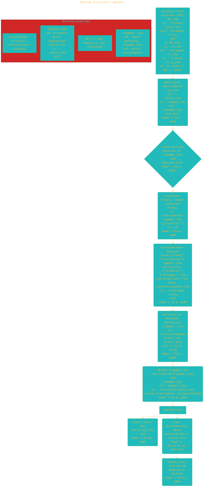
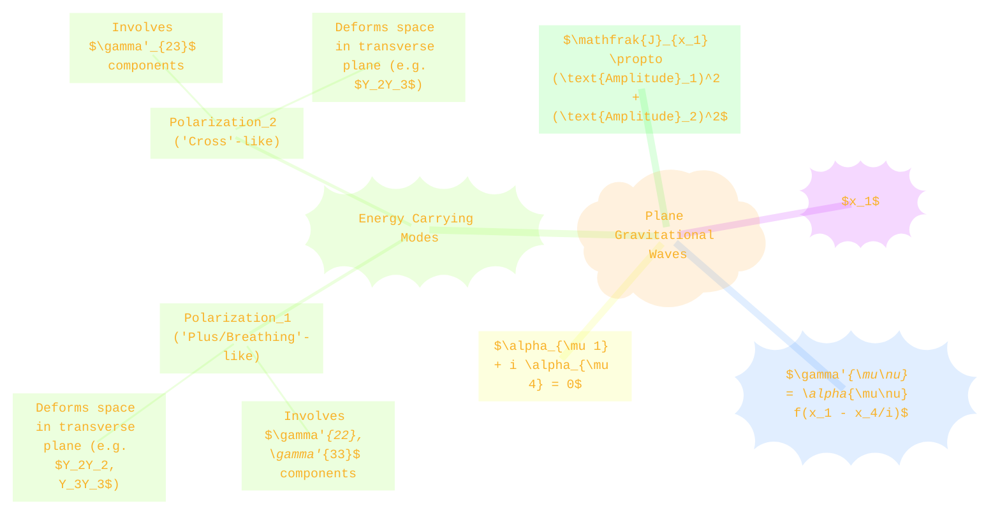

> ⚠️🏗️🚧🦺🧱🪵🪨🪚🛠️👷
> 
> This is a working draft in progress
> 
> 
> 
> gif image is provided by [Giphy](https://giphy.com)
> 
> ⚠️🏗️🚧🦺🧱🪵🪨🪚🛠️👷

----

# Näherungsweise Integration der Feldgleichungen der Gravitation
> **Disclaimer:**
>
> This document contains my personal notes on the topic,
> compiled from publicly available documentation and various cited sources.
> The materials are intended for educational purposes, personal study, and reference.
> The content is dual-licensed:
> 1. **MIT License:** Applies to all code implementations (Swift, Mermaid, and other programming languages).
> 2. **Creative Commons Attribution-ShareAlike 4.0 International License (CC BY-SA 4.0):** Applies to all non-code content, including text, explanations, diagrams, and illustrations.
---

Here's an overview of Albert Einstein's 1916 paper, "Näherungsweise Integration der Feldgleichungen der Gravitation" (Approximate Integration of the Field Equations of Gravitation), presented with explanations, diagrams, and relevant equations.

📜 **Citation:** Einstein, A. (1916). Näherungsweise Integration der Feldgleichungen der Gravitation. *Sitzungsberichte der Königlich Preussischen Akademie der Wissenschaften (Berlin)*, 688-696.

----

# 🌍 Overview of Einstein's Approach

Einstein's paper details an approximation method for solving the gravitational field equations in the weak-field limit. This allows for the study of phenomena like gravitational waves and the gravitational field of a point mass. The core idea is to treat the metric tensor $g_{\mu\nu}$ as a small perturbation $\gamma_{\mu\nu}$ from a flat (Euclidean, due to his use of imaginary time) background.

## Key Steps & Concepts Flowchart 📊

----

# 🔢 Core Mathematical Framework

## 1. Weak Field Approximation and Metric
Einstein starts by defining the metric tensor $g_{\mu\nu}$ as a perturbation $\gamma_{\mu\nu}$ from a background metric, which is Euclidean ($-\delta_{\mu\nu}$) due to the use of an imaginary time coordinate $x_4 = it$.

$$
g_{\mu\nu} = -\delta_{\mu\nu} + \gamma_{\mu\nu} \quad \text{(Paper's Eq. 1, p.688)}
$$

Here, $\delta_{\mu\nu}$ is the Kronecker delta, and $\gamma_{\mu\nu}$ are assumed to be small quantities such that their squares and products can be neglected in the first approximation.

## 2. Linearized Field Equations and Gauge Choice
The Einstein Field Equations (EFE) are linearized under this approximation. The paper uses a form:

$$
R_{\mu\nu} + S_{\mu\nu} = -\varkappa \left( T_{\mu\nu} - \frac{1}{2} g_{\mu\nu} T \right) \quad \text{(Paper's Eq. 1, p.689)}
$$

After linearization and neglecting terms, a complex equation for $\gamma_{\mu\nu}$ emerges (Paper's Eq. 2, p.689).  
To simplify this, a quantity $\gamma'_{\mu\nu}$ is introduced, related to $\gamma_{\mu\nu}$ (see below), along with a gauge condition analogous to the Lorenz gauge in electromagnetism:

$$
\sum_{\nu} \frac{\partial \gamma'_{\mu\nu}}{\partial x_\nu} = 0 \quad \text{(Paper's Eq. 4, p.689)}
$$

## 3. The Wave Equation
This choice leads to a simplified wave equation for a potential $\gamma'_{\mu\nu}$:

$$
\sum_{\alpha} \frac{\partial^2 \gamma'_{\mu\nu}}{\partial x_\alpha^2} = 2\varkappa T_{\mu\nu} \quad \text{(Paper's Eq. 6, p.690)}
$$

This is effectively $\Box \gamma'_{\mu\nu} = -2\varkappa T_{\mu\nu}$ (with a sign convention for $\Box$ and $T_{\mu\nu}$ related to source).  
The potential $\gamma_{\mu\nu}$ appearing in the metric $g_{\mu\nu}$ is related to $\gamma'_{\mu\nu}$ by:

$$
\gamma_{\mu\nu} = \gamma'_{\mu\nu} - \frac{1}{2}\delta_{\mu\nu}\sum_\sigma\gamma'_{\sigma\sigma} \quad \text{(Paper's Eq. 8, p.690)}
$$

(This is the definition of a trace-reversed potential if $\gamma'_{\mu\nu}$ is the "barred" potential commonly used).

## 4. Solution using Retarded Potentials
The wave equation (Eq. 6, p.690) is solved using retarded potentials, similar to electromagnetism:

$$
\gamma'_{\mu\nu}(x_1, x_2, x_3, x_4) = -\frac{\varkappa}{2\pi} \int \frac{T_{\mu\nu}(x'_1, x'_2, x'_3, x_4-r)}{r} dV_0 \quad \text{(Paper's Eq. 9, p.690)}
$$

where $r = \sqrt{(x_1-x'_1)^2 + (x_2-x'_2)^2 + (x_3-x'_3)^2}$ and $x_4$ plays the role of time argument.

---

# ⭐ Application 1: Gravitational Field of a Point Mass

For a point mass $M$ at rest, the energy-momentum tensor $T_{\mu\nu}$ has only $T_{44}$ as non-zero (related to mass density $\rho$, $T_{44}=-\rho$ in the paper's initial setup, though this specific sign for $\rho$ might be nuanced by later context for energy).  
This leads to $\gamma'_{\mu\nu}$ being non-zero only for $\gamma'_{44}$:

$$
\gamma'_{44} = -\frac{\varkappa M}{2\pi r} \quad \text{(Paper's Eq. 13, p.691)}
$$

(Note: The sign of $\gamma'_{44}$ has to be chosen carefully to match the resulting metric with standard Schwarzschild weak-field limit, potentially implying $T_{44}=+\rho$ in the integral, or $\varkappa \to -\varkappa$ for mass. Einstein's (14) implies derived $\gamma_{ii} = -\frac{\varkappa M}{4\pi r}$ and $\gamma_{44} = +\frac{\varkappa M}{4\pi r}$ which reconstruct (14) and require $\gamma'_{44} = +\frac{\varkappa M}{2\pi r}$).

The metric components $g_{\mu\nu} = -\delta_{\mu\nu} + \gamma_{\mu\nu}$ are then found (Paper's Eq. 14, p.692):

$$
\begin{pmatrix}
-\left(1+\frac{\varkappa M}{4\pi r}\right) & 0 & 0 & 0 \\
0 & -\left(1+\frac{\varkappa M}{4\pi r}\right) & 0 & 0 \\
0 & 0 & -\left(1+\frac{\varkappa M}{4\pi r}\right) & 0 \\
0 & 0 & 0 & -\left(1-\frac{\varkappa M}{4\pi r}\right)
\end{pmatrix}
$$

This matches the weak-field limit of the Schwarzschild solution when $\frac{\varkappa}{4\pi} = \frac{2G}{c^2}$ (with $c=1$).

---

# 🌊 Application 2: Plane Gravitational Waves

For plane waves propagating in a vacuum ($T_{\mu\nu}=0$), so $\sum_\alpha \frac{\partial^2 \gamma'_{\mu\nu}}{\partial x_\alpha^2} = 0$.  
A wave propagating in the $x_1$-direction is:

$$
\gamma'_{\mu\nu} = \alpha_{\mu\nu} f(x_1 - x_4/i)
$$

(Paper's Eq. 15, p.692), where $f$ is an arbitrary function, and $x_4/i$ is the real time $t$. The term $x_1 - x_4/i$ means $x_1 - ct$ with $c=1$.  
The gauge condition (Eq. 4, p.689) imposes constraints on the constant amplitudes $\alpha_{\mu\nu}$:

$$
\alpha_{\mu 1} + i \alpha_{\mu 4} = 0 \quad \text{for } \mu=1,2,3,4 \quad \text{(Paper's Eq. 16, p.692)}
$$

This reduces the number of independent components of $\alpha_{\mu\nu}$. Einstein identifies 6 "types" of waves (a-f in Eq. 17, p.692), but only three combinations of these (related to types d, e, f) transport energy. These physically significant components are purely spatial in the transverse plane (e.g., $\alpha_{22}, \alpha_{33}, \alpha_{23}$).

## Energy Transport by Plane Waves ⚡
The energy-momentum pseudotensor $t_{\mu\nu}$ for the gravitational field is given by (simplified for chosen gauge, Eq. 11, p.691):

$$
t_{\mu\nu} = \frac{1}{4\varkappa} \left[ \sum_{\alpha,\beta} \frac{\partial \gamma'_{\alpha\beta}}{\partial x_\mu} \frac{\partial \gamma'_{\alpha\beta}}{\partial x_\nu} - \frac{1}{2} \delta_{\mu\nu} \sum_{\alpha,\beta,\sigma} \left( \frac{\partial \gamma'_{\alpha\beta}}{\partial x_\sigma} \right)^2 \right]
$$

The energy flux in the $x_1$-direction is $\mathfrak{J}_{x_1} = \frac{1}{i} t_{41}$. After calculation, for a general superposition of energy-carrying waves:

$$
\mathfrak{J}_{x_1} = \frac{1}{4\varkappa} \left[ \left(\frac{\partial\gamma'_{Y_2 Y_3}}{\partial l}\right)^2 + \frac{1}{2} \left( \left(\frac{\partial\gamma'_{Y_2 Y_2}}{\partial l}\right)^2 + \left(\frac{\partial\gamma'_{Y_3 Y_3}}{\partial l}\right)^2 \right) \right]
$$

(This form is analogous to Eq. (20) on p.695, representing contributions from "cross" ($\gamma'_{Y_2Y_3}$) and "plus/breathing" ($\gamma'_{Y_2Y_2}, \gamma'_{Y_3Y_3}$) polarizations. $\partial/\partial l$ denotes differentiation with respect to the wave's phase $x_1-x_4/i$. The exact coefficients in Einstein's Eq. 18 on p.693 are slightly different but represent a sum of squares of wave amplitudes).

----

# 💡 Application 3: Energy Loss by Gravitational Radiation

Einstein then calculates the energy radiated by a non-relativistic system of moving masses by considering the far field. The potentials $\gamma'_{\mu\nu}$ are related to the time derivatives of the source's quadrupole moment.  
For instance, for $\gamma'_{22}$:

$$
\gamma'_{22} \approx -\frac{\varkappa}{4\pi R} \frac{\partial^2}{\partial (x_4/i)^2} \int T_{44} x_2^2 dV_0 \approx -\frac{\varkappa}{2\pi R} \frac{1}{2c^2} \frac{\partial^2 J_{22}}{\partial t^2} \quad \text{(cf. Paper's Eq. 23, p.695)}
$$

where $J_{22} = \int \rho x_2^2 dV_0$ is a component of the mass quadrupole moment tensor (here $t$ is real time, and $T_{44}$ is related to $\rho$).  
The total energy radiated per unit time, averaged over all directions (luminosity $A$), is famously given by the quadrupole formula:

$$
A = \frac{\varkappa}{24\pi} \sum_{\alpha,\beta} \left( \frac{\partial^3 J_{\alpha\beta}}{\partial (x_4/i)^3} \right)^2 \quad \text{ (Paper's Eq. 21, p.695)}
$$

Interpreted with $c$ and $G$ where $\varkappa = 8\pi G/c^4$:

$$
A = \frac{G}{3c^5} \sum_{\alpha,\beta} \left( \frac{d^3 J_{\alpha\beta}}{dt^3} \right)^2
$$

(The factor might differ slightly based on definition of $J_{\alpha\beta}$ and if it's trace-free or not; Einstein's sum is over all $\alpha, \beta = 1,2,3$).

----

# 🤔 A Note on Coordinates and Notation

*   **Imaginary Time ($x_4 = it$):** Einstein uses $x_4=it$ to work with a Euclidean background metric ($-\delta_{\mu\nu}$). Physical quantities in real-time often involve factors of $i$. For example, energy flux $\mathfrak{J}_{x_1} = \frac{1}{i} t_{41}$.
*   **$\varkappa$:** This is Einstein's gravitational constant, related to Newton's constant $G$ by $\varkappa = \frac{8\pi G}{c^4}$ (though $c=1$ is often used in the paper). Einstein gives $\varkappa \approx 1.87 \times 10^{-27}$ in cgs units using $x_4$ as cm (i.e. $c=1$).
*   $\gamma_{\mu\nu}$ vs $\gamma'_{\mu\nu}$: $\gamma'_{\mu\nu}$ is the potential that directly satisfies the simple wave equation sourced by $T_{\mu\nu}$. $\gamma_{\mu\nu}$ is the actual perturbation to $g_{\mu\nu} = -\delta_{\mu\nu} + \gamma_{\mu\nu}$ and is related to $\gamma'_{\mu\nu}$ via a trace term.

---

# ✅ Conclusion

This seminal paper laid the groundwork for understanding gravitational phenomena in the weak-field limit. It demonstrated how the field equations can be approximated to yield wave equations, predicted the existence of gravitational waves propagating at the speed of light, described their properties (polarizations), and derived the famous quadrupole formula for the energy emitted by astrophysical systems due to gravitational radiation. This work was a crucial step towards the later direct detection of gravitational waves. ✨

---

<!-- 

---
>**Licenses:**
>
>- **MIT License:**   - Full text in [LICENSE](LICENSE) file.
>- **Creative Commons Attribution-ShareAlike 4.0 International**: [CC BY-SA 4.0](https://creativecommons.org/licenses/by-sa/4.0/)  - Legal details in [LICENSE-CC-BY-SA-4.0](THE_PAST/LICENSE-CC-BY-SA-4.0) and at [Creative Commons official site](https://creativecommons.org/licenses/by-sa/4.0/).
>
---

**References:**
*   Einstein, A. (1916). Näherungsweise Integration der Feldgleichungen der Gravitation. *Sitzungsberichte der Königlich Preussischen Akademie der Wissenschaften (Berlin)*, 688-696.
*    Schutz, B. (2009). *A First Course in General Relativity*. Cambridge University Press. (For context on weak fields and gravitational waves).
*   Misner, C. W., Thorne, K. S., & Wheeler, J. A. (1973). *Gravitation*. W. H. Freeman. (Comprehensive textbook, often referred to as MTW).

