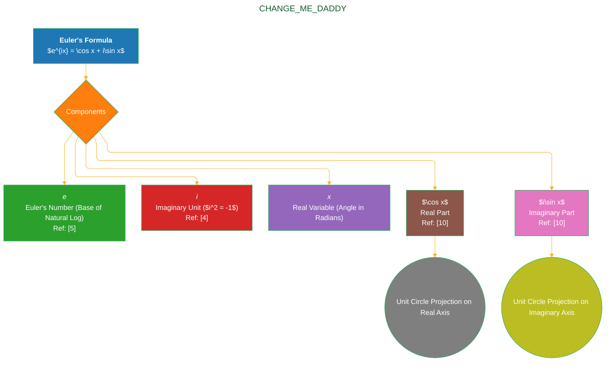
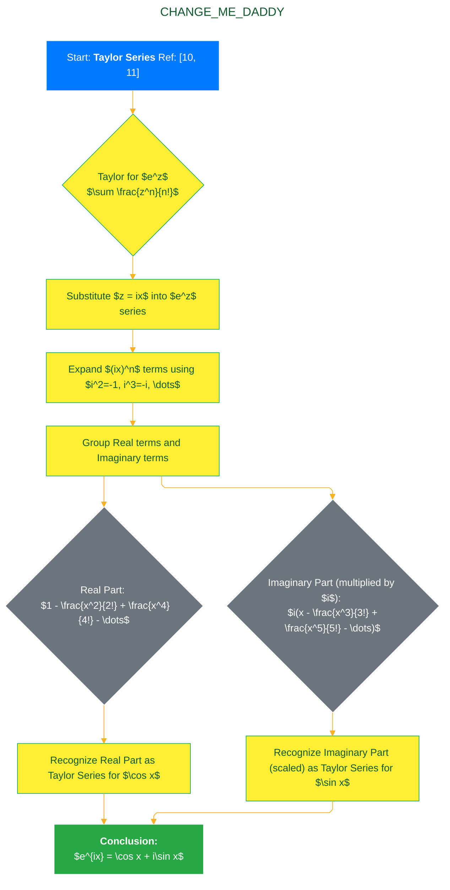
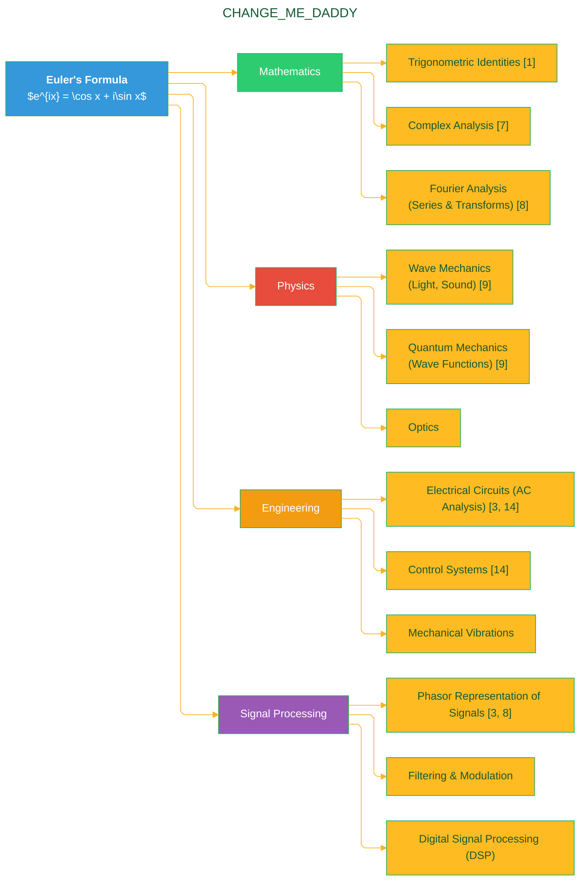

> ⚠️🏗️🚧🦺🧱🪵🪨🪚🛠️👷
> 
> This is a working draft in progress
> 
> 
> 
> ⚠️🏗️🚧🦺🧱🪵🪨🪚🛠️👷


----


# Euler Formula Explained
> **Disclaimer:**
>
> This document contains my personal notes on the topic,
> compiled from publicly available documentation and various cited sources.
> The materials are intended for educational purposes, personal study, and reference.
> The content is dual-licensed:
> 1. **MIT License:** Applies to all code implementations (Swift, Mermaid, and other programming languages).
> 2. **Creative Commons Attribution-ShareAlike 4.0 International License (CC BY-SA 4.0):** Applies to all non-code content, including text, explanations, diagrams, and illustrations.
---


----

## Understanding Euler's Formula: The Bridge Between Exponentials and Trigonometry

### 1. Introduction: What is Euler's Formula?

Euler's formula is a cornerstone of mathematics, physics, and engineering, celebrated for its profound beauty and utility. It establishes a fundamental relationship between the complex exponential function $e^{ix}$ and the trigonometric functions $\sin(x)$ and $\cos(x)$. This elegant equation, $e^{ix} = \cos x + i\sin x$, provides a powerful way to view and manipulate complex numbers and trigonometric expressions, effectively bridging the worlds of algebra, geometry, and calculus [1].

Its discovery is attributed to the Swiss mathematician Leonhard Euler in the 18th century [2]. The formula is not just a mathematical curiosity; it offers deep insights into the nature of numbers and functions and serves as a critical tool in analyzing periodic phenomena, waves, and oscillations [3].

```mermaid
%%{
  init: {
    'theme': 'dark',
    'fontFamily': 'Arial',
    'fontSize': 14
  }
}%%
mindmap
  root((Euler's Formula: An Overview))
    Definition
      :Relationship between complex exponential and trigonometry;
      :$e^{ix} = \cos x + i\sin x$ [1];
    Key Components
      :Imaginary Unit (i) [4];
      :Euler's Number (e) [5];
      :Real variable (x - angle);
      :Cosine function;
      :Sine function;
    Significance
      :Connects five fundamental mathematical constants (Euler's Identity special case) [6];
      :Simplifies trigonometric manipulations;
      :Foundation for complex analysis [7];
      :Essential in signal processing (Phasors) [3];
      :Crucial for Fourier Analysis [8];
    Applications
      :Mathematics;
      :Physics (Quantum Mechanics, Waves) [9];
      :Engineering (Electrical Circuits, Control Systems) [3];
      :Signal Processing;
```

---

### 2. The Mathematical Definition of Euler's Formula

At its heart, Euler's formula is stated as:

$$
e^{ix} = \cos x + i\sin x \quad [1, 2]
$$

Where:

*   **$e$** is [Euler's number](https://en.wikipedia.org/wiki/E_(mathematical_constant)), the base of the natural logarithm (approximately 2.71828) [5]. This constant is fundamental in calculus and many areas of science.
*   **$i$** is the [imaginary unit](https://en.wikipedia.org/wiki/Imaginary_unit), satisfying the equation $i^2 = -1$ [4]. It is the basis of complex numbers.
*   **$x$** is a real number, typically representing an angle in radians.
*   **$\cos x$** and **$\sin x$** are the standard trigonometric functions cosine and sine, respectively, defined, for instance, via the unit circle or Taylor series expansions [10].

This formula shows that the complex exponential function $e^{ix}$ can be expressed as a sum of a real part ($\cos x$) and an imaginary part ($i\sin x$). Geometrically, this traces a unit circle in the complex plane as $x$ varies [7].



---

### 3. Understanding the Components

To fully appreciate Euler's formula, let's briefly review its individual components.

#### 3.1 Complex Numbers and the Imaginary Unit ($i$)

A complex number is a number of the form $z = a + bi$, where $a$ and $b$ are real numbers, and $i$ is the imaginary unit. The imaginary unit $i$ is defined by the property $i^2 = -1$ [4]. Complex numbers can be visualized on a 2D plane called the **complex plane** (also known as the Argand diagram), where the horizontal axis represents the real part ($a$) and the vertical axis represents the imaginary part ($b$) [7].

```mermaid
%%{
  init: {
    'theme': 'dark',
    'fontFamily': 'Arial',
    'fontSize': 14
  }
}%%
xyChart
    title "The Complex Plane (Argand Diagram) Ref: [7]"
    x-axis "Real Axis (Re)" -5 --> 5
    y-axis "Imaginary Axis (Im)" -5 --> 5
    line "Point z = a + bi" [[3, 4]]
    bar "Origin" [[0,0]]
    note "Point (3, 4) represents z = 3 + 4i" @ 3,4
```

#### 3.2 The Exponential Function ($e^x$)

The exponential function $f(x) = e^x$, where $e$ is Euler's number, is fundamental in mathematics. It is its own derivative ($\frac{d}{dx}e^x = e^x$), which leads to its unique properties of growth and its appearance in solutions to many differential equations [10, p. 448]. When the exponent is imaginary, as in $e^{ix}$, Euler's formula reveals its periodic nature.

#### 3.3 Trigonometric Functions ($\cos x, \sin x$)

The cosine and sine functions are typically introduced using right-angled triangles but are more generally defined using the **unit circle** (a circle with radius 1 centered at the origin). For any point $(a,b)$ on the unit circle, if $x$ is the angle (in radians) measured counter-clockwise from the positive real axis to the line segment connecting the origin to $(a,b)$, then $\cos x = a$ and $\sin x = b$ [10, Ch. 6].

```mermaid
---
title: "CHANGE_ME_DADDY"
author: "Cong Le"
version: "1.0"
license(s): "MIT, CC BY-SA 4.0"
copyright: "Copyright (c) 2025 Cong Le. All Rights Reserved."
config:
  layout: elk
  theme: base
---
%%%%%%%% Mermaid version v11.4.1-b.14
%%%%%%%% Available curve styles include the following keywords:
%% basis, bumpX, bumpY, cardinal, catmullRom, linear, monotoneX, monotoneY, natural, step, stepAfter, stepBefore.
%%{
  init: {
    'securityLevel': 'loose',
    'flowchart': { 'htmlLabels': true, 'curve': 'linear' },
    'fontFamily': 'Comic Sans MS, cursive, sans-serif',
    'themeVariables': {
      'primaryColor': '#F225E3',
      'primaryTextColor': '#145A32',
      'lineColor': '#F8B229',
      'primaryBorderColor': '#27AE60',
      'secondaryColor': '#EBDEF0',
      'secondaryTextColor': '#6C3483',
      'secondaryBorderColor': '#A569BD',
      'fontSize': '15px'
    }
  }
}%%
flowchart LR
    subgraph Unit_Circle_Representation["Unit_Circle_Representation<br/>Ref: [10]"]
        A["Origin <br/>(0,0)"] --> B("Point P on Unit Circle")
        B -- "Radius = 1" --> A
        A -- "Angle x<br/>(radians)" --> C{"Angle"}
        B --> X_Coord["x-coordinate = cos(x)"]
        B --> Y_Coord["y-coordinate = sin(x)"]
        P_Rep["P = (cos x, sin x)"]
        X_Coord --> P_Rep
        Y_Coord --> P_Rep
    end
    style Unit_Circle_Representation fill:#222, stroke:#fff
```



*Explanation of Diagram: The diagram shows how for a point P on the unit circle, its x-coordinate is $\cos(x)$ and y-coordinate is $\sin(x)$, where $x$ is the angle from the positive real axis.*

---

### 4. Visualizing Euler's Formula on the Complex Plane

Euler's formula $e^{ix} = \cos x + i\sin x$ beautifully describes a point on the unit circle in the complex plane [7].

*   The real part of $e^{ix}$ is $\cos x$.
*   The imaginary part of $e^{ix}$ is $\sin x$.

As $x$ (the angle in radians) varies:

*   $e^{i0} = \cos 0 + i\sin 0 = 1 + 0i = 1$
*   $e^{i\pi/2} = \cos(\pi/2) + i\sin(\pi/2) = 0 + 1i = i$
*   $e^{i\pi} = \cos \pi + i\sin \pi = -1 + 0i = -1$ (This leads to Euler's Identity)
*   $e^{i3\pi/2} = \cos(3\pi/2) + i\sin(3\pi/2) = 0 - 1i = -i$
*   $e^{i2\pi} = \cos(2\pi) + i\sin(2\pi) = 1 + 0i = 1$

The term $e^{ix}$ can be thought of as a vector of length 1 in the complex plane, starting from the origin and pointing to the coordinates $(\cos x, \sin x)$. Increasing $x$ rotates this vector counter-clockwise around the origin. This interpretation is crucial in understanding phasors in physics and engineering [3].

```mermaid
%%{
  init: {
    'theme': 'dark',
    'fontFamily': 'Arial',
    'fontSize': 14,
    'quadrantChart': {
        'chartHeight': 400,
        'chartWidth': 400,
        'titlePadding': 10,
        'xAxisLabel': 'Real Axis (cos x)',
        'yAxisLabel': 'Imaginary Axis (sin x)',
        'quadrantInternalPadding': 10,
        'quadrantLabelFontSize': 16,
        'quadrantTextTopPadding': 5,
        'quadrant1Text': 'Quadrant I',
        'quadrant2Text': 'Quadrant II',
        'quadrant3Text': 'Quadrant III',
        'quadrant4Text': 'Quadrant IV',
         'pointRadius': 5,
         'pointTextPadding': 7
    }
  }
}%%
quadrantChart
    title "Euler's Formula: e^{ix} on the Unit Circle (Ref: [7])"
    x-axis -1.2 --> 1.2
    y-axis -1.2 --> 1.2
    quadrant-1 Unit Circle Path
    quadrant-2 Unit Circle Path
    quadrant-3 Unit Circle Path
    quadrant-4 Unit Circle Path
    points
        "e^{ix} (x ≈ π/4)": [0.707, 0.707]
        "x (Angle)": [0,0]
    x-axis --> "cos x"
    y-axis --> "sin x"
    note "Vector from origin to (cos x, sin x)<br>Length = 1" @ 0.707, 0.707
    path "Vector for e^{ix}"
      M 0 0
      L 0.707 0.707
```

*Diagram Interpretation: This diagram shows $e^{ix}$ as a point on the unit circle. For an angle $x$ (e.g., $\pi/4$), the coordinates are $(\cos x, \sin x)$. The dashed lines show the path of the unit circle. The arrow represents the vector $e^{ix}$.*

---

### 5. Derivations of Euler's Formula (Brief Overview)

There are several ways to derive Euler's formula. The most common and perhaps most intuitive method involves Taylor series expansions [2, 11].

#### 5.1 Taylor Series Expansion Method

The Taylor series (Maclaurin series, centered at 0) for $e^z$, $\cos x$, and $\sin x$ are well-known results from calculus [10, Ch. 11]:

$$
e^z = 1 + z + \frac{z^2}{2!} + \frac{z^3}{3!} + \frac{z^4}{4!} + \dots = \sum_{n=0}^{\infty} \frac{z^n}{n!}
$$

$$
\cos x = 1 - \frac{x^2}{2!} + \frac{x^4}{4!} - \frac{x^6}{6!} + \dots = \sum_{n=0}^{\infty} (-1)^n \frac{x^{2n}}{(2n)!}
$$

$$
\sin x = x - \frac{x^3}{3!} + \frac{x^5}{5!} - \frac{x^7}{7!} + \dots = \sum_{n=0}^{\infty} (-1)^n \frac{x^{2n+1}}{(2n+1)!}
$$

Substituting $z = ix$ into the series for $e^z$:

$$
e^{ix} = 1 + (ix) + \frac{(ix)^2}{2!} + \frac{(ix)^3}{3!} + \frac{(ix)^4}{4!} + \frac{(ix)^5}{5!} + \dots
$$

Using $i^2 = -1, i^3 = -i, i^4 = 1, i^5 = i, \dots$:

$$
e^{ix} = 1 + ix - \frac{x^2}{2!} - i\frac{x^3}{3!} + \frac{x^4}{4!} + i\frac{x^5}{5!} - \dots
$$

Rearranging terms by grouping real and imaginary parts:

$$
e^{ix} = \left(1 - \frac{x^2}{2!} + \frac{x^4}{4!} - \dots\right) + i\left(x - \frac{x^3}{3!} + \frac{x^5}{5!} - \dots\right)
$$

These are precisely the Taylor series for $\cos x$ and $\sin x$:

$$
e^{ix} = \cos x + i\sin x \quad [11]
$$



Other derivation methods involve:

*   **Calculus:** Defining a function $f(x) = \frac{\cos x + i\sin x}{e^{ix}}$, showing its derivative is zero, implying $f(x)$ is constant. Evaluating at $x=0$ gives $f(x)=1$ [1].
*   **Differential Equations:** Showing that $y = e^{ix}$ and $y = \cos x + i\sin x$ both satisfy the differential equation $y'' = -y$ with the same initial conditions $y(0)=1, y'(0)=i$ [1].

---

### 6. Key Properties and Implications

Euler's formula leads to several important mathematical results.

#### 6.1 Euler's Identity

Perhaps the most famous special case is **Euler's Identity**, obtained by setting $x = \pi$ [6]:

$$
e^{i\pi} = \cos \pi + i\sin \pi
$$

Since $\cos \pi = -1$ and $\sin \pi = 0$:

$$
e^{i\pi} = -1 + i(0)
$$

$$
\mathbf{e^{i\pi} + 1 = 0} \quad [6]
$$

This equation is renowned for linking five fundamental mathematical constants: $e$, $i$, $\pi$, $1$, and $0$, along with the basic operations of addition, multiplication, and exponentiation. It has been described as "the most beautiful equation in mathematics" [12].

#### 6.2 Periodicity

Since $\cos x$ and $\sin x$ are periodic with period $2\pi$, $e^{ix}$ is also periodic with period $2\pi$ [1]:

$$
e^{i(x + 2k\pi)} = \cos(x + 2k\pi) + i\sin(x + 2k\pi) = \cos x + i\sin x = e^{ix}
$$

for any integer $k$.

#### 6.3 Representations for Cosine and Sine

Euler's formula can be rearranged to express $\cos x$ and $\sin x$ in terms of complex exponentials [1, 8].

From $e^{ix} = \cos x + i\sin x$.

Consider $e^{-ix} = \cos(-x) + i\sin(-x) = \cos x - i\sin x$ (since $\cos$ is even and $\sin$ is odd).

Adding $e^{ix}$ and $e^{-ix}$:

$$
e^{ix} + e^{-ix} = (\cos x + i\sin x) + (\cos x - i\sin x) = 2\cos x
$$

$$
\mathbf{\cos x = \frac{e^{ix} + e^{-ix}}{2}} \quad [8]
$$

Subtracting $e^{-ix}$ from $e^{ix}$:

$$
e^{ix} - e^{-ix} = (\cos x + i\sin x) - (\cos x - i\sin x) = 2i\sin x
$$

$$
\mathbf{\sin x = \frac{e^{ix} - e^{-ix}}{2i}} \quad [8]
$$

These forms are extremely useful in calculus, Fourier analysis, and engineering.

#### 6.4 Relationship to De Moivre's Theorem

De Moivre's Theorem states that for any integer $n$:

$$
(\cos x + i\sin x)^n = \cos(nx) + i\sin(nx) \quad [13]
$$

Using Euler's formula, $(\cos x + i\sin x)^n = (e^{ix})^n$. By properties of exponents, $(e^{ix})^n = e^{i(nx)}$.

Applying Euler's formula again, $e^{i(nx)} = \cos(nx) + i\sin(nx)$.

Thus, Euler's formula provides a straightforward way to derive De Moivre's Theorem [1].

```mermaid
%%{ init: { 'theme': 'dark', 'look': 'handDrawn' } }%%
mindmap
  root((Key Properties & Implications of Euler's Formula))
    Euler's Identity ($e^{i\pi} + 1 = 0$)
      :Connects $e, i, \pi, 1, 0$ [6]
      :Special case for $x=\pi$
      :Described as "most beautiful equation" [12]
    Periodicity
      :$e^{i(x+2k\pi)} = e^{ix}$ [1]
      :Reflects periodicity of $\sin$ and $\cos$
    Exponential Forms of Trig Functions
      :$\cos x = \frac{e^{ix} + e^{-ix}}{2}$ [8]
      :$\sin x = \frac{e^{ix} - e^{-ix}}{2i}$ [8]
      :Useful for integration & proofs
    De Moivre's Theorem
      :$(\cos x + i\sin x)^n = \cos(nx) + i\sin(nx)$ [13]
      :Easily derived using $(e^{ix})^n = e^{inx}$ [1]
    Logarithm of Complex Numbers
      :Helps define $\ln(z)$ for complex $z$ [7]
```

---

### 7. Applications of Euler's Formula

Euler's formula is not just an abstract mathematical beauty; it has profound practical applications across various fields.

*   **Signal Processing:** Sinusoidal signals (like audio waves or radio waves) can be represented as the real or imaginary part of $A e^{i(\omega t + \phi)}$, where $A$ is amplitude, $\omega$ is angular frequency, $t$ is time, and $\phi$ is phase. This representation, often called a **phasor**, simplifies adding, subtracting, and analyzing signals [3, 8].
*   **Electrical Engineering:** In AC (Alternating Current) circuit analysis, voltages and currents are often sinusoidal. Euler's formula allows these to be treated as complex exponentials, making impedance calculations and circuit analysis much more manageable using complex numbers [3, 14].
*   **Physics:**
    *   **Wave Mechanics:** Describing waves (e.g., light, sound) with complex exponentials [9].
    *   **Quantum Mechanics:** The wave function, $\Psi$, which describes the state of a quantum system, is inherently complex and often involves terms like $e^{ipx/\hbar}$ or $e^{-iEt/\hbar}$ [9, Ch. 1-3].
*   **Mathematics:**
    *   **Proving Trigonometric Identities:** Many complex trigonometric identities can be proven more easily by converting to exponential forms [1].
    *   **Complex Analysis:** It's foundational for studying functions of complex variables [7].
    *   **Fourier Analysis:** The Fourier Transform and Fourier Series, which decompose functions or signals into a sum of sinusoids, heavily rely on Euler's formula (representing sinusoids as $e^{ikx}$ or $e^{i\omega t}$) [8].
*   **Control Systems:** Analyzing the stability and response of systems using frequency domain techniques which employ complex numbers and Euler's formula [14].



----

### 8. Euler's Formula in Different Contexts

While the core formula is $e^{ix} = \cos x + i\sin x$, the variable representing the angle or argument can change based on context.

*   **Angle $\theta$:** Often used in pure mathematics or polar coordinates: $e^{i\theta} = \cos \theta + i\sin \theta$ [7].
*   **Time-varying signals $\omega t$:** In physics and engineering, $\omega$ is angular frequency and $t$ is time. The term $e^{j\omega t}$ (engineers often use $j$ for the imaginary unit instead of $i$ to avoid confusion with current $i$) represents a phasor rotating in the complex plane with angular velocity $\omega$ [3].

$$
 e^{j\omega t} = \cos(\omega t) + j\sin(\omega t)
$$

*   **General Complex Exponent $z = a+bi$:** Euler's formula is a special case of the complex exponential $e^z$. If $z = a+bi$, then
    
$$
e^z = e^{a+bi} = e^a \cdot e^{bi} = e^a (\cos b + i\sin b) \quad [7]
$$

  Here, $e^a$ is the magnitude and $b$ is the angle (argument) in radians.

Thus, Euler's formula specifically deals with the case where the real part of the exponent is zero, confining the result to the unit circle.

---

## 9. Summary and Conclusion

Euler's formula, $e^{ix} = \cos x + i\sin x$, is a remarkable and indispensable equation that elegantly connects the exponential function with trigonometry through the world of complex numbers. Its ability to represent points on the unit circle, simplify trigonometric operations, and provide a foundation for analyzing periodic phenomena makes it a vital tool across mathematics, physics, and engineering. From Euler's charismatic identity ($e^{i\pi}+1=0$) to its pervasive use in Fourier analysis and signal processing, the formula's impact is profound, showcasing the deep and often surprising interconnectedness of mathematical concepts [1, 2, 6].

```mermaid
%%{
  init: {
    'theme': 'dark',
    'fontFamily': 'Arial',
    'fontSize': 13,
    'mindmap': {
      'padding': 15,
      'maxDepth': 4
    }
  }
}%%
mindmap
  root((Euler's Formula: $e^{ix} = \cos x + i\sin x$))
    Definition & Components
      :Equation:: $e^{ix} = \cos x + i\sin x$ [1]
      :e:: Euler's Number [5]
      :i:: Imaginary Unit ($i^2 = -1$) [4]
      :x:: Real variable (angle in radians)
      :$\cos x$:: Real Part [10]
      :$i\sin x$:: Imaginary Part [10]
    Visualization
      :Unit Circle in Complex Plane [7]
        ::Real axis: $\cos x$
        ::Imaginary axis: $\sin x$
        ::Magnitude: 1
        ::Argument (Angle): $x$
    Derivations
      :Taylor Series Expansion (most common) [11]
        ::Series for $e^z, \cos x, \sin x$ [10]
        ::Substitute $z=ix$
        ::Group real & imaginary terms
      :Calculus (Derivative Method) [1]
      :Differential Equations [1]
    Key Properties
      :Euler's Identity
        ::$e^{i\pi} + 1 = 0$ [6]
        ::Links $e, i, \pi, 1, 0$
      :Periodicity
        ::$e^{i(x+2k\pi)} = e^{ix}$ [1]
      :Exponential forms of $\cos x, \sin x$ [8]
        ::$\cos x = (e^{ix} + e^{-ix})/2$
        ::$\sin x = (e^{ix} - e^{-ix})/(2i)$
      :De Moivre's Theorem Link [13]
        ::$ (\cos x + i\sin x)^n = (e^{ix})^n = e^{inx} $ [1]
    Applications
      :Mathematics
        ::Trigonometric Proofs [1]
        ::Complex Analysis [7]
        ::Fourier Analysis (Series, Transforms) [8]
        ::Number Theory
      :Physics
        ::Wave Mechanics (Light, Sound) [9]
        ::Quantum Mechanics (Wavefunctions) [9]
        ::Optics, Electromagnetism
      :Engineering
        ::Electrical Circuits (AC Analysis, Phasors) [3, 14]
        ::Signal Processing (Filters, Modulation) [8]
        ::Control Systems [14]
        ::Mechanical Vibrations
    Contextual Variations
      :$e^{i\theta}$ (Polar coordinates) [7]
      :$e^{j\omega t}$ (Engineering, $j$ for imaginary unit, $\omega t$ for time-varying signals) [3]
      :General $e^z = e^{a+bi} = e^a(\cos b + i\sin b)$ [7]
    Broader Significance
      :Unifies different mathematical fields
      :Simplifies complex problems
      :Foundation for advanced theories
      :Elegance and beauty in mathematics [12]
```

---

## 10. References

[1] Weisstein, Eric W. "Euler Formula." From *MathWorld--A Wolfram Web Resource*. [https://mathworld.wolfram.com/EulerFormula.html](https://mathworld.wolfram.com/EulerFormula.html) (Accessed October 26, 2023).

[2] Bradley, R. E., D'Antonio, L. A., & Sandifer, C. E. (2007). *Euler at 300: An Appreciation*. Mathematical Association of America. (Specific history and derivations often found in such texts about Euler). A more general attribution can be found in many calculus and complex analysis textbooks.

[3] OpenStax, *University Physics Volume 3*, Chapter 15: Alternating-Current Circuits. (Illustrates use of phasors and complex exponentials derived from Euler's formula in AC circuits). [https://openstax.org/books/university-physics-volume-3/pages/15-introduction](https://openstax.org/books/university-physics-volume-3/pages/15-introduction) (Accessed October 26, 2023).

[4] Weisstein, Eric W. "Imaginary Unit." From *MathWorld--A Wolfram Web Resource*. [https://mathworld.wolfram.com/ImaginaryUnit.html](https://mathworld.wolfram.com/ImaginaryUnit.html) (Accessed October 26, 2023).

[5] Weisstein, Eric W. "e." From *MathWorld--A Wolfram Web Resource*. [https://mathworld.wolfram.com/e.html](https://mathworld.wolfram.com/e.html) (Accessed October 26, 2023). Also see NIST Digital Library of Mathematical Functions, Section 4.2: The Number e. [https://dlmf.nist.gov/4.2](https://dlmf.nist.gov/4.2) (Accessed October 26, 2023).

[6] Weisstein, Eric W. "Euler Identity." From *MathWorld--A Wolfram Web Resource*. [https://mathworld.wolfram.com/EulerIdentity.html](https://mathworld.wolfram.com/EulerIdentity.html) (Accessed October 26, 2023).

[7] Needham, T. (1997). *Visual Complex Analysis*. Oxford University Press. (A classic text providing geometric intuition for complex numbers and Euler's formula).

[8] Oppenheim, A. V., Willsky, A. S., & Nawab, S. H. (1997). *Signals and Systems* (2nd ed.). Prentice Hall. (Standard textbook detailing Fourier analysis and its reliance on Euler's formula).

[9] Feynman, R. P., Leighton, R. B., & Sands, M. (1964). *The Feynman Lectures on Physics, Vol. III: Quantum Mechanics*. Addison-Wesley. (Discusses complex numbers and exponential forms in quantum mechanics). Also, OpenStax, *University Physics Volume 3*, Chapter 27: Wave Optics. [https://openstax.org/books/university-physics-volume-3/pages/27-introduction](https://openstax.org/books/university-physics-volume-3/pages/27-introduction)

[10] Strang, G. (2016). *Calculus* (Wellesley-Cambridge Press). Also, OpenStax, *Calculus Volume 1, 2, or 3* for Taylor series and definitions of trigonometric and exponential functions. E.g., Vol 2, Chapter 6: Taylor and Maclaurin Series. [https://openstax.org/books/calculus-volume-2/pages/6-introduction](https://openstax.org/books/calculus-volume-2/pages/6-introduction) (Accessed October 26, 2023).

[11] Euler, L. (1748). *Introductio in analysin infinitorum*, Vol. I, Chapter 8. (This is Euler's original work where the formula is introduced, though often referenced through secondary historical analyses like [2]). An English translation of relevant sections may be available in certain historical mathematics collections.

[12] Nahin, P. J. (1998). *An Imaginary Tale: The Story of $\sqrt{-1}$*. Princeton University Press. (Often cited for its discussion on the beauty and significance of Euler's Identity).

[13] Weisstein, Eric W. "de Moivre's Identity." From *MathWorld--A Wolfram Web Resource*. [https://mathworld.wolfram.com/deMoivresIdentity.html](https://mathworld.wolfram.com/deMoivresIdentity.html) (Accessed October 26, 2023).

[14] Nise, N. S. (2019). *Control Systems Engineering* (8th ed.). Wiley. (Standard textbook illustrating use of complex numbers and frequency domain analysis based on Euler's formula).

---

*Note: Access dates are included for online resources as URLs and content can change. For textbooks like [2], [7], [8], [9], [10], [12], and [14], the specific page numbers for Euler's formula can vary by edition, but they are standard topics in these fields.*


---

<!-- 


---
>**Licenses:**
>
>- **MIT License:**  [](LICENSE) - Full text in [LICENSE](LICENSE) file.
>- **Creative Commons Attribution-ShareAlike 4.0 International**: [CC BY-SA 4.0](https://creativecommons.org/licenses/by-sa/4.0/) [](https://creativecommons.org/licenses/by-sa/4.0/) - Legal details in [LICENSE-CC-BY-SA-4.0](THE_PAST/LICENSE-CC-BY-SA-4.0) and at [Creative Commons official site](https://creativecommons.org/licenses/by-sa/4.0/).
>
---