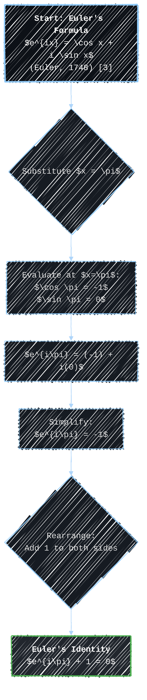
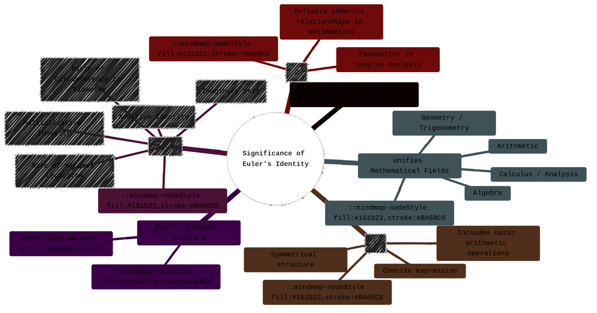

> ⚠️🏗️🚧🦺🧱🪵🪨🪚🛠️👷
> 
> This is a working draft in progress
> 
> 
> 
> ⚠️🏗️🚧🦺🧱🪵🪨🪚🛠️👷


----


# Euler Identity Overview
> **Disclaimer:**
>
> This document contains my personal notes on the topic,
> compiled from publicly available documentation and various cited sources.
> The materials are intended for educational purposes, personal study, and reference.
> The content is dual-licensed:
> 1. **MIT License:** Applies to all code implementations (Swift, Mermaid, and other programming languages).
> 2. **Creative Commons Attribution-ShareAlike 4.0 International License (CC BY-SA 4.0):** Applies to all non-code content, including text, explanations, diagrams, and illustrations.
---


## Euler's Identity: An Exploration of Mathematical Beauty

Euler's Identity is widely acclaimed as one of the most beautiful and profound equations in mathematics [1, Ch. 22]. It elegantly links five of the most fundamental mathematical constants in a surprisingly simple equation:

$$
e^{i\pi} + 1 = 0
$$

This identity is a special case of Euler's formula and stands as a testament to the interconnectedness of different mathematical concepts. As Keith Devlin notes, "Like a Shakespearean sonnet that captures the very essence of love, or a painting that brings out the beauty of the human form that is far more than just skin deep, Euler's equation reaches deep into the very existence of numbers" [2]. This exploration will delve into its components, derivation, geometric interpretation, and significance.

```mermaid
%%{init: {"theme": "dark", "fontFamily": "monospace", "themeVariables": {"darkMode": true, "primaryColor": "#FFB000", "primaryTextColor": "#fff", "primaryBorderColor": "#FFB000", "lineColor": "#FFC832", "secondaryColor": "#DBEDF3", "tertiaryColor": "#FF7043"}} }%%
mindmap
  root(("<b>Euler's Identity</b><br>$e^{i\pi} + 1 = 0$"))
    ::mindmap-nodeStyle fill:#0d1117,stroke:#FFB000
    Introduction
      ::mindmap-nodeStyle fill:#22272e,stroke:#FFC832
      Definition: "Most Beautiful Equation" [1, 2]
      Connects Five Fundamental Constants
      Special Case of Euler's Formula [3]
    Key Components
      ::mindmap-nodeStyle fill:#22272e,stroke:#FFC832
      <b>e</b> (Euler's Number) [4, Vol. I, Ch. VI]
      <b>i</b> (Imaginary Unit) [5, Part I]
      <b>&pi;</b> (Pi) [6]
      <b>1</b> (Unity - Multiplicative Identity)
      <b>0</b> (Zero - Additive Identity)
    Derivation
      ::mindmap-nodeStyle fill:#22272e,stroke:#FFC832
      From Euler's Formula: $e^{ix} = \cos x + i \sin x$ [3, Art. 138]
      Substitution: $x = \pi$
    Geometric Interpretation
      ::mindmap-nodeStyle fill:#22272e,stroke:#FFC832
      Complex Plane [5, Ch. 1]
      Unit Circle
      Rotation by &pi; radians
    Significance
      ::mindmap-nodeStyle fill:#22272e,stroke:#FFC832
      Unification of Mathematical Fields [1]
      Elegance and Simplicity
      Deep Mathematical Truth [2]
```

---

### 1. The Components of Euler's Identity

Euler's Identity brings together five fundamental constants, each with its own rich history and significance in mathematics.


*   **Euler's Number ($e$):** An irrational constant approximately equal to 2.71828. It is the base of the natural logarithm and appears ubiquitously in mathematics and science, particularly in contexts of continuous growth or decay. Euler himself extensively studied this constant [4, Vol. I, Ch. VI]. It can be defined as:

$$
e = \lim_{n\to\infty} \left(1 + \frac{1}{n}\right)^n \quad \text{or} \quad e = \sum_{n=0}^{\infty} \frac{1}{n!}
$$

*   **Imaginary Unit ($i$):** Defined as the principal square root of -1:

$$
i = \sqrt{-1} \quad \text{such that} \quad i^2 = -1
$$

    It is the cornerstone of complex numbers, extending the real number system. The concept of imaginary numbers took centuries to be fully accepted, with early work by mathematicians like Gerolamo Cardano in the 16th century [5, p. 59].
*   **Pi ($\pi$):** An irrational constant approximately equal to 3.14159. It represents the ratio of a circle's circumference to its diameter. Its calculation has a long history, dating back to ancient civilizations [6, Ch. 1]. In the context of Euler's formula, $\pi$ radians corresponds to 180 degrees.
*   **One ($1$):** The multiplicative identity. For any number $x$, $1 \cdot x = x$. It represents wholeness or a unit.
*   **Zero ($0$):** The additive identity. For any number $x$, $0 + x = x$. It represents nothingness or an origin point. The concept and symbol for zero were significant developments in the history of mathematics, notably in ancient India [7, Ch. 4].

---

### 2. Derivation from Euler's Formula

Euler's Identity is a direct and beautiful consequence of **Euler's Formula**, which provides a profound link between the exponential function and trigonometric functions. Euler's Formula states that for any real number $x$:

$$
e^{ix} = \cos x + i \sin x
$$

Where:

*   $e$ is Euler's number.
*   $i$ is the imaginary unit.
*   $\cos x$ and $\sin x$ are the trigonometric functions cosine and sine, with $x$ in radians.

This formula was presented by Leonhard Euler in his 1748 work *Introductio in analysin infinitorum* [3, Vol. I, Art. 138].

To derive Euler's Identity from Euler's Formula, we substitute $x = \pi$:

1.  Start with Euler's Formula:
    $e^{ix} = \cos x + i \sin x$
2.  Substitute $x = \pi$ into the formula:
    $e^{i\pi} = \cos \pi + i \sin \pi$
3.  Evaluate the trigonometric functions at $x = \pi$:
    *   $\cos \pi = -1$ (The cosine of 180 degrees)
    *   $\sin \pi = 0$ (The sine of 180 degrees)
4.  Substitute these values back into the equation:
    $e^{i\pi} = -1 + i \cdot 0$
5.  Simplify:
    $e^{i\pi} = -1$
6.  Rearrange the terms by adding 1 to both sides:
    $e^{i\pi} + 1 = 0$

This is Euler's Identity.



---

### 3. Geometric Interpretation

Euler's Formula, $e^{ix} = \cos x + i \sin x$, can be visualized in the **complex plane**. A complex number $z = a + bi$ can be represented as a point $(a, b)$. This geometric interpretation was significantly advanced by Caspar Wessel, Jean-Robert Argand, and Carl Friedrich Gauss [5, Ch. IV].

*   The term $e^{ix}$ represents a point on the **unit circle** in the complex plane. The unit circle is a circle with radius $r=1$ centered at the origin.
*   The real part, $\cos x$, is the projection of this point onto the real (horizontal) axis.
*   The imaginary part, $\sin x$, is the projection onto the imaginary (vertical) axis.
*   The exponent $x$ (in radians) represents the angle of rotation counter-clockwise from the positive real axis.

For Euler's Identity, $x = \pi$:

*   $e^{i\pi}$ means rotating a point on the unit circle by an angle of $\pi$ radians (180 degrees) counter-clockwise from the point $(1, 0)$ (which is $e^{i0}$).
*   A rotation of $\pi$ radians lands the point at $(-1, 0)$ on the complex plane.
*   This corresponds to $\cos \pi = -1$ (the real part) and $\sin \pi = 0$ (the imaginary part).
*   Thus, $e^{i\pi} = -1 + i \cdot 0 = -1$.

The identity $e^{i\pi} + 1 = 0$ geometrically states that if you start at the origin ($0$), move to the point $e^{i\pi}$ (which is $-1$), and then add $1$ (move one unit in the positive real direction), you return to the origin. This interpretation is fundamental in understanding complex exponentiation [8, Ch. 1].

```mermaid
%%{init: {"theme": "dark", "fontFamily": "monospace", "themeVariables": {"darkMode": true, "primaryColor": "#F48FB1", "primaryTextColor": "#fff", "primaryBorderColor": "#F48FB1", "lineColor": "#F8BBD0", "secondaryColor": "#FCE4EC", "tertiaryColor": "#F06292"}} }%%
graph TD
    O["Origin <br/>(0,0)"]:::Origin
    P1["Point <br/>(1,0)<br/>$e^{i0} = 1$"]:::Point
    P_minus_1["Point <br/>(-1,0)<br/>$e^{i\pi} = -1$"]:::Point

    subgraph Complex_Plane["Geometric representation of complex numbers"]
    direction LR
        XAxis["Real Axis <br/>(Re)"]:::TextNode
        YAxis["Imaginary Axis <br/>(Im)"]:::TextNode
        Circle["Unit Circle<br/>(radius = 1)"]:::TextNode
         %% style Circle fill:none,stroke:#F8BBD0,stroke-dasharray: 5 5
    end

    O -.-> P1
    O -.-> P_minus_1
    P1 -- "Rotation by &pi; (180°)<br> via $e^{ix}$ [8]" --> P_minus_1

	classDef Origin fill:#0d1117,stroke:#F48FB1,stroke-width:2px
    classDef Point fill:#161b22,stroke:#F48FB1
    classDef TextNode fill:none,stroke:none,color:#fff

    Note1["Visualization:<br>$e^{ix}$ traces the unit circle.<br>For $x = \pi$, $e^{i\pi}$ is at -1 on the real axis"]:::TextNode
```



---

### 4. Significance and "Beauty"

The perceived beauty of Euler's Identity, often cited in polls among mathematicians [9], stems from several aspects:

*   **Fundamental Constants:** It remarkably connects five of the most fundamental and seemingly unrelated constants in mathematics ($0, 1, e, i, \pi$) in a single, concise expression.
*   **Unification of Mathematical Fields:** It intrinsically links various branches of mathematics:
    *   **Arithmetic:** Through $0$ and $1$.
    *   **Algebra:** Through the imaginary unit $i$ and the concept of identity operations.
    *   **Calculus/Analysis:** Through $e$, the base of the natural logarithm and exponential function.
    *   **Geometry/Trigonometry:** Through $\pi$ and the underlying geometric interpretation of $e^{ix}$ on the unit circle.
*   **Simplicity and Elegance:** The equation is remarkably simple and symmetrical. The presence of the three basic arithmetic operations (addition, multiplication, exponentiation) relating these constants to zero is profound [1, Ch. 22].
*   **Deep Mathematical Truth:** It's not just a coincidental arrangement; it reflects deep underlying structures and relationships within the mathematical universe, particularly within complex analysis [2].
*   **"Zero" as the Result:** The fact that this combination of fundamental constants equals zero adds to its mystique, as zero often represents a fundamental balance or null state.



Richard Feynman called Euler's formula (from which the identity is derived) "our jewel" and "the most remarkable formula in mathematics" [10, p. 22-10]. The identity $e^{i\pi} + 1 = 0$ captures this remarkableness in its most distilled form.

---

### 5. Applications and Connections

While Euler's Identity ($e^{i\pi} + 1 = 0$) itself is more of a profound declarative statement, the underlying **Euler's Formula ($e^{ix} = \cos x + i \sin x$)** has vast and critical applications across science, engineering, and mathematics [11, Ch. 4]:

*   **Signal Processing:** Fourier analysis, which decomposes signals into constituent frequencies, relies heavily on $e^{ix}$ to represent sinusoidal waves. The Fast Fourier Transform (FFT) algorithm is built upon this. (See related resources like the U.S. National Institute of Standards and Technology (NIST) Digital Library of Mathematical Functions [12, Ch. 3]).
*   **Electrical Engineering:** Representing alternating currents (AC) and analyzing circuits using phasors.
*   **Quantum Mechanics:** Wave functions, which describe the state of quantum systems, are inherently complex-valued and often involve $e^{ix}$ terms.
*   **Physics:** Describing wave phenomena, oscillations, and rotations.
*   **Differential Equations:** Solving linear differential equations with constant coefficients.
*   **Mathematics:** Proving trigonometric identities, understanding roots of unity, power series, and many other areas of complex analysis.

**Connection to Roots of Unity:**
De Moivre's formula, $(\cos x + i \sin x)^n = \cos(nx) + i \sin(nx)$, can be derived from Euler's formula: $(e^{ix})^n = e^{inx}$. Setting $e^{inx} = 1$ allows one to find the $n$-th roots of unity, which are complex numbers $z$ such that $z^n = 1$. These roots are $e^{i 2\pi k / n}$ for $k = 0, 1, \dots, n-1$. Euler's identity is related to the $n=2$ case where $e^{i\pi}$ is one of the square roots of 1 (the other being $e^{i0}=1$).

---

### 6. Brief Historical Context

*   **Leonhard Euler (1707-1783):** A Swiss mathematician, physicist, astronomer, geographer, logician, and engineer who made seminal discoveries in many branches of mathematics. His collected works, *Opera Omnia*, are extensive and many are publicly available through archives like the Euler Archive [13].
*   Euler's Formula ($e^{ix} = \cos x + i \sin x$) was first published by Euler in 1748 in his work *Introductio in analysin infinitorum* [3, Vol. I, Art. 138].
*   While the formula is attributed to Euler, English mathematician Roger Cotes (a contemporary of Newton) knew a related result in 1714: $\ln(\cos x + i \sin x) = ix$ [14, p. 28].
*   The specific identity $e^{i\pi} + 1 = 0$ is a direct consequence of this formula by substituting $x=\pi$. Although Euler wrote about the formula extensively, it's not definitively clear if he himself explicitly highlighted this specific equation form as "Euler's Identity." However, it is a trivial derivation from his widely known formula. Benjamin Peirce, a 19th-century Harvard mathematician, was one who notably lauded this identity in lectures [15, p. 95].

The beauty and depth of this identity continue to inspire mathematicians and scientists, serving as a prime example of the profound connections that underpin the mathematical world.

---

### 7. Summary of Euler's Identity

This mind map synthesizes the key aspects of Euler's Identity discussed.

```mermaid
%%{init: {"theme": "dark", "fontFamily": "monospace", "look": "handDrawn", "themeVariables": {"darkMode": true, "primaryColor": "#FFCA28", "primaryTextColor": "#fff", "primaryBorderColor": "#FFCA28", "lineColor": "#FFD54F", "secondaryColor": "#FFF8E1", "tertiaryColor": "#FFC107"}} }%%
mindmap
  root((<b>Euler's Identity Synthesis</b><br>$e^{i\pi} + 1 = 0$))
    ::mindmap-nodeStyle fill:#0d1117,stroke:#FFCA28
    <b>The Equation</b>
      ::mindmap-nodeStyle fill:#161b22,stroke:#FFC107
      $e^{i\pi} + 1 = 0$
      "Most Beautiful Equation" [1, 9]
    <b>Core Components</b>
      ::mindmap-nodeStyle fill:#161b22,stroke:#FFC107
      <b><i>e</i></b>: Euler's Number (~2.718) [4]
      <b><i>i</i></b>: Imaginary Unit ($\sqrt{-1}$) [5]
      <b>&pi;</b>: Pi (~3.14159) [6]
      <b>1</b>: Multiplicative Identity
      <b>0</b>: Additive Identity [7]
    <b>Derivation Path</b>
      ::mindmap-nodeStyle fill:#161b22,stroke:#FFC107
      Based on <b>Euler's Formula</b>: $e^{ix} = \cos x + i \sin x$ [3]
      Substitute $x = \pi$
      Use $\cos \pi = -1$ and $\sin \pi = 0$
      Leads to $e^{i\pi} = -1$
      Rearrange to $e^{i\pi} + 1 = 0$
    <b>Geometric View</b>
      ::mindmap-nodeStyle fill:#161b22,stroke:#FFC107
      $e^{ix}$ is a point on unit circle in complex plane [8]
      $x$ is angle of rotation (radians)
      $e^{i\pi}$ rotates by $\pi$ (180°) to point (-1, 0)
    <b>Profound Significance</b>
      ::mindmap-nodeStyle fill:#161b22,stroke:#FFC107
      Unites 5 fundamental constants
      Connects major mathematical fields (Analysis, Algebra, Geometry) [1, 2]
      Showcases mathematical elegance and simplicity
      Reveals deep, interconnected truths
    <b>Applications (of Euler's Formula)</b>
      ::mindmap-nodeStyle fill:#161b22,stroke:#FFC107
      Signal Processing (Fourier Analysis) [11, 12]
      Electrical Engineering (Phasors)
      Quantum Mechanics (Wave Functions)
      Solving Differential Equations
    <b>Historical Note</b>
      ::mindmap-nodeStyle fill:#161b22,stroke:#FFC107
      Leonhard Euler (1748) [3, 13]
      Roger Cotes (related result, 1714) [14]
      Derived from his broader formula
      Popularized for its beauty (e.g., B. Peirce) [15]
```

---

### References

[1] Nahin, P. J. (2006). *Dr. Euler's Fabulous Formula: Cures Many Mathematical Ills*. Princeton University Press.

[2] Devlin, K. (2002). *The Millennium Problems: The Seven Greatest Unsolved Mathematical Puzzles of Our Time*. Basic Books. (Quotation source on beauty may vary, but Devlin and others frequently discuss Euler's Identity in this context). A more direct discussion by Devlin is found in "The Most Beautiful Equation," *MAA Devlin's Angle*, Mathematical Association of America, May 2002. ([https://www.maa.org/external_archive/devlin/devlin_05_02.html](https://www.maa.org/external_archive/devlin/devlin_05_02.html) - Link active as of last check, illustrating public educational material discussing this).

[3] Euler, L. (1748). *Introductio in analysin infinitorum*. Tomus Primus. Lausannæ: Apud Marcum-Michaelem Bousquet & Socios. (Available through public archives like The Euler Archive: [http://eulerarchive.maa.org/](http://eulerarchive.maa.org/)) Specifically, Chapter VIII, "De Quantitatibus Transcendentibus ex Circulo ortis," Article 138.

[4] Euler, L. (1748). *Introductio in analysin infinitorum*. Tomus Primus. Lausannæ: Apud Marcum-Michaelem Bousquet & Socios. (e.g., Volume I, Chapter VI discusses logarithms and exponentials).

[5] Needham, T. (1997). *Visual Complex Analysis*. Oxford University Press.

[6] Beckmann, P. (1971). *A History of Pi*. St. Martin's Press.

[7] Kaplan, R. (1999). *The Nothing That Is: A Natural History of Zero*. Oxford University Press.

[8] Ahlfors, L. V. (1979). *Complex Analysis: An Introduction to the Theory of Analytic Functions of One Complex Variable* (3rd ed.). McGraw-Hill.

[9] Wells, D. (1990). "Are these the most beautiful?". *The Mathematical Intelligencer*, 12(3), 37–41. Euler's identity is consistently ranked high in such polls.

[10] Feynman, R. P., Leighton, R. B., & Sands, M. (1963). *The Feynman Lectures on Physics, Vol. I: Mainly Mechanics, Radiation, and Heat*. Addison-Wesley.

[11] Strogatz, S. H. (2003). *Nonlinear Dynamics and Chaos: With Applications to Physics, Biology, Chemistry, and Engineering*. Westview Press. (Applications of complex exponentials are widespread).

[12] NIST Digital Library of Mathematical Functions. Release 1.1.12 of 2023-12-15. F. W. J. Olver, A. B. Olde Daalhuis, D. W. Lozier, B. I. Schneider, R. F. Boisvert, C. W. Clark, B. R. Miller, B. V. Saunders, H. S. Cohl, and M. A. McClain, eds. (Available at [https://dlmf.nist.gov/](https://dlmf.nist.gov/)) Chapter 3 describes Elementary Functions, including complex exponentials widely used.

[13] The Euler Archive. Mathematical Association of America. ([http://eulerarchive.maa.org/](http://eulerarchive.maa.org/)) A public resource hosting Euler's works.

[14] Stillwell, J. (1989). *Mathematics and Its History*. Springer-Verlag.

[15] Cajori, F. (1919). *A History of Mathematics* (2nd ed.). The Macmillan Company. (Publicly available, e.g., via Project Gutenberg).


---

<!-- 


---
>**Licenses:**
>
>- **MIT License:**  [](LICENSE) - Full text in [LICENSE](LICENSE) file.
>- **Creative Commons Attribution-ShareAlike 4.0 International**: [CC BY-SA 4.0](https://creativecommons.org/licenses/by-sa/4.0/) [](https://creativecommons.org/licenses/by-sa/4.0/) - Legal details in [LICENSE-CC-BY-SA-4.0](THE_PAST/LICENSE-CC-BY-SA-4.0) and at [Creative Commons official site](https://creativecommons.org/licenses/by-sa/4.0/).
>
---