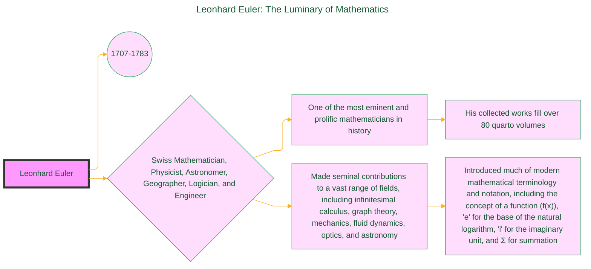
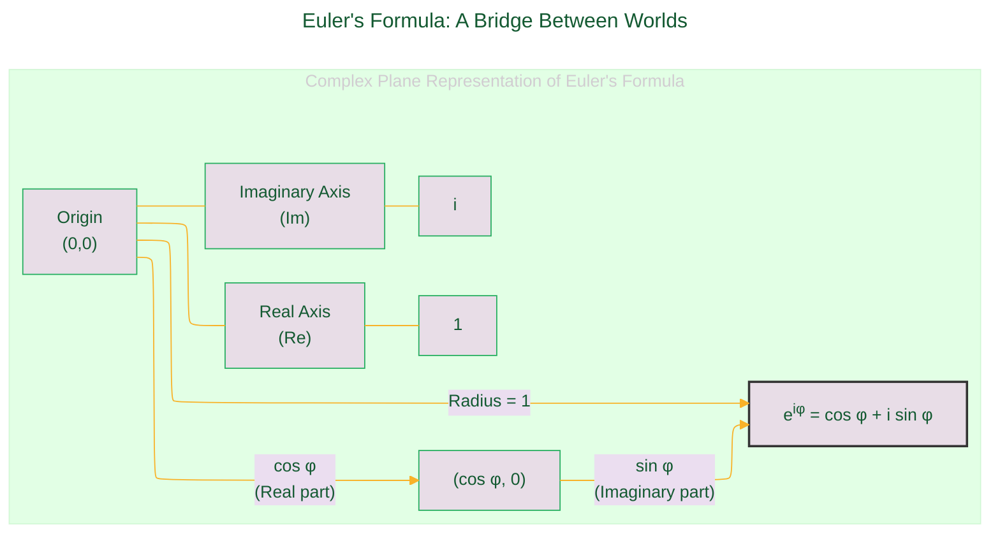
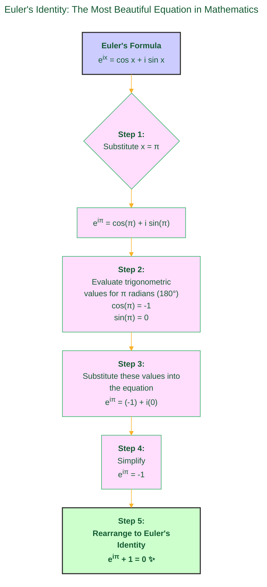

> ⚠️🏗️🚧🦺🧱🪵🪨🪚🛠️👷
> 
> This is a working draft in progress
> 
> ⚠️🏗️🚧🦺🧱🪵🪨🪚🛠️👷

----

# God's Equation
> **Disclaimer:**
>
> This document contains my personal notes on the topic,
> compiled from publicly available documentation and various cited sources.
> The materials are intended for educational purposes, personal study, and reference.
> The content is dual-licensed:
> 1. **MIT License:** Applies to all code implementations (Swift, Mermaid, and other programming languages).
> 2. **Creative Commons Attribution-ShareAlike 4.0 International License (CC BY-SA 4.0):** Applies to all non-code content, including text, explanations, diagrams, and illustrations.
---

## Leonhard Euler: The Luminary of Mathematics 🧠

Before we explore the formulas, it's essential to appreciate the colossal figure of Leonhard Euler.

*(Sources for Euler's biographical details include O'Connor, J. J., & Robertson, E. F. (2003). Leonhard Euler. MacTutor History of Mathematics archive, University of St Andrews. and the Encyclopædia Britannica).*

---

## Euler's Formula: A Bridge Between Worlds 🌉

Euler's formula creates a profound and powerful link between complex exponential functions and trigonometric functions. It is a cornerstone of complex analysis.

**The Formula Stated:**
The formula is elegantly expressed as:

$$
e^{ix} = \cos x + i \sin x
$$

Let's break down its components:

*   $e$: Euler's number, the base of the natural logarithm, an irrational constant approximately equal to 2.71828.
*   $i$: The imaginary unit, defined as the square root of -1 (i.e., $i^2 = -1$).
*   $x$: A real number, representing an angle measured in radians. When used in this formula, $x$ specifies the rotation on the complex plane.
*   $\cos x$: The cosine of the angle $x$.
*   $\sin x$: The sine of the angle $x$.

This formula beautifully maps an angle $x$ to a point on the unit circle in the complex plane. The coordinates of this point are $(\cos x, \sin x)$.

The diagram illustrates:

*   The **Real axis (Re)** is horizontal, and the **Imaginary axis (Im)** is vertical.
*   The term $e^{i\varphi}$ (or $e^{ix}$) represents a point situated on the **unit circle** (a circle with a radius of 1, centered at the origin).
*   The angle $\varphi$ (or $x$) is the angle in radians formed by the line segment connecting the origin to $e^{i\varphi}$ and the positive real axis.
*   $\cos \varphi$ is the real component (the projection onto the Re axis).
*   $\sin \varphi$ is the imaginary component (the projection onto the Im axis).

*(This visualization is a fundamental concept in understanding complex numbers and is widely covered in mathematics resources such as Khan Academy's materials on Euler's Formula and Wolfram MathWorld).*

---

## Euler's Identity: "The Most Beautiful Equation in Mathematics" 😍

Euler's identity emerges as a specific instance of Euler's formula when $x$ is set to $\pi$. It is renowned for its profound beauty, linking five fundamental mathematical constants.

**The Identity:**

$$
e^{i\pi} + 1 = 0
$$

This equation astonishingly connects:

*   $0$: The additive identity.
*   $1$: The multiplicative identity.
*   $\pi$: Pi, the transcendental number representing the ratio of a circle's circumference to its diameter (approx. 3.14159).
*   $e$: Euler's number, base of natural logarithms.
*   $i$: The imaginary unit.

**Derivation Path:**
The image clearly shows the derivation, which we can represent as a flow:

This simple derivation underscores the deep interconnectedness of mathematical concepts that arise from seemingly disparate branches of the field. The elegance is in its simplicity and profundity. 😲

---

## Concise Summary of Concepts 📋

| Concept          | Equation                                     | Essential Components                 | Core Significance & Applications                                                                                                                                 |
| :--------------- | :------------------------------------------- | :----------------------------------- | :----------------------------------------------------------------------------------------------------------------------------------------------------------------- |
| Euler's Formula  | $e^{ix} = \cos x + i \sin x$                 | $e, i, x$ (real angle), $\cos, \sin$ | Establishes the fundamental relationship between complex exponentials and trigonometry. Vital in complex analysis, electrical engineering, quantum mechanics, and signal processing (e.g., underpinning the Fourier Transform). |
| Euler's Identity | $e^{i\pi} + 1 = 0$                           | $0, 1, e, \pi, i$                    | A special, deeply insightful case of Euler's Formula. Celebrated for its mathematical beauty, connecting five of the most significant numbers in mathematics through basic arithmetic operations. |

---

## The "God's Equation" Moniker 🤔

The term "God's equation" or "the most beautiful equation" is an informal expression of the awe mathematicians and scientists often feel when encountering Euler's identity. It's not a formal designation but rather reflects admiration for its profound simplicity and the unexpected unification of fundamental constants.

As physicist Richard Feynman famously remarked in his lectures, "It is our jewel." 🌟 This sentiment captures the essence of its perceived beauty and importance. Mathematician Keith Devlin also discusses this perception widely among mathematicians in "Dr. Euler's Fabulous Formula."

---

## References and Further Reading 📚

1.  **O'Connor, J. J., & Robertson, E. F. (2003). *Leonhard Euler*. MacTutor History of Mathematics archive, University of St Andrews.**
    *   A comprehensive and publicly accessible biography of Leonhard Euler from a trusted academic source (UK). (Available at: [mathshistory.st-andrews.ac.uk/Biographies/Euler/](https://mathshistory.st-andrews.ac.uk/Biographies/Euler/))
2.  **Euler, Leonhard. (n.d.). In *Encyclopædia Britannica*.**
    *   A reliable encyclopedic entry for biographical information. (Available through: [britannica.com](https://www.britannica.com))
3.  **Wikipedia contributors. (2023). *Euler's formula*. Wikipedia, The Free Encyclopedia.**
    *   A widely used public knowledge resource. (Retrieved from: [https://en.wikipedia.org/wiki/Euler%27s_formula](https://en.wikipedia.org/wiki/Euler%27s_formula))
4.  **Wikipedia contributors. (2023). *Euler's identity*. Wikipedia, The Free Encyclopedia.**
    *   (Retrieved from: [https://en.wikipedia.org/wiki/Euler%27s_identity](https://en.wikipedia.org/wiki/Euler%27s_identity))
5.  **Weisstein, Eric W. "Euler Formula." From *MathWorld*--A Wolfram Web Resource.**
    *   A trusted and extensive mathematical encyclopedia. (Available at: [https://mathworld.wolfram.com/EulerFormula.html](https://mathworld.wolfram.com/EulerFormula.html))
6.  **Weisstein, Eric W. "Euler Identity." From *MathWorld*--A Wolfram Web Resource.**
    *   (Available at: [https://mathworld.wolfram.com/EulerIdentity.html](https://mathworld.wolfram.com/EulerIdentity.html))
7.  **Khan Academy. *Euler's formula & Euler's identity*.**
    *   Publicly accessible educational videos and articles explaining the concepts. (Available at: [khanacademy.org](https://www.khanacademy.org) - search for "Euler's formula")
8.  **Devlin, K. (2004). *Dr. Euler's Fabulous Formula: Cures Many Mathematical Ills*. Princeton University Press.**
    *   An accessible book exploring Euler's formula and its significance.
9.  **Feynman, R. P., Leighton, R. B., & Sands, M. (1963). *The Feynman Lectures on Physics, Vol. I*. Addison-Wesley. (Chapter 22: Algebra).**
    *   A classic set of lectures where Feynman discusses the beauty of Euler's identity. Many universities and educational initiatives provide access to these lectures or transcripts.
10. **Mathematical Association of America (MAA).**
    *   The MAA often publishes articles and resources related to the history and beauty of mathematics, including Euler's contributions. Their website ([maa.org](https://www.maa.org)) can be a source for such materials.

---

<!-- 

---
>**Licenses:**
>
>- **MIT License:**   - Full text in [LICENSE](LICENSE) file.
>- **Creative Commons Attribution-ShareAlike 4.0 International**: [CC BY-SA 4.0](https://creativecommons.org/licenses/by-sa/4.0/)  - Legal details in [LICENSE-CC-BY-SA-4.0](THE_PAST/LICENSE-CC-BY-SA-4.0) and at [Creative Commons official site](https://creativecommons.org/licenses/by-sa/4.0/).
>
---