> ⚠️🏗️🚧🦺🧱🪵🪨🪚🛠️👷
> 
> This is a working draft in progress
> 
> 
> 
> gif image is provided by [Giphy](https://giphy.com)
> 
> ⚠️🏗️🚧🦺🧱🪵🪨🪚🛠️👷

----

# De Broglie Hypothesis
> **Disclaimer:**
>
> This document contains my personal notes on the topic,
> compiled from publicly available documentation and various cited sources.
> The materials are intended for educational purposes, personal study, and reference.
> The content is dual-licensed:
> 1. **MIT License:** Applies to all code implementations (Swift, Mermaid, and other programming languages).
> 2. **Creative Commons Attribution-ShareAlike 4.0 International License (CC BY-SA 4.0):** Applies to all non-code content, including text, explanations, diagrams, and illustrations.
---

# The De Broglie Hypothesis: Matter Waves

## 1. Introduction: The Wave Nature of Matter

The De Broglie Hypothesis, proposed by French physicist Louis de Broglie in his 1924 PhD thesis[^1], revolutionized our understanding of the fundamental nature of matter. It posits that **all matter exhibits wave-like properties**, meaning particles such as electrons, protons, and even macroscopic objects possess an associated wavelength. This concept generalized the wave-particle duality previously observed for light, suggesting it as a universal principle. De Broglie's insight was a cornerstone in the development of quantum mechanics, providing a physical basis for the quantization rules in Bohr's atomic model[^2] and paving the way for Schrödinger's wave equation.

---

## 2. Historical Context and Motivation

De Broglie's proposal did not emerge in a vacuum. It was built upon several key developments in early 20th-century physics that challenged classical notions:

*   **Planck's Quantum Hypothesis (1900):** Max Planck, to explain black-body radiation, proposed that energy is quantized and emitted or absorbed in discrete packets called quanta ($E = hf$)[^5].
*   **Einstein's Photoelectric Effect (1905):** Albert Einstein extended Planck's idea, suggesting that light itself consists of particles (photons), each with energy $E = hf$[^6]. This established the particle nature of light waves.
*   **Bohr Model of the Atom (1913):** Niels Bohr proposed a model for the hydrogen atom where electrons orbit the nucleus only in specific, quantized energy levels, without explaining *why* these orbits were stable or quantized[^2].
*   **Symmetry Argument:** De Broglie was motivated by a sense of symmetry in nature. If light, traditionally considered a wave, could exhibit particle-like properties (photons), then perhaps particles, like electrons, could exhibit wave-like properties[^1].

For light (photons), the energy is $E = hf$ and momentum is $p = E/c = hf/c$. Since $c = f\lambda$ for light, momentum can be written as $p = h/\lambda$. De Broglie boldly hypothesized that this relationship $p = h/\lambda$, or $\lambda = h/p$, should apply to material particles as well[^1].

---

## 3. Mathematical Formulation: The De Broglie Wavelength

The central equation of the De Broglie Hypothesis quantifies the wavelength associated with a particle[^1]:

$$
\lambda = \frac{h}{p}
$$

Where:
*   $\lambda$ (lambda) is the **De Broglie wavelength** of the particle.
*   $h$ is **Planck's constant**, a fundamental constant in quantum mechanics, approximately $6.626 \times 10^{-34} \text{ J} \cdot \text{s}$[^7].
*   $p$ is the **momentum** of the particle.

For a particle with rest mass $m_0$ moving at a velocity $v_p$ (particle velocity), its classical momentum is $p = m_0 v_p$. If relativistic effects are significant (when $v_p$ is a considerable fraction of the speed of light $c$), the relativistic momentum $p = \gamma m_0 v_p$ must be used, where $\gamma = 1/\sqrt{1 - v_p^2/c^2}$ is the Lorentz factor.

The energy of a particle can also be related to its wave properties. For a photon, $E = hf$. De Broglie proposed that for matter waves, the frequency $f$ is related to the particle's total energy $E$ (including rest mass energy if applicable) by the same relation[^1]:

$$
E = hf
$$

Combining this with the wave relation $v_w = f\lambda$ (where $v_w$ is the wave velocity, sometimes called phase velocity), we have:  
$v_w = f\lambda = (E/h)(h/p) = E/p$.

It's important to note that for a massive particle, this wave velocity $v_w$ is not the same as the particle velocity $v_p$.  
For a non-relativistic particle, $E \approx K = \frac{1}{2}m_0 v_p^2 = \frac{p^2}{2m_0}$ (kinetic energy).  
Then $v_w = E/p \approx (p^2/2m_0)/p = p/(2m_0) = v_p/2$.  
For a relativistic particle, $E = \gamma m_0 c^2$ and $p = \gamma m_0 v_p$, so $v_w = E/p = (\gamma m_0 c^2) / (\gamma m_0 v_p) = c^2/v_p$. Since $v_p < c$, this implies $v_w > c$, which is initially puzzling but refers to the phase velocity, not the group velocity (which corresponds to particle velocity and energy transport)[^8, Ch. 2].

---

## 4. Experimental Confirmation

De Broglie's hypothesis, though radical, received stunning experimental confirmation within a few years, primarily through electron diffraction experiments.

### 4.1. Davisson-Germer Experiment (1927)

Clinton Davisson and Lester Germer at Bell Labs were studying the scattering of electrons off a nickel crystal. Initially, they observed diffuse scattering. However, after an accidental break in their vacuum system and subsequent heating of the nickel target (which caused large crystal domains to form), they observed that electrons were scattered in specific directions, showing maxima and minima in intensity—a hallmark of wave diffraction[^3].

The angles at which these intensity peaks occurred could be explained by treating the electron beam as a wave diffracting from the regular atomic planes of the nickel crystal, similar to X-ray diffraction (Bragg's Law). The wavelength calculated from the diffraction pattern matched de Broglie's predicted wavelength for electrons of that energy ($\lambda = h/p$)[^3].

### 4.2. G.P. Thomson Experiment (1927)

Independently, George Paget (G.P.) Thomson (son of J.J. Thomson, who discovered the electron as a particle) in Aberdeen, Scotland, performed experiments by passing a beam of high-energy electrons through thin metal foils (like gold, aluminum, celluloid)[^4].  
If electrons were purely particles, they would scatter randomly or pass straight through with some deflection. Instead, Thomson observed distinct diffraction rings on a photographic plate placed behind the foil. These rings were analogous to the diffraction patterns produced when X-rays pass through polycrystalline materials (Debye-Scherrer diffraction).

The radii of these rings depended on the electron energy (and thus their de Broglie wavelength) and the spacing of atomic planes in the metal crystallites, again confirming $\lambda = h/p$[^4].

De Broglie was awarded the Nobel Prize in Physics in 1929 "for his discovery of the wave nature of electrons"[^9]. Davisson and G.P. Thomson shared the Nobel Prize in Physics in 1937 "for their experimental discovery of the diffraction of electrons by crystals"[^10].

---
## 5. Implications and Significance

The De Broglie Hypothesis had profound implications:

1.  **Universality of Wave-Particle Duality:** It established that wave-particle duality is not unique to light but a fundamental property of all physical entities[^1, 8].
2.  **Explanation of Bohr's Quantization:** De Broglie showed that Bohr's condition for stable electron orbits in the hydrogen atom ($m_e v r = n\hbar$) could be interpreted as the electron forming a standing wave around the nucleus. Only orbits whose circumference was an integer multiple of the electron's de Broglie wavelength would allow for a stable standing wave pattern ($2\pi r = n\lambda = nh/p_e \Rightarrow p_e r = n\hbar$)[^1, Ch. I].
    $$
    2\pi r = n\lambda \quad (n = 1, 2, 3, \dots)
    $$
3.  **Foundation for Schrödinger's Wave Mechanics:** De Broglie's idea of matter waves directly inspired Erwin Schrödinger to develop his famous wave equation, which describes how the wave function (representing the state of a quantum system) evolves over time[^11, Introduction]. The Schrödinger equation is a cornerstone of quantum mechanics.
4.  **Electron Microscopy:** The wave nature of electrons, with wavelengths much shorter than visible light (for energetic electrons), led to the development of the electron microscope. This allows for much higher resolution imaging than light microscopes, revolutionizing fields like materials science and biology[^12, Ch. 1].
5.  **Understanding of Particle Behavior:** It provided a framework to understand phenomena like quantum tunneling, where particles can pass through potential barriers even if they don't have enough classical energy to do so—their wave nature allows for a non-zero probability density on the other side of the barrier[^8, Ch. 6].

```mermaid
---
title: "Implications and Significance"
author: "Cong Le"
version: "1.0"
license(s): "MIT, CC BY-SA 4.0"
copyright: "Copyright (c) 2025 Cong Le. All Rights Reserved."
config:
  layout: elk
  theme: base
---
%%%%%%%% Mermaid version v11.4.1-b.14
%%%%%%%% Available curve styles include the following keywords:
%% basis, bumpX, bumpY, cardinal, catmullRom, linear, monotoneX, monotoneY, natural, step, stepAfter, stepBefore.
%%{
  init: {
    'flowchart': { 'htmlLabels': true, 'curve': 'linear' },
    'fontFamily': 'American Typewriter, cursive, sans-serif',
    'themeVariables': {
      'primaryColor': '#F225E3',
      'primaryTextColor': '#145A32',
      'lineColor': '#F8B229',
      'primaryBorderColor': '#27AE60',
      'secondaryColor': '#EBDEF0',
      'secondaryTextColor': '#6C3483',
      'secondaryBorderColor': '#A569BD',
      'fontSize': '20px'
    }
  }
}%%
flowchart TD
    A["<b>De Broglie Hypothesis (&lambda; = h/p)</b> [1]"] --> B["Universality of Wave-Particle Duality"]
    A --> C["Explanation of Bohr's Quantized Orbits [2]"]
    C --> C1["Electron forms a <font color='#add8e6'>standing wave</font> around nucleus<br/><i>2&pi;r = n&lambda;</i> -> Angular momentum quantization"]
    A --> D["Foundation for Schrödinger's Wave Mechanics [11]"];
    D --> D1["Schrödinger Equation describes evolution of <font color='#add8e6'>wave function &Psi;</font>"]
    A --> E["Technological Applications"]
    E --> E1["Electron Microscopy [12]<br/>(Shorter &lambda; -> higher resolution)"]
    A --> F["Conceptual Understanding"]
    F --> F1["Quantum Tunneling [8]"]
    F --> F2["Diffraction & Interference of particles<br/>(electrons, neutrons, atoms, molecules)"]

    style A fill:#ffcc99,stroke:#333,stroke-width:3px
```

----

## 6. Limitations and Broader Context

While groundbreaking, the De Broglie Hypothesis also has limitations and fits into a broader quantum framework:

*   **Nature of the Wave:** De Broglie's initial idea didn't fully specify the physical nature of the "matter wave." Later, Max Born interpreted the square of the amplitude of the wave function (derived from Schrödinger's equation, inspired by de Broglie) as a **probability density** for finding the particle at a particular point in space and time[^13]. So, the wave is a wave of probability amplitude.
*   **Macroscopic Objects:** For macroscopic objects, their momentum $p$ is very large due to their large mass. This results in an incredibly small de Broglie wavelength $\lambda = h/p$. For example, a 1 kg object moving at 1 m/s has $\lambda \approx 6.6 \times 10^{-34} \text{ m}$, which is far too small to be detected or to have any observable wave effects (like diffraction) in everyday scenarios. Wave properties become significant only at the atomic and subatomic scales[^8, Ch. 3].
*   **Wave Velocity vs. Particle Velocity:** As mentioned, the de Broglie phase velocity $v_w = E/p$ can exceed $c$. This is not a violation of relativity because phase velocity does not carry information or energy. The group velocity of the wave packet, $v_g = d\omega/dk$ (where $\omega = 2\pi f$ and $k = 2\pi/\lambda$), corresponds to the particle's velocity and is always less than or equal to $c$[^8, Ch. 2; 14].
*   **Relationship to Quantum Field Theory (QFT):** In QFT, particles are viewed as excitations of underlying quantum fields. Wave-particle duality is naturally incorporated, where fields inherently have wave-like properties, and their quantized excitations manifest as particles[^15, Ch. 1].

---

## 7. Concluding Summary Mind Map

The De Broglie Hypothesis stands as a pivotal concept in modern physics, asserting the wave-like nature of all matter. Its simple equation, $\lambda = h/p$, connects a particle's momentum to a characteristic wavelength, unifying the concepts of waves and particles and laying crucial groundwork for the development of quantum mechanics. Experimental confirmations through electron diffraction solidified its validity and opened doors to new technologies like electron microscopy.

```mermaid
---
title: "Concluding Summary Mind Map"
author: "Cong Le"
version: "1.0"
license(s): "MIT, CC BY 4.0"
copyright: "Copyright (c) 2025 Cong Le. All Rights Reserved."
config:
  theme: base
---
%%%%%%%% Mermaid version v11.4.1-b.14
%%{
  init: {
    'fontFamily': 'American Typewriter',
    'mindmap': {
	    'nodeAlign': 'center',
	    'padding': 20
    },
    'themeVariables': {
      'primaryColor': '#FC82',
      'primaryTextColor': '#F8B229',
      'primaryBorderColor': '#27AE60',
      'secondaryColor': '#EBF3',
      'secondaryTextColor': '#6C3483',
      'secondaryBorderColor': '#A569BD',
      'fontSize': '20px'
    }
  }
}%%
mindmap
  root)"**De Broglie Hypothesis: Summary**<br/>*Louis de Broglie, 1924*"(
    Central_Tenet))"Central Tenet"((
      ::icon(fa fa-bullseye)
      Matter_Waves["All matter possesses wave-like properties<br/> (**Matter Waves**) [1]"]
      Wave-Particle Duality is universal
    Key_Equation))"Key Equation"((
      ::icon(fa fa-link)
      Equation["**&lambda; = h / p**"]
        ("&lambda;: De Broglie Wavelength")
        ("h: Planck's Constant [7]")
        ("p: Momentum of particle")
      Equation["**E = hf**"]
        ("E: Total Energy")
        ("f: De Broglie Frequency")
    Historical_Roots))"**Historical Roots**"((
      ::icon(fa fa-history)
      Planck_quantum["Planck's quantum (E=hf) [5]"]
      Einstein_photons["Einstein's photons (p=h/&lambda;) [6]"]
      Bohr_atom["Bohr's atom (quantized orbits) [2]"]
      Symmetry_argument["Symmetry argument (waves<->particles) [1]"]
    Experimental_Verification))"Experimental Verification"((
      ::icon(fa fa-check-circle)
      Davisson_Germer["**Davisson-Germer (1927)** [3]"]
        Electron diffraction from Nickel crystal
      G_P_Thomson["**G.P. Thomson (1927)** [4]"]
        Electron diffraction through thin foils
      Nobel_Prizes["Nobel Prizes [9, 10]"]
    Major_Implications))"Major Implications"((
      ::icon(fa fa-lightbulb-o)
      Foundation_of_Quantum_Mechanics["**Foundation of Quantum Mechanics**"]
      Explanation_of_Bohr_Orbits["**Explanation of Bohr's Orbits** [1]"]
        Electron_as_standing_wave["Electron as standing wave<br/> (2&pi;r = n&lambda;)"]
      Inspired_Schrödinger_Equation["**Inspired Schrödinger Equation** [11]"]
        Describes_evolution_of_wave_function["Describes evolution of wave function<br/>(&Psi;)"]
      Electron_Microscopy["**Electron Microscopy** [12]"]
        Utilizes short &lambda; of electrons for high resolution
    Limitations_and_Broader_Context["**Limitations & Broader Context**"]
      ::icon(fa fa-puzzle-piece)
      Matter_wave_is_a_probability_amplitude_wave["Matter wave is a probability amplitude wave<br/>(|&Psi;|<sup>2</sup>) [13]"]
      Wave_effects_negligible_for_macroscopic_objects["Wave effects negligible for macroscopic objects<br/>(tiny &lambda;) [8]"]
      Distinction_between_phase_velocity_and_group_velocity["Distinction between phase velocity (E/p) and group velocity (particle velocity) [14]"]
      Superseded_by_QFT_conceptually["Superseded by Quantum Field Theory (QFT) conceptually [15]"]
```

---

<!-- 

---
>**Licenses:**
>
>- **MIT License:**   - Full text in [LICENSE](LICENSE) file.
>- **Creative Commons Attribution-ShareAlike 4.0 International**: [CC BY-SA 4.0](https://creativecommons.org/licenses/by-sa/4.0/)  - Legal details in [LICENSE-CC-BY-SA-4.0](THE_PAST/LICENSE-CC-BY-SA-4.0) and at [Creative Commons official site](https://creativecommons.org/licenses/by-sa/4.0/).
>
---

## References

[^1]: De Broglie, L. (1925). Recherches sur la théorie des quanta (Researches on the quantum theory). *Annales de Physique*, 10(3), 22-128. (English translation available: L. de Broglie, "On the Theory of Quanta," *Ann. Found. Louis de Broglie*, **17**, 1992). (Original PhD Thesis, 1924).

[^2]: Bohr, N. (1913). On the Constitution of Atoms and Molecules, Part I. *Philosophical Magazine*, 26(151), 1-25.

[^3]: Davisson, C. J., & Germer, L. H. (1927). Diffraction of Electrons by a Crystal of Nickel. *Physical Review*, 30(6), 705-740. (A public domain version may be found through university archives or APS public access initiatives).

[^4]: Thomson, G. P. (1927). The Diffraction of Cathode Rays by Thin Films of Platinum. *Nature*, 119(3007), 890. (Also published more extensively in *Proc. Roy. Soc. A*, **117**, 600-609 (1928) "Experiments on the Diffraction of Cathode Rays").

[^5]: Planck, M. (1901). Ueber das Gesetz der Energieverteilung im Normalspectrum. *Annalen der Physik*, 309(3), 553-563.

[^6]: Einstein, A. (1905). Über einen die Erzeugung und Verwandlung des Lichtes betreffenden heuristischen Gesichtspunkt. *Annalen der Physik*, 322(6), 132-148.

[^7]: National Institute of Standards and Technology (NIST). (2019). CODATA Value: Planck constant. *NIST Physical Measurement Laboratory*. Retrieved from [https://physics.nist.gov/cgi-bin/cuu/Value?h](https://physics.nist.gov/cgi-bin/cuu/Value?h)

[^8]: Eisberg, R., & Resnick, R. (1985). *Quantum Physics of Atoms, Molecules, Solids, Nuclei, and Particles* (2nd ed.). John Wiley & Sons.

[^9]: The Nobel Prize in Physics 1929. *NobelPrize.org*. Nobel Prize Outreach AB 2023. Retrieved from [https://www.nobelprize.org/prizes/physics/1929/summary/](https://www.nobelprize.org/prizes/physics/1929/summary/)

[^10]: The Nobel Prize in Physics 1937. *NobelPrize.org*. Nobel Prize Outreach AB 2023. Retrieved from [https://www.nobelprize.org/prizes/physics/1937/summary/](https://www.nobelprize.org/prizes/physics/1937/summary/)

[^11]: Schrödinger, E. (1926). Quantisierung also Eigenwertproblem (Quantization as an Eigenvalue Problem). *Annalen der Physik*, 384(4), 361-376. (And subsequent papers in the series).

[^12]: Williams, D. B., & Carter, C. B. (2009). *Transmission Electron Microscopy: A Textbook for Materials Science* (2nd ed.). Springer.

[^13]: Born, M. (1926). Zur Quantenmechanik der Stoßvorgänge (On the Quantum Mechanics of Collision Processes). *Zeitschrift für Physik*, 37(12), 863-867.

[^14]: Griffiths, D. J., & Schroeter, D. F. (2018). *Introduction to Quantum Mechanics* (3rd ed.). Cambridge University Press. (See Chapter 2 on Wave Packets).

[^15]: Peskin, M. E., & Schroeder, D. V. (1995). *An Introduction to Quantum Field Theory*. Addison-Wesley Publishing Company (now CRC Press).

----

*(Note: Access to original journal articles may require institutional subscriptions or purchase. Publicly accessible versions are often linked from university repositories, author websites, or archives like arXiv for pre-prints. Government-funded research often has public access mandates, but this typically applies to more recent work. Nobel Prize websites and NIST are directly accessible public government/institutional resources.)*

