> ⚠️🏗️🚧🦺🧱🪵🪨🪚🛠️👷
> 
> This is a working draft in progress
> 
> 
> 
> gif image is provided by [Giphy](https://giphy.com)
> 
> ⚠️🏗️🚧🦺🧱🪵🪨🪚🛠️👷

----

# De Broglie Hypothesis Overview
> **Disclaimer:**
>
> This document contains my personal notes on the topic,
> compiled from publicly available documentation and various cited sources.
> The materials are intended for educational purposes, personal study, and reference.
> The content is dual-licensed:
> 1. **MIT License:** Applies to all code implementations (Swift, Mermaid, and other programming languages).
> 2. **Creative Commons Attribution-ShareAlike 4.0 International License (CC BY-SA 4.0):** Applies to all non-code content, including text, explanations, diagrams, and illustrations.
---

The De Broglie Hypothesis, proposed by French physicist Louis de Broglie 🧑‍🔬 in his 1924 PhD thesis, revolutionized our understanding of matter by introducing the concept of **wave-particle duality** for all matter, not just light. This ingenious idea suggested that particles like electrons, previously thought of only as discrete entities, could also exhibit wave-like properties.

---

## 🌊🧱 The De Broglie Hypothesis: Matter Waves

De Broglie drew an analogy with light, which was known to behave as both a wave (exhibiting diffraction and interference) and a particle (photons, as seen in the photoelectric effect). He proposed that if waves can have particle-like properties, then particles should also have wave-like properties.

He formulated an equation to describe the wavelength ($\lambda$) of a particle, now known as the **De Broglie wavelength**:

$$
\lambda = \frac{h}{p}
$$

Since the momentum ($p$) of a particle with mass ($m$) and velocity ($v$) is given by $p = mv$, the equation can also be written as:

$$
\lambda = \frac{h}{mv}
$$

Where:
*   $\lambda$ (lambda) = wavelength of the particle
*   $h$ = Planck's constant (approximately $6.626 \times 10^{-34} \text{ J}\cdot\text{s}$)
*   $p$ = momentum of the particle
*   $m$ = rest mass of the particle
*   $v$ = velocity of theparticle

Let's break down these components:

```mermaid
---
title: "The De Broglie Hypothesis: Matter Waves"
author: "Cong Le"
version: "1.0"
license(s): "MIT, CC BY-SA 4.0"
copyright: "Copyright (c) 2025 Cong Le. All Rights Reserved."
config:
  layout: elk
  theme: base
---
%%%%%%%% Mermaid version v11.4.1-b.14
%%%%%%%% Available curve styles include the following keywords:
%% basis, bumpX, bumpY, cardinal, catmullRom, linear, monotoneX, monotoneY, natural, step, stepAfter, stepBefore.
%%{
  init: {
    'flowchart': { 'htmlLabels': true, 'curve': 'linear' },
    'fontFamily': 'American Typewriter, cursive, sans-serif',
    'themeVariables': {
      'primaryColor': '#F225E3',
      'primaryTextColor': '#145A32',
      'lineColor': '#F8B229',
      'primaryBorderColor': '#27AE60',
      'secondaryColor': '#EBDEF0',
      'secondaryTextColor': '#6C3483',
      'secondaryBorderColor': '#A569BD',
      'fontSize': '20px'
    }
  }
}%%
flowchart TD
    subgraph De_Broglie_Equation["De Broglie Equation: λ = h / p = h / mv"]
        Lambda["λ: Particle Wavelength"]
        Equals1["="]
        Ratio1["h / p"]
        h1["h: Planck's Constant"]
        p1["p: Particle Momentum"]

        Equals2["="]
        Ratio2["h / (m * v)"]
        h2["h: Planck's Constant"]
        mv["(m * v)"]
        m1["m: Rest Mass of Particle"]
        v1["v: Velocity of Particle"]

        Lambda --> Equals1
        Equals1 --> Ratio1
        Ratio1 --- h1
        Ratio1 --- p1

        Ratio1 --> Equals2
        Equals2 --> Ratio2
        Ratio2 --- h2
        Ratio2 --- mv
        mv --- m1
        mv --- v1
    end

    style Lambda fill:#89CFF0,stroke:#333,stroke-width:2px
    style h1 fill:#90EE90,stroke:#333,stroke-width:2px
    style p1 fill:#FFB6C1,stroke:#333,stroke-width:2px
    style h2 fill:#90EE90,stroke:#333,stroke-width:2px
    style m1 fill:#FFD700,stroke:#333,stroke-width:2px
    style v1 fill:#DDA0DD,stroke:#333,stroke-width:2px
    style mv fill:#FFA07A,stroke:#333,stroke-width:2px
```

This equation implies that any moving particle, whether it's an electron, a proton, a baseball ⚾, or even a planet 🪐, has an associated wavelength. However, for macroscopic objects, the mass ($m$) is so large that the resulting wavelength ($\lambda$) is incredibly small, making its wave nature practically unobservable. For microscopic particles like electrons, the mass is small enough for the wavelength to be significant and measurable.

---

## 🤔 The Context: Wave-Particle Duality

The idea of wave-particle duality was already established for light at the time of de Broglie's proposal:
*   **Light as a Wave 🌊**: Phenomena like diffraction (bending of light around obstacles) and interference (constructive and destructive combination of light waves) clearly demonstrate its wave nature. Light has a measurable wavelength ($\lambda$) and frequency ($\nu$).
*   **Light as a Particle 🧱**: The photoelectric effect (emission of electrons when light shines on a material) and Compton scattering could only be explained if light consisted of discrete packets of energy called photons. The energy of a photon is given by $E = h\nu$.

De Broglie reasoned that if light could have this dual nature, matter should too. He proposed that electrons, which were considered particles, must also have a wave nature.

```mermaid
---
title: "The Context: Wave-Particle Duality"
author: "Cong Le"
version: "1.0"
license(s): "MIT, CC BY-SA 4.0"
copyright: "Copyright (c) 2025 Cong Le. All Rights Reserved."
config:
  layout: elk
  theme: base
---
%%%%%%%% Mermaid version v11.4.1-b.14
%%%%%%%% Available curve styles include the following keywords:
%% basis, bumpX, bumpY, cardinal, catmullRom, linear, monotoneX, monotoneY, natural, step, stepAfter, stepBefore.
%%{
  init: {
    'flowchart': { 'htmlLabels': true, 'curve': 'linear' },
    'fontFamily': 'American Typewriter, cursive, sans-serif',
    'themeVariables': {
      'primaryColor': '#F225E3',
      'primaryTextColor': '#145A32',
      'lineColor': '#F8B229',
      'primaryBorderColor': '#27AE60',
      'secondaryColor': '#EBDEF0',
      'secondaryTextColor': '#6C3483',
      'secondaryBorderColor': '#A569BD',
      'fontSize': '20px'
    }
  }
}%%
flowchart TD
    subgraph Duality_Concept["Wave-Particle Duality"]
    direction LR
        Wave["Wave Nature 🌊"]
        Particle["Particle Nature 🧱"]
        Wave <--> Entity["Entity<br/>(e.g., Light, Electron)"] <--> Particle
    end

    subgraph Light_Example["Light<br/>(Photon)"]
    direction TB
        Light_Phenomena["Light exhibits:"]
        Light_Wave["Diffraction & Interference<br/>(Wavelength: λ, Frequency: ν)"]
        Light_Particle["Photoelectric Effect<br/>(Energy Packets: E = hν)"]
        Light_Phenomena --> Light_Wave
        Light_Phenomena --> Light_Particle
    end

    subgraph Matter_DeBroglie["Matter<br/>(e.g., Electron) - De Broglie's Extension"]
    direction TB
        Matter_Phenomena["Matter exhibits:"]
        Matter_Particle["Known Particle Properties<br/>(Mass: m, Velocity: v, Momentum: p)"]
        Matter_Wave["Predicted Wave Properties<br/>(De Broglie Wavelength: λ = h/p<br/>Predicted Diffraction)"]
        Matter_Phenomena --> Matter_Particle
        Matter_Phenomena --> Matter_Wave
    end

    Duality_Concept -- "Applied to" --> Light_Example
    Duality_Concept -- "Extended by De Broglie to" --> Matter_DeBroglie

    style Wave fill:#add8e6,stroke:#333
    style Particle fill:#ffcccb,stroke:#333
    style Entity fill:#f0e68c,stroke:#333
```

---

## 🔬 Experimental Confirmation: Davisson and Germer

De Broglie's hypothesis was initially a theoretical proposition. The crucial experimental verification came in **1927** from the work of American physicists **Clinton Davisson** and **Lester Germer**.

In their experiment, they bombarded a nickel crystal with a beam of electrons. They observed that the electrons were scattered in a way that showed diffraction patterns – a hallmark of wave behavior. The observed diffraction pattern was consistent with the wavelength predicted by de Broglie's equation for the electrons used. 🎯 This experiment provided strong evidence that electrons, indeed, possess wave-like properties. George Paget Thomson independently performed similar experiments with cathode rays, also confirming electron diffraction around the same time.

This was a monumental confirmation of de Broglie's revolutionary idea.

Here's a timeline of these key events:

---

## 🏆 Significance and Nobel Recognition

The De Broglie hypothesis was a cornerstone in the development of quantum mechanics. It profoundly changed the way physicists viewed the fundamental nature of matter and paved the way for Erwin Schrödinger to develop his wave equation, which describes how these matter waves behave.

For his groundbreaking prediction of the wave nature of electrons, Louis de Broglie was awarded the **Nobel Prize in Physics in 1929** 🏅. Clinton Davisson and George Paget Thomson shared the Nobel Prize in Physics in 1937 for their experimental discovery of electron diffraction by crystals.

---

## Conclusione

The De Broglie hypothesis fundamentally altered our perception of the universe at its most basic level. It established that wave-particle duality is not just a peculiar property of light but a universal principle applying to all forms of matter and energy. This concept remains central to quantum physics and continues to inform our understanding of the subatomic world. ✨

---

## References

*   De Broglie, L. (1925). *Recherches sur la théorie des quanta* (Researches on the quantum theory). Annales de Physique, 10(3), 22-128. (Original PhD thesis)
*   The Nobel Prize in Physics 1929. NobelPrize.org. Nobel Prize Outreach AB 2023. [https://www.nobelprize.org/prizes/physics/1929/summary/](https://www.nobelprize.org/prizes/physics/1929/summary/)
*   The Nobel Prize in Physics 1937. NobelPrize.org. Nobel Prize Outreach AB 2023. [https://www.nobelprize.org/prizes/physics/1937/summary/](https://www.nobelprize.org/prizes/physics/1937/summary/)
*   Davisson, C. J., & Germer, L. H. (1927). Diffraction of Electrons by a Crystal of Nickel. *Physical Review*, 30(6), 705–740.
*   Britannica, T. Editors of Encyclopaedia (2023, October 26). *Davisson-Germer experiment*. *Encyclopedia Britannica*. [https://www.britannica.com/science/Davisson-Germer-experiment](https://www.britannica.com/science/Davisson-Germer-experiment)

---

<!-- 

---
>**Licenses:**
>
>- **MIT License:**   - Full text in [LICENSE](LICENSE) file.
>- **Creative Commons Attribution-ShareAlike 4.0 International**: [CC BY-SA 4.0](https://creativecommons.org/licenses/by-sa/4.0/)  - Legal details in [LICENSE-CC-BY-SA-4.0](THE_PAST/LICENSE-CC-BY-SA-4.0) and at [Creative Commons official site](https://creativecommons.org/licenses/by-sa/4.0/).
>
---
