> ⚠️🏗️🚧🦺🧱🪵🪨🪚🛠️👷
> 
> This is a working draft in progress
> 
> 
> 
> gif image is provided by [Giphy](https://giphy.com)
> 
> ⚠️🏗️🚧🦺🧱🪵🪨🪚🛠️👷

----

# Louis de Broglie: A Pioneer of Quantum Mechanics ⚛️

> **Disclaimer:**
>
> This document contains my personal notes on the topic,
> compiled from publicly available documentation and various cited sources.
> The materials are intended for educational purposes, personal study, and reference.
> The content is dual-licensed:
> 1. **MIT License:** Applies to all code implementations (Swift, Mermaid, and other programming languages).
> 2. **Creative Commons Attribution-ShareAlike 4.0 International License (CC BY-SA 4.0):** Applies to all non-code content, including text, explanations, diagrams, and illustrations.
---

**Louis Victor Pierre Raymond, 7th Duc de Broglie** (15 August 1892 – 19 March 1987) [^1], [^5] was a pivotal French theoretical physicist and nobleman. His work fundamentally changed our understanding of matter.

## 📜 I. Biographical Overview and Timeline

Let's start with a mind map summarizing the key aspects of his life and contributions, followed by a timeline highlighting major milestones.

```mermaid
---
title: "Biographical Overview and Timeline"
author: "Cong Le"
version: "1.0"
license(s): "MIT, CC BY 4.0"
copyright: "Copyright (c) 2025 Cong Le. All Rights Reserved."
config:
  theme: base
---
%%%%%%%% Mermaid version v11.4.1-b.14
%%{
  init: {
    'fontFamily': 'American Typewriter',
    'mindmap': {
	    'nodeAlign': 'center',
	    'padding': 20
    },
    'themeVariables': {
      'primaryColor': '#FC82',
      'primaryTextColor': '#F8B229',
      'primaryBorderColor': '#27AE60',
      'secondaryColor': '#EBF3',
      'secondaryTextColor': '#6C3483',
      'secondaryBorderColor': '#A569BD',
      'fontSize': '20px'
    }
  }
}%%
mindmap
  root)"Louis de Broglie"(
    Background))"Background"((
      Born["Born:<br/>Aug 15, 1892 (Dieppe, France) 🇫🇷"]
      Died["Died:<br/>Mar 19, 1987 (Louveciennes, France)"]
      Family["Family:<br/>Aristocratic Broglie family"]
        Father["Father: Louis-Alphonse-Victor, 5th duc de Broglie"]
        Mother["Mother: Pauline d'Armaille"]
        Brother["Brother: Maurice de Broglie (physicist)"]
      Early_Education["Early Education: Humanities (History degree)"]
      Later_Education["Later Education: Mathematics & Physics degree"]
    Military_Service))"Military Service"((
      WWI["WWI (1914-1919)"]
        Radio_Communications["Radio Communications 📻"]
        Eiffel_Tower_transmitter["Eiffel Tower transmitter"]
        Work_with_Léon_Brillouin["Work with Léon Brillouin"]
    Scientific_Career))"Scientific Career 🔬"((
      PhD_Thesis("PhD Thesis<br/>(1924):<br/> **Recherches sur la théorie des quanta**")
        ::icon(fa fa-scroll)
        De_Broglie_Hypothesis["**De Broglie Hypothesis**:<br/> *All matter has wave properties*"]
        ::icon(fa fa-wave-square)
        Wave_Particle_Duality["**Wave-Particle Duality**"]
      Nobel_Prize_in_Physics("Nobel Prize in Physics<br/>(1929) 🏆<br/>**for his discovery of the wave nature of electrons**")
        Experimental_Confirmation["Experimental Confirmation:<br/>Davisson-Germer (1927), G.P. Thomson"]
      Wave_Mechanics["Wave Mechanics"]
        Influenced_Schrödinger_wave_mechanics["Influenced Schrödinger's wave mechanics"]
      Pilot_Wave_Theory))"Pilot-Wave Theory 🌊"((
        Initial_proposal["Initial proposal<br/>(1927 Solvay Conference)"]
        Abandoned_then_revisited["Abandoned, then revisited<br/>(1950s)"]
        De_Broglie_Bohm_Theory["De Broglie-Bohm Theory<br/>(with David Bohm, Jean-Pierre Vigier)"]
      Internal_Clock_Hypothesis["Internal Clock Hypothesis<br/>(Zitterbewegung link) ⏱️"]
      Theories_on_Neutrino_and_Photon_Mass["Theories on Neutrino & Photon Mass"]
      Hidden_Thermodynamics["Hidden Thermodynamics"]
    Academic_Roles_and_Honors))"Academic Roles & Honors 🎖️"((
      Académie_française["Académie française<br/>(Seat 1, 1944)"]
      Perpetual_Secretary["Perpetual Secretary, French Academy of Sciences"]
      Proposed_CERN_creation["Proposed CERN creation"]
      Kalinga_Prize["Kalinga Prize (1952)"]
      Royal_Society["Royal Society (Foreign Member, 1953)"]
      Légion_d_honneur["Légion d'honneur (Knight Grand Cross, 1961)"]
      Henri_Poincaré_Institute["Henri Poincaré Institute (Applied Mechanics Center)"]
      International_Academy_of_Quantum_Molecular_Science["International Academy of Quantum Molecular Science<br/>(Early Member)"]
    Key_Publications))"Key Publications 📚"((
      The_Revolution_in_Physics["**The Revolution in Physics**"]
      Matter_and_Light["**Matter and Light**"]
      Ondes_et_mouvements["**Ondes et mouvements**"]
      Non_linear_Wave_Mechanics[**Non-linear Wave Mechanics:<br/>A Causal Interpretation**]
    Philosophy_of_Science))"Philosophy of Science 🤔"((
      Wrote on the value of scientific discoveries
      Founded["Founded **Actualités scientifiques et industrielles**"]
```

### Timeline of Key Events 📅

```mermaid
---
title: "Key Milestones - De Broglie Hypothesis"
author: "Cong Le"
version: "1.0"
license(s): "MIT, CC BY-SA 4.0"
copyright: "Copyright (c) 2025 Cong Le. All Rights Reserved."
config:
  layout: elk
  theme: base
---
%%%%%%%% Mermaid version v11.4.1-b.14
%%%%%%%% Available curve styles include the following keywords:
%% basis, bumpX, bumpY, cardinal, catmullRom, linear, monotoneX, monotoneY, natural, step, stepAfter, stepBefore.
%%{
  init: {
    'gantt': { 'htmlLabels': true },
    'fontFamily': 'American Typewriter, cursive, sans-serif',
    'themeVariables': {
      'primaryColor': '#C80004',
      'primaryTextColor': '#2BB',
      'lineColor': '#F8B229',
      'primaryBorderColor': '#27AE60',
      'secondaryColor': '#EBDEF0',
      'secondaryTextColor': '#6C3483',
      'secondaryBorderColor': '#A569BD',
      'fontSize': '20px'
    }
  }
}%%
gantt
    dateFormat  YYYY-MM-DD
    title Louis de Broglie's Life Milestones

    section Early Life & Education
    Birth                 :milestone, birth, 1892-08-15, 1d
    Initial Degree (History) :crit, degree1, 1910-01-01, 365d
    Physics Degree        :crit, degree2, 1913-01-01, 365d

    section Military Service & Early Research
    WWI Service           :active, ww1, 1914-08-01, 1825d
    Work with Maurice (X-rays) : work_xray, after ww1, 730d

    section Groundbreaking Discoveries
    PhD Thesis ("Recherches sur la théorie des quanta") :milestone, phd, 1924-11-25, 1d
    De Broglie Hypothesis   :active, hypo, after phd, 30d
    Experimental Confirmation (Davisson-Germer) :milestone, confirm, 1927-01-01, 1d
    Nobel Prize in Physics  :milestone, nobel, 1929-12-10, 1d
    Solvay Conference (Pilot Wave Intro) :active, solvay, 1927-10-24, 5d

    section Later Career & Legacy
    Académie française Election :milestone, acad_fr, 1944-10-12, 1d
    Kalinga Prize         :milestone, kalinga, 1952-01-01, 1d
    Revisits Pilot-Wave Theory (with Bohm, Vigier) :active, pilot_rev, 1952-01-01, 1460d
    Became 7th Duc de Broglie :milestone, duc, 1960-07-14, 1d
    Death                 :milestone, death, 1987-03-19, 1d
```

---

## 👨‍👩‍👧‍👦 II. Family and Ancestry

De Broglie hailed from a distinguished aristocratic family.

```dot
/*
 * title: Family and Ancestry
 * author: Cong Le
 * version: 1.0
 * license(s): MIT, CC BY-SA 4.0
 * copyright: Copyright (c) 2025 Cong Le. All Rights Reserved.
 */
digraph BroglieFamily {
    rankdir="TB";
    node [shape=box, style="rounded,filled", fillcolor="lightblue"];
    edge [arrowhead="none", style="solid"];

    "François-Marie, 1st duc de Broglie (1671–1745)" [shape=ellipse, fillcolor="lightgrey"];
    "Victor, 5th duc de Broglie" [label="Louis-Alphonse-Victor,\n5th duc de Broglie"];
    "Pauline d'Armaille";
    "Maurice de Broglie (Physicist)" [label="Maurice de Broglie\n(Brother, Physicist)"];
    "Louis de Broglie" [fillcolor="gold"];
    "Other Siblings" [label="Albertina (Marquise de Luppé)\nPhilip (d. young)\nPauline (Comtesse de Pange)"];

    "François-Marie, 1st duc de Broglie (1671–1745)" -> "Victor, 5th duc de Broglie" [label="Ancestor"];
    "Victor, 5th duc de Broglie" -> "Maurice de Broglie (Physicist)";
    "Victor, 5th duc de Broglie" -> "Louis de Broglie";
    "Victor, 5th duc de Broglie" -> "Other Siblings";
    "Pauline d'Armaille" -> "Maurice de Broglie (Physicist)";
    "Pauline d'Armaille" -> "Louis de Broglie";
    "Pauline d'Armaille" -> "Other Siblings";

    subgraph Parents {
        rank=same;
        "Victor, 5th duc de Broglie";
        "Pauline d'Armaille";
        {rank=source; "Victor, 5th duc de Broglie" -> "Pauline d'Armaille" [label="married", style="dashed", arrowhead="none", constraint=false];}
    }
}
```

---

## 💡 III. Core Scientific Contributions

### A. The De Broglie Hypothesis and Wave-Particle Duality

This was his most seminal contribution, proposed in his 1924 PhD thesis. He suggested that if light (waves) can behave like particles (photons), then particles like electrons should also exhibit wave-like properties. 🌊↔️ partículas

**The De Broglie Wavelength Equation:**
The wavelength ($\lambda$) associated with a particle is given by:
$$
\lambda = \frac{h}{p}
$$
Where:
*   $\lambda$ is the de Broglie wavelength
*   $h$ is Planck's constant ($\approx 6.626 \times 10^{-34} \text{ J}\cdot\text{s}$)
*   $p$ is the momentum of the particle ($p = mv$ for non-relativistic particles)

This concept can be visualized as:

**Experimental Confirmation:**
*   **Davisson-Germer Experiment (1927):** Showed electron diffraction by a nickel crystal.
*   **George Paget Thomson's Experiments (1927):** Showed electron diffraction through thin metal foils.

These experiments provided crucial evidence for the wave nature of electrons. 🎉

### B. Wave Mechanics and Its Interpretations

De Broglie's ideas were foundational for **Erwin Schrödinger**, who developed wave mechanics and the famous **Schrödinger equation**.

**Interpretations:**
1.  **Initial Thought (De Broglie):** Real, physical wave associated with particles.
2.  **Probabilistic Interpretation (Born):** The wavefunction ($\Psi$) from Schrödinger's equation describes the *probability* of finding a particle in a certain state or location.
3.  **Pilot-Wave Theory (De Broglie, Bohm, Vigier):** An attempt at a causal, non-linear interpretation.
    *   De Broglie first proposed this at the 1927 Solvay Conference.
    *   He later abandoned it but returned to it in the 1950s, influenced by David Bohm's work. This became known as the **De Broglie-Bohm theory**. Jean-Pierre Vigier also contributed.
    *   This theory posits a "pilot wave" that guides the particle.

The evolution of his thoughts on interpretation:

```plantuml
/'
title: Evolution of De Broglie's Wave Interpretation
author: Cong Le
version: 1.0
license(s): MIT, CC BY-SA 4.0
copyright: Copyright (c) 2025 Cong Le. All Rights Reserved.
'/
@startuml
title Evolution of De Broglie's Wave Interpretation

state "Initial Idea (1924-1927)" as S1 : Real physical wave\nassociated with particles.
state "Solvay Conference (1927)" as S2 : Presents Pilot-Wave concept.
state "Dominance of Probabilistic View" as S3 : Schrödinger Eq. & Born Rule emerge.\nDe Broglie abandons Pilot Wave.
state "Bohm's Refinement (1950s)" as S4 : David Bohm develops\na consistent Pilot-Wave theory.
state "De Broglie's Revisit (1956+)" as S5 : Revives Pilot-Wave with Bohm & Vigier.\nTheory of Double Solution,\nNon-linear Wave Mechanics.

[*] --> S1
S1 --> S2
S2 --> S3
S3 --> S4 : Influences later thought
S4 --> S5
S5 --> [*]
@enduml
```

Click to show/hide the full native PlantUML implementation.

### C. Other Theoretical Ideas

*   **Electron's Internal Clock:** Conjectured in his 1924 thesis, potentially linked to Schrödinger's *zitterbewegung*.
*   **Non-Zero Rest Mass for Neutrinos and Photons:** This was a consequence of his attempts to build a coherent theory. This also led him to doubt the expansion of the universe.
*   **Variable Mass of Particles:** Believed true mass isn't constant.
*   **Hidden Thermodynamics:** His later work aimed to unify thermodynamics and mechanics, proposing an action-entropy relation:
    $$
    \frac{\text{action}}{h} = -\frac{\text{entropy}}{k}
    $$
    Where $k$ is the Boltzmann constant.
*   **Photon as Fusion of Dirac Neutrinos (1934):** An idea challenged for not being rotationally invariant.
*   **Equivalence of Mechanical and Optical Principles:** In his thesis, he highlighted the connection between Fermat's principle (optics) and Maupertuis' principle of least action (mechanics), building on Hamilton's earlier work.
    $$
    \text{Fermat's Principle (Phase Waves)} \equiv \text{Maupertuis' Principle (Moving Body)}
    $$

His early formula relating mechanics and optics:
$$
mc^2 = h\nu
$$
(This is Einstein's mass-energy equivalence combined with Planck's energy-quantum relation.)

---

## 🌐 IV. Influence and Collaborations

De Broglie's work was interconnected with many prominent physicists of his time.

```dot
/*
 * title: Influence and Collaborations
 * author: Cong Le
 * version: 1.0
 * license(s): MIT, CC BY-SA 4.0
 * copyright: Copyright (c) 2025 Cong Le. All Rights Reserved.
 */
digraph QuantumConnections {
    rankdir=LR;
    node [shape=box, style="filled", fontname="Helvetica"];
    edge [fontname="Helvetica", fontsize=10];

    // Main Scientists
    DeBroglie [label="Louis de Broglie", fillcolor="gold"];
    Einstein [label="Albert Einstein", fillcolor="lightcoral"];
    Planck [label="Max Planck", fillcolor="lightcoral"];
    Bohr [label="Niels Bohr", fillcolor="lightblue"];
    Schrodinger [label="Erwin Schrödinger", fillcolor="lightgreen"];
    Heisenberg [label="Werner Heisenberg", fillcolor="lightblue"]; // For broader context
    Born [label="Max Born", fillcolor="lightgreen"]; // Probabilistic interpretation
    Davisson_Germer [label="Davisson & Germer", fillcolor="lightyellow"];
    GP_Thomson [label="G.P. Thomson", fillcolor="lightyellow"];
    Bohm [label="David Bohm", fillcolor="mediumpurple1"];
    Vigier [label="Jean-Pierre Vigier", fillcolor="mediumpurple1"];
    Maurice_de_Broglie [label="Maurice de Broglie\n(Brother)", fillcolor="khaki"];
    Brillouin_Leon [label="Léon Brillouin", fillcolor="khaki"]; // WWI Radio
    Brillouin_Marcel [label="Marcel Brillouin\n(Hydrodynamic Atom Model)", fillcolor="khaki"]; // Early influence

    // Relationships
    Planck -> Einstein [label="Inspired (Photons)"];
    Einstein -> DeBroglie [label="Inspired (Wave-Particle Duality for Light)\nSupported Thesis"];
    DeBroglie -> Schrodinger [label="Influenced \n(Wave Mechanics)"];
    Bohr -> DeBroglie [label="Influenced (Bohr Model,\nQuantization Conditions)", dir=back]; // De Broglie's work explained Bohr's conditions
    DeBroglie -> Davisson_Germer [label="Hypothesis Confirmed By"];
    DeBroglie -> GP_Thomson [label="Hypothesis Confirmed By"];
    Schrodinger -> Born [label="Wavefunction formalism used by"];
    DeBroglie -> Bohm [label="Collaborated/Influenced \n(Pilot-Wave Theory)"];
    DeBroglie -> Vigier [label="Collaborated/Influenced \n(Pilot-Wave Theory)"];
    Bohm -> DeBroglie [label="Refined Pilot-Wave", dir=back, style=dashed];
    Maurice_de_Broglie -> DeBroglie [label="Collaborated (X-Rays)\nEarly Discussions", style=dotted];
    Brillouin_Leon -> DeBroglie [label="Collaborated (WWI Radio)", style=dotted];
    Brillouin_Marcel -> DeBroglie [label="Early Influence (Hydrodynamic Model)", style=dotted];

    // Grouping ideas
    subgraph "Founders of Quantum Theory" {
        rank=same; Planck; Bohr; Einstein;
    }
    subgraph "Key Developers of Wave Mechanics" {
        rank=same; DeBroglie; Schrodinger; Born; Heisenberg;
    }
    subgraph "Experimental Verification" {
        rank=same; Davisson_Germer; GP_Thomson;
    }
    subgraph "Pilot-Wave Collaborators" {
        rank=same; Bohm; Vigier;
    }
}
```

Click to show/hide the full native DOT implementation.

---
## 🏅 V. Awards and Honors

Louis de Broglie received numerous accolades for his groundbreaking work.

*   **1929:** Nobel Prize in Physics 🏆
*   **1929:** Henri Poincaré Medal
*   **1932:** Albert I of Monaco Prize
*   **1938:** Max Planck Medal
*   **1938:** Fellow, Royal Swedish Academy of Sciences
*   **1939:** International Member, American Philosophical Society
*   **1944:** Fellow, Académie française
*   **1948:** International Member, United States National Academy of Sciences
*   **1952:** Kalinga Prize (from UNESCO, for popularizing science) 🌍
*   **1953:** Fellow, Royal Society
*   **1958:** International Honorary Member, American Academy of Arts and Sciences
*   **1961:** Knight of the Grand Cross in the Légion d'honneur

----
## 📚 VI. Major Publications

A selection of his influential works:

*   ***Recherches sur la théorie des quanta*** (Research on the quantum theory), Thesis, Paris, 1924.
*   ***Ondes et mouvements*** (Waves and motions), 1926.
*   ***Mecanique ondulatoire*** (Wave Mechanics), 1928.
*   ***Matière et lumière*** (Matter and Light), 1937.
*   ***La Physique nouvelle et les quanta*** (New Physics and Quanta), 1937.
*   ***Une tentative d'interprétation causale et non linéaire de la mécanique ondulatoire: la théorie de la double solution***, 1956. (English translation: *Non-linear Wave Mechanics: A Causal Interpretation*, 1960).
*   ***Sur les sentiers de la science*** (On the Paths of Science), 1960.
*   ***Les incertitudes d'Heisenberg et l'interprétation probabiliste de la mécanique ondulatoire*** (Heisenberg uncertainty and wave mechanics probabilistic interpretation), 1982.

---
## ✨ VII. Legacy

Louis de Broglie's contributions were monumental:
*   He established the **wave nature of all matter**, a cornerstone of quantum mechanics.
*   His work paved the way for **Schrödinger's wave mechanics**.
*   He was a key figure in the ongoing debate about the **interpretation of quantum mechanics**, championing a causal view with his pilot-wave theory.
*   He was instrumental in the call for a multi-national European laboratory, which led to the creation of **CERN**. 🔬
*   He was a dedicated **popularizer of science**.

As Jean-Claude Lehmann stated, "The death of Louis de Broglie marks the disappearance of one of the most brilliant pioneers in contemporary physics." [^7]

---

This overview, with its diagrams and mathematical representations, should provide a comprehensive understanding of Louis de Broglie's profound impact on modern physics. His journey from humanities to becoming a Nobel laureate in physics is truly inspiring! 🌟

---

<!-- 

---
>**Licenses:**
>
>- **MIT License:**   - Full text in [LICENSE](LICENSE) file.
>- **Creative Commons Attribution-ShareAlike 4.0 International**: [CC BY-SA 4.0](https://creativecommons.org/licenses/by-sa/4.0/)  - Legal details in [LICENSE-CC-BY-SA-4.0](THE_PAST/LICENSE-CC-BY-SA-4.0) and at [Creative Commons official site](https://creativecommons.org/licenses/by-sa/4.0/).
>
---

**References:**
(The provided document includes an extensive list of references. I'll highlight a few as examples of how they'd be cited in Markdown, based on the footnote numbers in the original text.)

[^1]: Based on the text, likely refers to a general biographical source or pronunciation guide. (Original had [^1]: [^3] )
[^5]: Leroy, Francis (2003). *A Century of Nobel Prize Recipients: Chemistry, Physics, and Medicine* (illustrated ed.). CRC Press. p. 141. ISBN 0-8247-0876-8.
[^6]: "The Nobel Prize in Physics 1929". The Nobel Foundation.
[^7]: Ennis, Thomas W. (20 March 1987). "LOUIS DE BROGLIE, FRENCH PHYSICIST, WON '29 NOBEL PRIZE FOR WAVE THEORY". *The New York Times*.
[^8]: Whittaker, Edmund T. (1989). *A history of the theories of aether & electricity. 2: The modern theories, 1900 - 1926* (Repr ed.). New York: Dover Publ. ISBN 978-0-486-26126-3.
[^9]: Bridgman, P. W.; de Broglie, Louis; Knodel, Arthur J.; Miller, Jack C. (1960). "Review of Non-Linear Wave Mechanics: A Causal Interpretation, de BroglieLouis, KnodelArthur J., MillerJack C." *Scientific American*. **203** (4): 201– 206. ISSN 0036-8733.
[^18]: de Broglie, Louis Victor. "On the Theory of Quanta" (PDF). *Foundation of Louis de Broglie* (English translation by A.F. Kracklauer, 2004. ed.). Retrieved 2 January 2020.

